# **Capitulo 2: Introducción a la infraestructura en la nube: Descripción de la arquitectura y los servicios de Azure**

---

# Descripción de los componentes arquitectónicos principales de Azure

En este módulo se explican los componentes básicos de la infraestructura de Microsoft Azure. Obtendrás información sobre la infraestructura física y cómo se administran los recursos.

## **¿Qué es Microsoft Azure?**

Azure es un conjunto de servicios en la nube de Microsoft que te ayudan a resolver los desafíos actuales y futuros de tecnología. Azure te ofrece la libertad de crear, administrar e implementar aplicaciones en una red global masiva mediante tus herramientas y marcos de trabajo favoritos.

## ¿Qué ofrece Microsoft Azure?

Azure permite innovar, administrar y escalar tus aplicaciones e infraestructura de forma segura. Facilita la integración de entornos locales con la nube para crear nubes híbridas, además de proporcionar servicios de inteligencia artificial, análisis de datos, almacenamiento, redes y seguridad, permitiendo a las empresas crecer y adaptarse a sus necesidades sin tener que administrar toda la infraestructura.

## **¿Qué puedo hacer con Azure?**

Azure proporciona cientos de servicios que te permiten hacer de todo, desde ejecutar aplicaciones existentes en máquinas virtuales hasta explorar nuevos paradigmas de software, como bots inteligentes e inteligencia artificial generativa.

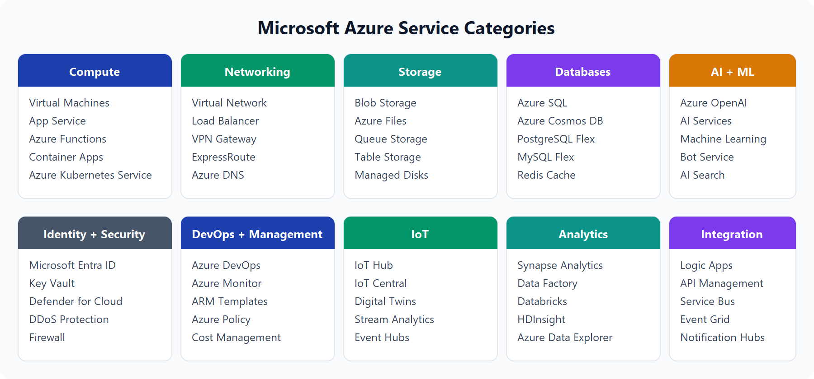

Muchos equipos de TI comienzan su recorrido en la nube moviendo sus aplicaciones web a máquinas virtuales, pero la nube es mucho más que eso.

Como ya vimos, todos los recursos que Azure nos puede ofrecer dependen de su categoría. Hay que entender que las soluciones de tecnología crecen rápido y de forma dinámica, así que Azure va de la mano con este crecimiento integrando IA, ML, análisis de datos y más.

## Introducción a las cuentas de Azure

Para crear y usar los servicios o recursos de Azure, necesitas una suscripción de Azure. Cuando trabajas con tus propias aplicaciones y cargas de trabajo, creas una cuenta de Azure y se te crea una suscripción.

- Cuenta de Azure: es tu identidad para acceder al Azure Portal (correo e inicio de sesión). → Creas una cuenta de Azure con tu correo.
- Suscripción de Azure: es el contrato donde se administran los servicios, permisos y la facturación. → Dentro de esa cuenta tienes una **suscripción** (por ejemplo, la gratuita o una de pago).
- Recursos de Azure: son los servicios que creas dentro de una suscripción, como máquinas virtuales, bases de datos o almacenamiento. → En esa suscripción creas tus **recursos**, como una máquina virtual o una base de datos.

Nota: Cuenta → Suscripción → Recursos.

## **Descripción de la infraestructura física de Azure**

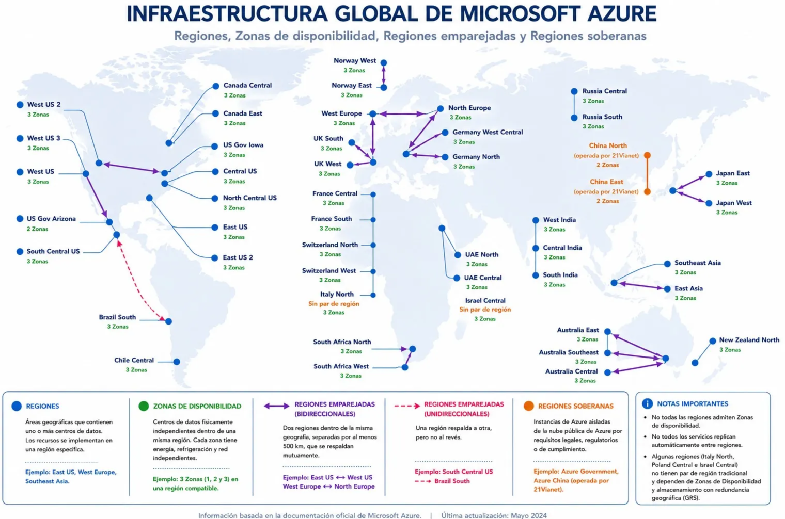

Los componentes principales de la arquitectura de Azure se pueden dividir en dos agrupaciones principales: la infraestructura física y la infraestructura de administración.

Aquí estaremos viendo la parte de infraestructura y aprenderemos cómo Azure organiza sus centros de datos, regiones y zonas de disponibilidad para ofrecer servicios confiables en todo el mundo.

### 1. Infraestructura física (Data Center)

La infraestructura física de Azure comienza con los centros de datos. Estos centros de datos son instalaciones con servidores organizados en bastidores, con energía dedicada, refrigeración e infraestructura de red, similar a un centro de datos local, pero a una escala mucho mayor. Este es simplemente el lugar donde viven los recursos.

### Geografía

Una geografía de Azure es una división geográfica o “continente” de Microsoft que agrupa una o varias regiones de Azure para cumplir requisitos de residencia de datos, cumplimiento normativo, resiliencia y organización de la infraestructura a nivel mundial.

Ejemplo:

- Estados Unidos
- Europa
- Asia
- Brasil

Nota: Sirve para agrupar y organizar las regiones.

> Geografía: Europa
> 

├── North Europe
├── West Europe
├── France Central
└── Germany West Central

### Región (Region)

En lugar de utilizar un solo centro de datos, Microsoft agrupa varios centros de datos cercanos. A ese conjunto se le llama región.

Una región es un área geográfica que contiene uno o varios centros de datos conectados mediante una red privada de muy baja latencia.

Nota: La región no es un edificio, es un área donde existen varios centros de datos.

Ejemplo:

East US (Región)

├── Centro de datos A
├── Centro de datos B
├── Centro de datos C

### Zonas de disponibilidad (Availability Zone)

Una zona de disponibilidad es una ubicación físicamente independiente dentro de una región de Azure, formada por uno o varios centros de datos que cuentan con alimentación eléctrica, refrigeración y redes propias e independientes.

Nota: **Independiente** es la palabra clave para esta definición.

### Regiones emparejadas (Regiones pares)

Las regiones emparejadas son dos regiones de Azure dentro de la misma geografía, separadas **cuando es posible** por al menos 500 km, diseñadas para proporcionar alta disponibilidad, replicación de datos y recuperación ante desastres.

Ejemplo:

- East US = Región
    - ↕ = Unidas a nivel de red, pero separadas a 500 km de distancia (**cuando sea posible**)
- West US = Región

### Geografía Soberana

Una geografía soberana es una instancia independiente de Azure diseñada para cumplir requisitos específicos de residencia de datos, cumplimiento normativo, seguridad y soberanía de un país o gobierno.

#### Ejemplos

- Azure Government: destinada a agencias gubernamentales y organizaciones autorizadas de Estados Unidos.
- Azure operated by 21Vianet: proporciona servicios de Azure para China bajo un operador local, conforme a la normativa del país.

Nota: Una **geografía soberana** es una instancia de Azure independiente para cumplir los requisitos de un gobierno o país, con normas estrictas de seguridad, cumplimiento y residencia de datos.

## Descripción de la infraestructura de administración de Azure

La infraestructura de administración incluye recursos de Azure, grupos de recursos, suscripciones y cuentas. Comprender esta jerarquía te ayudará a organizar los recursos, controlar quién puede acceder a qué y también quién puede administrar los costos por OpEx.

### Recursos y grupos de recursos de Azure

Un recurso es el bloque de construcción básico de Azure. Todo lo que crees, aprovisiones o implementes es un recurso. Las máquinas virtuales de Azure son un recurso; las redes virtuales (VNet), las bases de datos y los servicios de Azure AI son ejemplos de recursos dentro de Azure.


Los grupos de recursos son agrupaciones de recursos. **Cada recurso debe pertenecer obligatoriamente a un grupo de recursos**, pero un recurso solo puede estar asociado a un grupo. Los grupos de recursos no se pueden anidar (unir) y no se puede cambiar su nombre después de creados.

Las acciones que se aplican a un grupo de recursos afectan a todos los recursos que contiene. Al eliminar un grupo de recursos, se elimina todo lo que contiene. La concesión o denegación de acceso se aplica a todos sus recursos.

Si vas a configurar un entorno de desarrollo temporal, lo ideal sería que estuviera en un grupo de recursos, ya que esa agrupación te permite eliminar todos los recursos del grupo de una vez cuando termines.

Nota: Si ejecutamos varios proyectos en la nube, lo ideal sería crear un grupo de recursos independiente para cada proyecto, así quedan segmentados.

Nota: No hay reglas estrictas para estructurar los grupos de recursos; elige el enfoque que mejor funcione para tu situación.

### Suscripciones de Azure

Una suscripción de Azure es una unidad de administración, facturación y control de acceso que permite utilizar los productos y servicios de Azure.

- Es obligatoria para usar Azure.
- Está vinculada a una cuenta de Azure (una identidad de Microsoft Entra ID o un directorio de confianza).
- Una cuenta puede tener una o varias suscripciones, aunque solo se necesita una para comenzar.
- Dentro de una suscripción se crean y administran los recursos de Azure.

#### Funciones principales de las suscripciones

Administración: permite organizar y administrar los recursos de Azure.

Facturación: registra el consumo de los recursos y genera la factura correspondiente.

Control de acceso: permite definir quién puede acceder o administrar los recursos mediante permisos y políticas.

#### Tipos de límites de una suscripción

1. Límite de facturación (Billing Boundary)
- Cada suscripción genera una factura independiente.
- Permite separar los costos entre proyectos, departamentos o ambientes.
1. Límite de control de acceso (Access Control Boundary)
- Cada suscripción puede tener permisos, roles, políticas y límites de gasto diferentes.
- Por ejemplo, una suscripción para desarrolladores y otra para producción, cada una con reglas diferentes.

#### Esquema

Cuenta de Azure
│
▼
Suscripción
(Administración + Facturación + Control de acceso)
│
▼
Grupos de recursos
│
▼
Recursos de Azure
(VM, Storage, SQL, Redes, etc.)

### **Grupos de administración de Azure**

Los grupos de administración (Management Groups) son un nivel de organización que está por encima de las suscripciones. Su objetivo es administrar varias suscripciones al mismo tiempo.

- Los grupos de administración son un nivel que está por encima de las suscripciones.
- Sirven para organizar y administrar varias suscripciones como un solo conjunto.
- Permiten aplicar políticas, permisos y reglas de cumplimiento a todas las suscripciones del grupo.
- Las suscripciones heredan automáticamente las configuraciones aplicadas al grupo de administración.
- Los grupos de administración pueden organizarse en una jerarquía de hasta seis niveles.
- Cada organización (inquilino de Microsoft Entra) tiene un único grupo raíz, desde el cual se pueden aplicar políticas a toda la estructura.


# Descripción de los servicios de proceso de Azure

En este módulo se presentan los servicios de proceso de Azure y las opciones de innovación relacionadas. También estaremos viendo cómo funcionan las máquinas virtuales, los contenedores y Azure Functions. También revisará las opciones de hospedaje de aplicaciones con Azure App Service y aspectos básicos de los servicios de Azure AI, aprendizaje automático e IoT/Edge.

## Descripción de Azure Virtual Machines

Con Azure Virtual Machines (VM), puedes ejecutar servidores virtualizados en Azure como infraestructura como servicio (IaaS). Al igual que un servidor físico, controlas el sistema operativo y el software instalado.

Este se suele utilizar cuando buscamos:

- Control total sobre el sistema operativo (SO).
- Capacidad de ejecutar software personalizado.
- Usar configuraciones de hospedaje personalizadas.

Las máquinas virtuales de Azure eliminan la necesidad de comprar y mantener hardware de servidor físico. Como servicio IaaS, seguirás gestionando los parches, las actualizaciones y la configuración dentro de la máquina virtual.

En Azure puedes implementar máquinas virtuales rápidamente a partir de imágenes precompiladas. Una imagen es una plantilla que ya incluye un sistema operativo y herramientas, como componentes de hospedaje web. Un dato importante es que macOS no es un sistema operativo estándar disponible en Azure.

### Ejemplos de cuándo utilizar las máquinas virtuales

Entre los casos más comunes de uso de máquinas virtuales se incluyen:

- **Pruebas y desarrollo:** crea diferentes configuraciones de sistema operativo y aplicación rápidamente y, a continuación, quita la máquina virtual cuando se complete la prueba. (Aquí entra mucho la importancia de las suscripciones y grupos de recursos).
- **Hospedaje de aplicaciones en la nube:** ejecuta aplicaciones en Azure y escala o reduce verticalmente la capacidad a medida que cambia la demanda.
- **Extensión del centro de datos:** puedes ampliar tu infraestructura local utilizando Azure. En lugar de comprar más servidores físicos, conectas tu red local con una red virtual en Azure y ejecutas allí las máquinas virtuales o aplicaciones que necesites.
- **Recuperación ante desastres:** Azure puede utilizarse como un sitio de respaldo. Si el centro de datos principal deja de funcionar, las máquinas virtuales y las aplicaciones críticas pueden ejecutarse en Azure mediante una conmutación por error (failover), garantizando la continuidad del negocio.
- **Migración mediante lift-and-shift:** mueve las cargas de trabajo de servidor existentes con un rediseño mínimo de la aplicación. (Característica principal de IaaS).

## **Tamaño y recursos de máquina virtual**

Al aprovisionar una máquina virtual, eliges recursos como:

- Tamaño (propósito, número de núcleos de procesador y cantidad de RAM)
- Discos de almacenamiento (unidades de disco duro, unidades de estado sólido, etc.)
- Redes (red virtual, dirección IP pública y configuración de puertos)

## Descripción de las familias y nombre de tamaño de máquina virtual

Los tamaños de máquina virtual de Azure se agrupan en familias, con el fin de que podamos elegir rápidamente el tamaño ideal según las necesidades y cargas de trabajo.

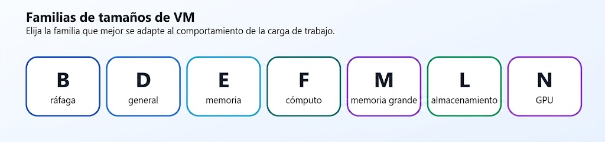

| Familia | Enfoque típico | Ejemplo de uso |
| --- | --- | --- |
| Serie B | Elástica, económica | Cargas de trabajo de desarrollo y pruebas con picos de CPU ocasionales |
| Serie D | Uso general | Servidores web, servidores de aplicaciones pequeños a medianos |
| Serie E | Optimización de memoria | Bases de datos en memoria, cargas de trabajo de análisis |
| Serie F | Optimización informática | Niveles de aplicaciones intensivos en CPU |
| Serie M | Uso de memoria grande | Bases de datos empresariales de gran tamaño |
| Serie L | Almacenamiento optimizado | Almacenamiento y procesamiento de datos de alto rendimiento |
| Serie N | GPU habilitada | Cargas de trabajo de aprendizaje e inferencia de inteligencia artificial y gráficos |

La ventaja de las máquinas virtuales (VM) es que se pueden personalizar en función de tus necesidades. Se puede ajustar la RAM, el disco, la red, la vCPU, la generación y mucho más.

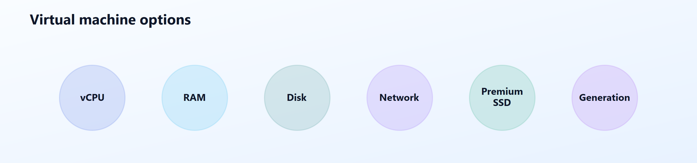

Algunos de los ajustes que puedes realizar son:

- **Recuento de vCPU**: afecta a la capacidad de proceso para cargas de trabajo simultáneas y enlazadas a CPU.
- **RAM**: afecta a la cantidad de datos de trabajo que la máquina virtual puede mantener en memoria.
- **Configuración del disco**: afecta a la capacidad de almacenamiento, las IOPS y el rendimiento.
- **Rendimiento de red**: afecta al rendimiento de la transferencia de datos dentro y fuera de la máquina virtual.
- **Compatibilidad con SSD Premium**: indica si el tamaño admite discos administrados Premium.
- **Generación de hardware**: indica la generación de plataformas y puede afectar al rendimiento de línea base.

La familia de máquinas virtuales (de uso general en este caso):

- `2`: el número de vCPU para este tamaño
- `s`: admite el almacenamiento SSD Premium.
- `v5`: generación de hardware para esa familia

Para elegir una máquina virtual debemos tener en cuenta qué necesitamos; luego partimos de la familia y después ajustamos según lo que más convenga a la carga de trabajo.

## **Opciones de escalado y resistencia para máquinas virtuales**

Se pueden ejecutar máquinas virtuales únicas para pruebas, desarrollo o tareas secundarias. También se pueden agrupar las máquinas virtuales para proporcionar alta disponibilidad, escalabilidad y redundancia. A este grupo de acciones se le puede llamar conjunto de escalado o de disponibilidad.

## Conjuntos de escalado de máquinas virtuales (Virtual Machine Scale Sets)

Un Virtual Machine Scale Set es un servicio de Azure que permite crear y administrar un conjunto de máquinas virtuales idénticas que pueden aumentar o disminuir automáticamente según la demanda y distribuir tráfico mediante un balanceador de carga.

## **Conjuntos de disponibilidad de máquinas virtuales**

Un conjunto de disponibilidad de máquinas virtuales (Virtual Machine Availability Set) es una característica de Azure que agrupa máquinas virtuales dentro de una región para distribuirlas entre diferentes dominios de error y dominios de actualización, reduciendo el impacto de fallos de hardware y mantenimientos planificados.

Dentro de un conjunto de disponibilidad existen dos conceptos importantes:

#### 1. Dominio de error (Fault Domain)

Un dominio de error representa una separación física de recursos de hardware.

La idea es:

Si falla un componente físico, como un servidor, un rack o parte de la infraestructura, no todas las máquinas virtuales se ven afectadas al mismo tiempo.

Ejemplo:

```
Availability Set

Dominio de error 1
 └── VM 1

Dominio de error 2
 └── VM 2
```

Si ocurre un fallo de hardware en el dominio 1:

```
VM 1 ❌

VM 2 ✅
```

La aplicación puede seguir funcionando.

#### 2. Dominio de actualización (Update Domain)

Un dominio de actualización controla cómo Azure realiza mantenimientos planificados.

La idea es:

Azure no actualiza todas las máquinas virtuales al mismo tiempo; las actualiza por grupos separados para evitar una interrupción completa.

Ejemplo:

```
Dominio de actualización 1
 └── VM 1

Dominio de actualización 2
 └── VM 2
```

Durante un mantenimiento:

Primero:

```
VM 1 → actualizando
VM 2 → funcionando
```

Después:

```
VM 1 → funcionando
VM 2 → actualizando
```

## Descripción de Azure Virtual Desktop

Azure Virtual Desktop es un servicio de Azure que permite acceder, a través de Internet, a un escritorio y aplicaciones de Windows alojados en máquinas virtuales de Azure, proporcionando acceso remoto seguro y centralizado desde casi cualquier dispositivo.

### **¿Cuándo usar Azure Virtual Desktop?**

Azure Virtual Desktop se utiliza cuando necesitas que los usuarios trabajen en un escritorio de Windows alojado en Azure, al que acceden desde cualquier lugar a través de Internet. Esto se ve sobre todo en estos escenarios:

- Trabajo remoto
- Acceso desde distintos dispositivos
- Aplicaciones centralizadas (las aplicaciones se ejecutan en Azure, no en el equipo del usuario)
- Mayor seguridad (los datos permanecen en Azure y el acceso puede protegerse con Microsoft Entra ID y autenticación multifactor (MFA))

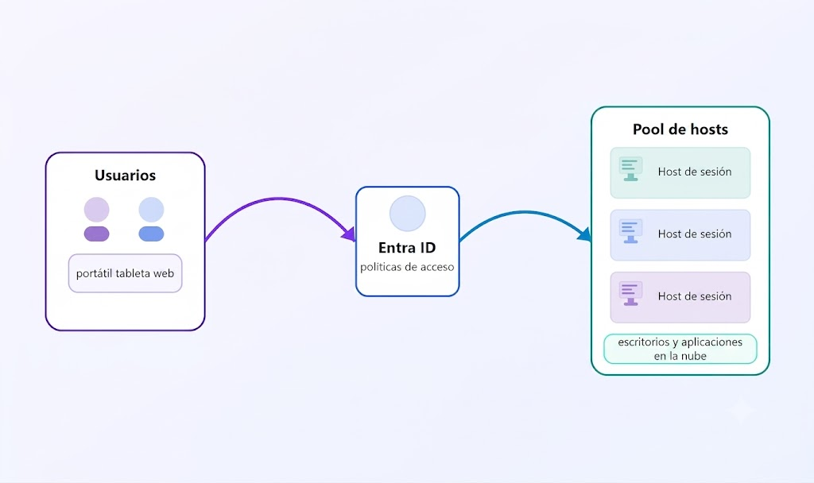

## Descripción de contenedores de Azure

Las máquinas virtuales reducen los costos en comparación con el hardware físico, pero siguen estando limitadas a un único sistema operativo por máquina virtual. Los contenedores son una excelente opción si quieres ejecutar varias instancias de una aplicación en un solo equipo host.

### **¿Qué son los contenedores?**

Un contenedor es un entorno aislado donde se almacenan aplicaciones junto con sus dependencias y bibliotecas. Este entorno se puede ejecutar tanto en local como en la nube. A este tipo de virtualización se le conoce como virtualización a nivel de proceso.

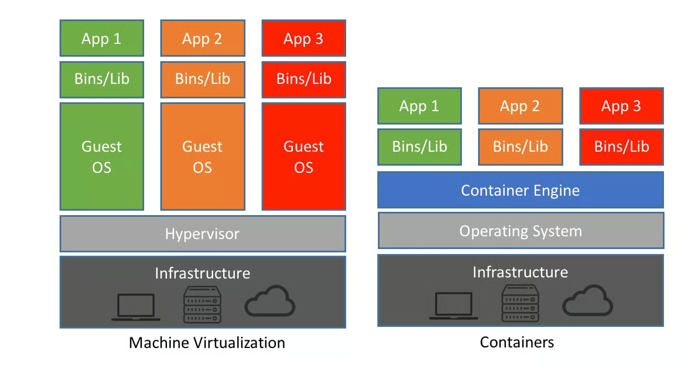

Nota: La ventaja de usar contenedores en lugar de máquinas virtuales tradicionales es que ahorras muchos recursos, por eso, cuando sea posible, es preferible desplegar las aplicaciones en contenedores.

**Características:**

1. Agilidad: basta con invocar Docker y el contenedor aparece lo más rápido posible; no tarda mucho en cargar.
2. Portabilidad: se puede llevar a cualquier lugar, siempre y cuando se cumplan los requisitos fundamentales.
3. Escalabilidad: los contenedores tienen la gran ventaja de ser rápidos y, sobre todo, permiten ejecutar varias aplicaciones debido a su bajo consumo de recursos.

### Azure Container Instances

Azure Container Instances ofrece la manera más rápida y sencilla de ejecutar un contenedor en Azure, sin administrar ninguna máquina virtual ni adoptar servicios adicionales. Azure Container Instances es una oferta de plataforma como servicio (PaaS). Subes tus contenedores y el servicio los ejecuta por ti.

Nota: El escalado de este servicio normalmente es manual, y se usa para tareas rápidas, scripts, pruebas y más.

### Azure Container Apps

Azure Container Apps (ACA) es un servicio PaaS que permite ejecutar aplicaciones basadas en contenedores sin administrar servidores de Kubernetes. Está diseñada para microservicios, API y aplicaciones web, e incluye escalado automático, escalado hasta 0 (puede llegar a 0 instancias cuando no hay tráfico), balanceo de carga integrado y otras características.

Nota: Es PaaS, ejecuta apps en contenedores, no administras servidores ni Kubernetes, tiene escalado automático, balanceo de carga y es ideal para microservicios.

### **Azure Kubernetes Service**

Azure Kubernetes Service (AKS) es un servicio de orquestación de contenedores. Un servicio de orquestación administra el ciclo de vida de los contenedores. Al implementar una flota de contenedores, AKS puede hacer que la administración de flotas sea más sencilla y eficaz.

Nota: cuando tenemos una aplicación, lo ideal sería administrarla de la manera más escalable y optimizada posible, es decir, segmentar el front, el back y el almacenamiento de la aplicación en contenedores diferentes.

## Descripción de Azure Functions

Azure Functions es una opción de proceso sin servidor (serverless) controlada por eventos que no necesita el mantenimiento de máquinas virtuales ni contenedores. Con Azure Functions, un evento activa la función, lo que reduce la necesidad de mantener recursos aprovisionados cuando no hay ningún evento.

## Informática sin servidor (Serverless)

Modelo de computación en la nube donde el código se ejecuta únicamente cuando ocurre un evento o una solicitud configurada para la función. La infraestructura es administrada por el proveedor de la nube, por lo que el usuario no administra servidores y solo paga por el uso.

**Características:**

**Cobro por uso (OpEx):** solo pagas por las ejecuciones, el tiempo de ejecución y los recursos consumidos.

**Mantenimiento automático:** el proveedor administra los servidores, el sistema operativo, la infraestructura y las actualizaciones.

**Escalabilidad automática:** el servicio aumenta o disminuye automáticamente la cantidad de instancias según la demanda, incluso puede escalar a **cero** cuando no hay solicitudes (según el servicio y el plan).

**Ejecución basada en eventos:** el código se ejecuta cuando ocurre un evento, como una solicitud HTTP, un temporizador, la carga de un archivo o un mensaje en una cola.

## **Descripción de los servicios de IA, aprendizaje automático e IoT/Edge en Azure**

Azure incluye categorías que te ayudan a crear soluciones inteligentes y conectadas sin empezar desde cero.

### Servicios de Azure AI

Son servicios ya preparados por Microsoft para agregar inteligencia artificial a una aplicación sin entrenar un modelo.

Por ejemplo, mediante una API puedes:

- Lenguaje: traducir texto, detectar sentimientos, resumir documentos.
- Voz: convertir voz a texto o texto a voz.
- Visión: reconocer objetos, personas o texto en imágenes.
- Procesamiento de documentos: extraer información de facturas, formularios o recibos.

La idea es:

> “Necesito una función de IA específica, la llamo mediante una API y listo.”
> 

No tienes que crear ni entrenar un modelo.

#### Azure OpenAI Service

Es otro servicio de IA, pero está enfocado en la **IA generativa**.

Con Azure OpenAI puedes usar modelos como GPT para:

- Chatbots.
- Generación de texto.
- Resúmenes.
- Generación de código.
- Creación de contenido.

Microsoft añade controles empresariales como:

- Seguridad.
- Gobernanza.
- Integración con Azure.

**La idea es:**

> “Quiero que un modelo genere contenido o converse con el usuario.”
> 

### **Azure Machine Learning**

Usa Azure Machine Learning cuando necesites compilar, entrenar y administrar modelos de aprendizaje automático personalizados. Esta opción es mejor cuando el escenario requiere desarrollo de modelos, experimentación y administración del ciclo de vida.

### **Servicios IoT y Edge**

Los servicios de Azure IoT te ayudan a conectar, supervisar y administrar dispositivos.

#### 1. Azure IoT Hub

**¿Qué hace?**

Es el **centro de comunicación** entre los dispositivos IoT y Azure.

- Comunicación **dispositivo → nube** (telemetría, sensores).
- Comunicación **nube → dispositivo** (comandos, actualizaciones).

Piensa en él como un **intermediario seguro** que conecta miles o millones de dispositivos con la nube.

**Palabra clave:** **comunicación bidireccional.**

#### 2. Azure IoT Central (SaaS)

Aquí está la diferencia.

IoT Central es una **aplicación ya construida** para administrar dispositivos IoT.

Con ella puedes:

- Ver dashboards.
- Monitorear dispositivos.
- Administrar dispositivos.
- Configurar reglas y alertas.
- Visualizar datos sin desarrollar toda la solución desde cero.

No tienes que construir la plataforma; Microsoft ya la proporciona.

**Palabra clave:** **administración y monitoreo de dispositivos IoT.**

Por eso es **SaaS**, no PaaS.

#### 3. Azure IoT Edge

Tu idea es prácticamente correcta.

IoT Edge permite que un dispositivo IoT **ejecute parte del procesamiento localmente**, sin enviar todo a la nube.

Ejemplo:

Una cámara con IA.

Sin IoT Edge:

- La cámara envía todo el video a Azure.
- Azure analiza el video.
- Azure devuelve el resultado.

Con IoT Edge:

- La cámara analiza el video localmente.
- Solo envía a Azure el resultado (por ejemplo, “se detectó una persona”).

Esto:

- Reduce la latencia.
- Ahorra ancho de banda.
- Permite seguir funcionando incluso con conectividad limitada.

**Palabra clave:** **procesamiento en el borde (Edge Computing).**

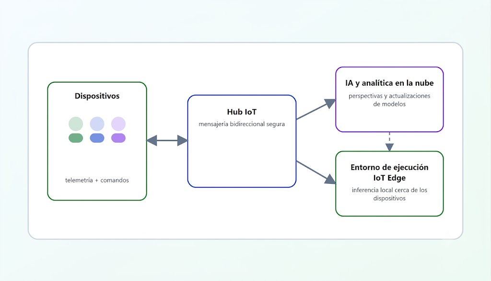

## Descripción de las opciones de hospedaje de aplicaciones

Si necesitamos hospedar una aplicación en Azure, podríamos pensar inicialmente en una máquina virtual (VM) o en contenedores. Tanto la VM como los contenedores son excelentes soluciones para hospedar aplicaciones, y aunque la VM ofrece mayor control, existen varios tipos de hospedaje en Azure que vamos a ver.

Hay otras opciones de hospedaje que puedes usar con Azure, incluido Azure App Service.

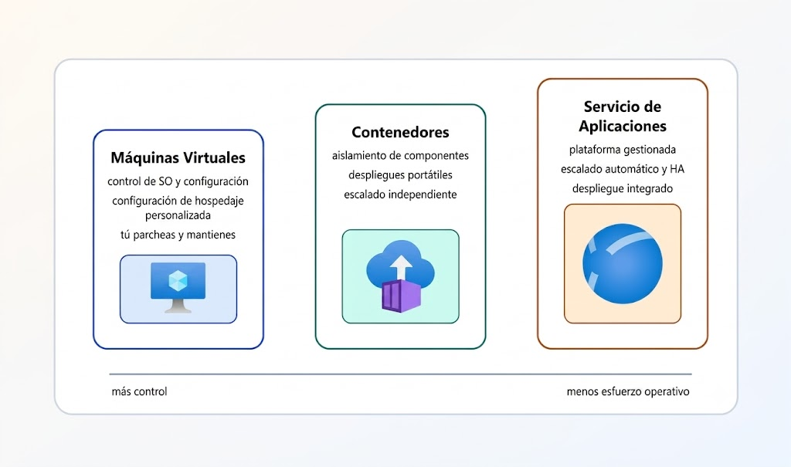

### Azure App Service

Nos permite compilar y hospedar aplicaciones web, trabajos en segundo plano, backends móviles y API RESTful en el lenguaje de programación que prefieras, sin administrar la infraestructura ya que es un servicio PaaS. Ofrece escalado automático y alta disponibilidad. App Service admite Windows y Linux, y también admite implementaciones automatizadas desde GitHub, Azure DevOps o cualquier repositorio de Git para la implementación continua.

App Service admite varios lenguajes y marcos, como .NET, .NET Core, Java, PHP, Python y Node.js.

### Tipos de servicios de aplicaciones

Con App Service, puedes hospedar los estilos de aplicación más comunes:

- Aplicaciones web
- Aplicaciones de API
- WebJobs
- Aplicaciones móviles

App Service controla la mayoría de las decisiones sobre la infraestructura que se tratan en el hospedaje de aplicaciones accesibles desde la web:

- La implementación y administración se integran en la plataforma.
- Los puntos de conexión se pueden proteger.
- Los sitios se pueden escalar rápidamente para controlar cargas de tráfico elevado.
- El equilibrio de carga integrado y el administrador de tráfico proporcionan alta disponibilidad.

Todos estos estilos de aplicación se hospedan en la misma infraestructura y comparten estas ventajas. Esto convierte a Azure App Service en la elección ideal para hospedar aplicaciones web.

#### **Aplicaciones web**

App Service incluye compatibilidad completa para hospedar aplicaciones web mediante ASP.NET, ASP.NET Core, Java, Ruby, Node.js, PHP o Python. Puedes elegir Windows o Linux como sistema operativo del host.

#### **Aplicaciones de API**

Al igual que al hospedar un sitio web, puedes compilar API web basadas en REST mediante el lenguaje y el marco que prefieras. App Service proporciona compatibilidad completa con Swagger y la capacidad de empaquetar y publicar la API en Azure Marketplace. Las API publicadas se pueden consumir desde cualquier cliente basado en HTTP o HTTPS.

#### **WebJobs**

Se puede usar la característica WebJobs para ejecutar un programa (.exe, Java, PHP, Python o Node.js) o un script (.cmd, .bat, PowerShell o Bash) en el mismo contexto que una aplicación web, aplicación de API o aplicación móvil. Puedes programarlos o ejecutarlos mediante un desencadenador.

#### **Aplicaciones móviles**

Usa la característica Mobile Apps de App Service para compilar rápidamente un back-end para aplicaciones iOS y Android. Con unos pocos clics en el Portal de Azure, puedes realizar lo siguiente:

- Almacenar los datos de aplicaciones móviles en una base de datos SQL basada en la nube.
- Autenticar a clientes con proveedores sociales comunes, como MSA, Google, X y Facebook.
- Enviar notificaciones push.
- Ejecutar lógica de back-end personalizada en C# o Node.js.

# Descripción de los servicios de red de Azure

En este módulo se presentan las funcionalidades de red de Azure para una comunicación segura entre los recursos de Azure, los entornos locales y los clientes conectados a Internet.

## Descripción de las redes virtuales de Azure (VNet)

Una red virtual (Azure Virtual Network o VNet) es una red privada en Azure que permite que los recursos, como máquinas virtuales, bases de datos, almacenamiento o aplicaciones, se comuniquen entre sí, con Internet o con redes locales de forma segura.

Las redes virtuales de Azure proporcionan las siguientes funcionalidades de red importantes:

- Aislamiento y segmentación
- Comunicación con Internet
- Comunicación entre recursos de Azure
- Comunicación con recursos locales (on-premises)
- Enrutar tráfico de red
- Conexión de redes virtuales

Datos importantes:

- Los **puntos de acceso público** tienen una dirección IP pública y son accesibles desde cualquier parte del mundo.
- Los **puntos de conexión privados** existen dentro de una red virtual y tienen una dirección IP privada en el espacio de direcciones de esa red virtual.

## Aislamiento y segmentación

Cuando creamos una Azure Virtual Network (red virtual) dentro de Azure, se define un espacio de direcciones IP con un rango de direcciones. Ese rango de IP solo existe dentro de la red virtual y no es enrutable en Internet. Después de dividir el espacio de direcciones IP en subredes, se les pueden asignar nombres, entre otras configuraciones.

**Resolución de nombres (DNS):** Permite convertir nombres (por ejemplo, `servidor1`) en direcciones IP. Puedes usar el **DNS integrado de Azure** o configurar un **DNS propio**.

## **Comunicación con Internet**

Permite que los recursos de Azure se comuniquen con Internet. Para recibir conexiones desde Internet, puedes asignar una IP pública al recurso o colocarlo detrás de un Azure Load Balancer.

## **Comunicación entre recursos de Azure**

Los recursos de Azure se pueden comunicar de forma segura entre sí, y esto se puede hacer de dos formas:

- **Red virtual (VNet):** conecta recursos como máquinas virtuales, Azure Kubernetes Service (AKS), App Service Environment y conjuntos de escalado.
- **Puntos de conexión de servicio (Service Endpoints):**
permiten que una **red virtual (VNet)** se conecte **de forma privada y segura** a servicios de Azure, como **Azure Storage** o **Azure SQL Database**, sin exponer el tráfico a Internet.

## **Comunicación** con recursos localizados en las instalaciones

Las redes virtuales de Azure permiten vincular recursos en el entorno local y dentro de la suscripción de Azure. De hecho, puedes crear una red que abarque tanto el entorno local como el entorno en la nube. Hay tres maneras de lograr esta conectividad:

#### 1. VPN Punto a Sitio (Point-to-Site - P2S)

- **Conecta un solo equipo** a una VNet de Azure mediante una VPN.
- Ideal para usuarios remotos.

Ejemplo: mi laptop desde mi casa se conecta de forma segura a Azure.

#### 2. VPN Sitio a Sitio (Site-to-Site - S2S)

- Conecta toda una red local con una VNet de Azure mediante una VPN.
- La conexión está cifrada y utiliza Internet.

Ejemplo: la oficina completa se conecta a Azure como si fuera una sola red.

#### 3. Azure ExpressRoute

Azure ExpressRoute es una conexión privada dedicada entre tu infraestructura y Azure que evita Internet pública, usando un circuito gestionado por un proveedor de telecomunicaciones para ofrecer mayor seguridad, estabilidad y menor latencia.

Tu red → proveedor → backbone privado Microsoft → Azure

# Enrutamiento de tráfico de red en Azure

Azure enruta automáticamente el tráfico entre:

- Subredes dentro de una red virtual (VNet).
- Redes virtuales conectadas.
- Redes locales conectadas.
- Internet.

Cuando se necesita más control sobre el tráfico, se pueden usar:

### Tablas de rutas (Route Tables)

Permiten definir reglas para indicar por dónde debe viajar el tráfico de red.

**Ejemplo:** enviar todo el tráfico de una máquina virtual hacia un firewall antes de salir a Internet.

### UDR (User Defined Routes)

Son rutas personalizadas creadas por el usuario para controlar el flujo del tráfico entre subredes o redes virtuales.

**Ejemplo:** obligar a que el tráfico pase por un dispositivo de seguridad antes de llegar a su destino.

### BGP (Border Gateway Protocol)

Protocolo que permite intercambiar rutas automáticamente entre redes locales y Azure.

Se utiliza con:

- VPN Gateway.
- Azure ExpressRoute.
- Azure Route Server.

**Ejemplo:** una oficina informa automáticamente a Azure sobre sus redes internas mediante BGP.

### Resumen:

- **Route Tables:** definen caminos de tráfico.
- **UDR:** rutas personalizadas creadas manualmente.
- **BGP:** aprende y comparte rutas automáticamente.

Nota: **Route Table = la tabla (el lugar donde están las reglas). / UDR = una regla personalizada dentro de esa tabla.**

## Filtrado del **tráfico** de red

Las redes virtuales de Azure nos permiten filtrar el tráfico entre subredes mediante los siguientes métodos:

#### **Los grupos de seguridad de red - (NSG - Network Security Groups)**

Son recursos de Azure que pueden contener varias reglas de seguridad, tanto de entrada como de salida. Permiten o bloquean tráfico en función del protocolo, entre otros criterios. (En pocas palabras, es una lista de reglas de control de acceso, o ACL).

#### Aplicaciones virtuales de red (Network Virtual Appliances - NVA)

Una NVA es una máquina virtual especializada que realiza funciones de red. En algunos casos, podemos ver máquinas virtuales con los siguientes firewalls instalados:

- pfSense
- FortiGate
- Palo Alto
- Cisco CSR

Si instalamos pfSense en una VM de Azure para que actúe como firewall, eso es una NVA.

Algunos casos muy comunes son los siguientes:

- Firewall: permite y bloquea.
- VPN Gateway: crea conexiones seguras.
- IDS/IPS: detecta ataques.
- SIEM: correlaciona eventos.
- Router virtual: enruta tráfico entre redes.

## Conexiones de redes virtuales

Las conexiones de redes virtuales o VNet Peering hacen que dos redes virtuales de Azure se conecten mediante la red privada de Microsoft. Y cuando hablamos de red privada de Microsoft, hablamos de la infraestructura física de red que Microsoft posee y opera.

# **Descripción de las redes privadas virtuales de Azure**

Una red privada virtual (VPN) usa un túnel cifrado sobre otra red. Normalmente, las VPN se implementan para conectar entre sí dos o más redes privadas de confianza a través de una red que no es de confianza (normalmente, la red pública de Internet).

## Puerta de enlace de VPN

Una puerta de enlace de VPN es un tipo de puerta de enlace de red virtual. Las instancias de Azure VPN Gateway se implementan en una subred dedicada de la red virtual y permiten la conectividad siguiente:

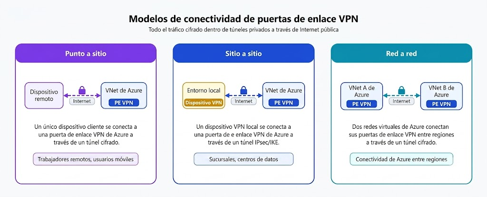

### Tipos de VPN Gateway en Azure

#### VPN Gateway basado en directivas (Policy-based)

- Utiliza reglas estáticas basadas en direcciones IP para decidir qué tráfico debe cifrarse.
- Evalúa cada paquete y, si coincide con una regla definida, lo envía por el túnel VPN.
- Es menos flexible porque los cambios de red requieren modificar las reglas manualmente.

Nota: Si el tráfico coincide con esta regla, usa este túnel.

#### VPN Gateway basado en rutas (Route-based)

- Utiliza tablas de enrutamiento para decidir qué tráfico debe pasar por el túnel VPN.
- El túnel IPSec funciona como una interfaz de red virtual.
- Es más flexible y permite usar protocolos como BGP para aprender rutas automáticamente.
- Es el método recomendado para conectar redes locales con Azure.

Nota: Si la ruta indica este túnel, el tráfico pasa cifrado por él.

Si necesitas alguno de los siguientes tipos de conectividad, usa una instancia de VPN Gateway basada en rutas:

- Conexiones entre redes virtuales
- Conexiones de punto a sitio
- Conexiones de varios sitios
- Coexistencia con una puerta de enlace de Azure ExpressRoute

## Escenarios de alta disponibilidad

Si vas a configurar una VPN para mantener la información segura, también quieres asegurarte de que sea una configuración de alta disponibilidad y tolerante a errores. Hay varias maneras de reforzar la resistencia de la puerta de enlace de VPN.

### Activo/en espera

Azure VPN Gateway implementa alta disponibilidad mediante dos instancias internas; como usuarios no las vemos, pero Microsoft las gestiona internamente. Si la instancia activa falla, la instancia secundaria asume automáticamente las conexiones, reduciendo el tiempo de interrupción y proporcionando tolerancia a fallos.

### Activo/activo

Azure VPN Gateway activo-activo (Active-Active) es una configuración donde ambas instancias del VPN Gateway están activas al mismo tiempo, cada una con su propia dirección IP pública y túnel VPN independiente. Esto permite que ambas procesen tráfico y proporciona mayor disponibilidad, ya que si una instancia falla, la otra puede continuar manteniendo la conexión.

## Conmutación por error de ExpressRoute

La conmutación por error de ExpressRoute permite usar una VPN Gateway como respaldo de ExpressRoute. Si ExpressRoute falla, la VPN mantiene la conexión con Azure mediante un túnel cifrado a través de Internet.

## Puertas de enlace con redundancia de zona

En las regiones que admiten zonas de disponibilidad, se pueden implementar puertas de enlace VPN y ExpressRoute en una configuración con redundancia de zona. Esta configuración aporta una mayor disponibilidad, escalabilidad y resistencia a las puertas de enlace de red virtual.

## Descripción de Azure ExpressRoute

Azure ExpressRoute te permite ampliar las redes locales a la nube de Microsoft a través de una conexión privada, con la ayuda de un proveedor de conectividad. Esta conexión se denomina circuito ExpressRoute. Con ExpressRoute, puedes establecer conexiones a servicios en la nube de Microsoft, como Microsoft Azure y Microsoft 365. ExpressRoute permite conectar oficinas, centros de datos u otras instalaciones a la nube de Microsoft. Cada ubicación tendría su propio circuito ExpressRoute.

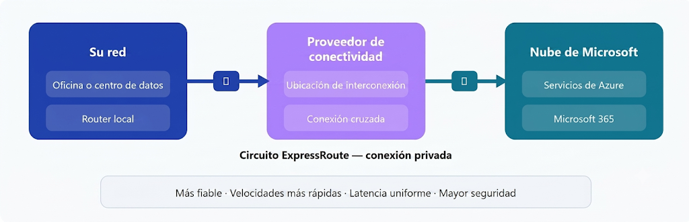

Las conexiones de ExpressRoute no pasan por Internet pública. Dado que omiten la red pública de Internet, las conexiones de ExpressRoute ofrecen más confiabilidad, velocidades más rápidas, latencias coherentes y mayor seguridad que las conexiones a Internet típicas.

## **Características y ventajas de ExpressRoute**

- Conectividad de servicios en la nube de Microsoft en todas las regiones dentro de la región geopolítica: permite que tu conexión privada a Microsoft pueda acceder a servicios de Azure ubicados en diferentes regiones cercanas dentro de la misma zona geográfica, sin tener que crear conexiones separadas para cada región.
- Conectividad global con ExpressRoute Global Reach: permite conectar tus propias redes locales entre sí usando la red global de Microsoft como intermediario. Por ejemplo, una oficina en América puede comunicarse con otra oficina en Europa mediante el backbone de Microsoft.
- Enrutamiento dinámico mediante BGP: permite que tu red y Microsoft intercambien rutas automáticamente. Si agregas o cambias redes, BGP actualiza la información sin tener que configurar rutas manualmente.
- Redundancia integrada en las ubicaciones de configuración entre pares: ExpressRoute tiene componentes redundantes para evitar puntos únicos de fallo. Si un enlace o componente falla, existe otro camino disponible para mantener la conexión.

### **Conectividad con los servicios en la nube de Microsoft**

ExpressRoute permite el acceso directo a los siguientes servicios en todas las regiones:

- Microsoft Office 365
- Microsoft Dynamics 365
- Servicios de proceso de Azure, como Azure Virtual Machines
- Servicios en la nube de Azure, como Azure Cosmos DB y Azure Storage

## **Conectividad global**

Entonces, si tienes dos ubicaciones de tu empresa (por ejemplo, una oficina en Asia y un centro de datos en Europa), cada una tiene su propio circuito ExpressRoute hacia Microsoft. Global Reach permite unir esos circuitos para que tus redes locales se comuniquen entre sí sin pasar por Internet.

## **Descripción de Azure DNS**

Azure DNS es un servicio de hospedaje para dominios DNS que ofrece resolución de nombres mediante la infraestructura de Microsoft Azure.

### **Ventajas de Azure DNS**

Azure DNS usa el ámbito y la escala de Microsoft Azure para proporcionar numerosas ventajas, entre las que se incluyen:

- Rendimiento y fiabilidad
- Seguridad
- Facilidad de uso
- Redes virtuales personalizables
- Registros de alias

### **Rendimiento y fiabilidad**

Azure DNS utiliza una red global de servidores DNS distribuidos para ofrecer alta disponibilidad y resistencia. Las consultas DNS son respondidas por el servidor más cercano disponible, mejorando la velocidad y confiabilidad de la resolución de nombres.

### **Seguridad**

Azure DNS se basa en Azure Resource Manager, que proporciona características como el control de acceso basado en rol de Azure (Azure RBAC), los registros de actividad y los bloqueos de recursos para ayudar a proteger los recursos y registros DNS.

### **Facilidad de uso**

Azure DNS también puede administrar registros DNS para los servicios de Azure y proporcionar DNS para los recursos externos. Azure DNS se integra en Azure Portal y usa las mismas credenciales, el contrato de soporte técnico y la facturación que los demás servicios de Azure.

### **Redes virtuales personalizables con dominios privados**

Azure DNS también admite dominios DNS privados. Esta característica te permite usar tus propios nombres de dominio personalizados en las redes virtuales privadas en lugar de los nombres proporcionados por Azure.

### **Registros de alias**

Azure DNS también admite conjuntos de registros de alias. Puedes usar un conjunto de registros de alias que haga referencia a un recurso de Azure, como una dirección IP pública de Azure, un perfil de Azure Traffic Manager o un punto de conexión de Azure Content Delivery Network (CDN).

Nota: no puedes usar Azure DNS para comprar un nombre de dominio. Por una tarifa anual, puedes comprar un nombre de dominio mediante dominios de App Service o un registrador de nombres de dominio de terceros.

# Descripción de los servicios de almacenamiento de Azure

En este módulo se presenta el almacenamiento en Azure, lo que incluye aspectos como diferentes tipos de almacenamiento y cómo una infraestructura distribuida puede hacer que los datos sean más eficientes.

## Descripción de las cuentas de almacenamiento de Azure

Una cuenta de almacenamiento proporciona un espacio de nombres único para los datos de Azure Storage, al que se puede acceder desde cualquier parte del mundo mediante HTTPS o HTTP. Los datos de la cuenta son seguros porque cuentan con las siguientes características:

- Disponibilidad
- Duraderos
- Escalables de forma masiva

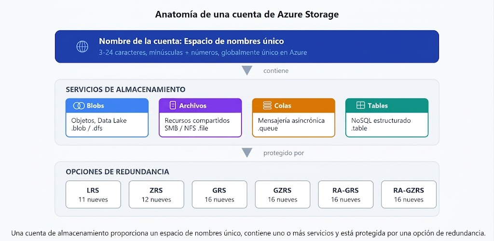

Azure Blob Storage: proporciona almacenamiento de datos no estructurados, es decir, archivos pesados y grandes.

Azure Files: una carpeta compartida de red tradicional. Sirve para compartir archivos en red, es similar al FTP.

Azure Queue Storage: permite almacenar grandes cantidades de mensajes y su función es la entrega de mensajes (cola y entrega). Ayuda a que, si una parte de la aplicación se satura de trabajo, los mensajes no se pierdan, sino que esperen pacientemente en la fila.

Azure Table Storage: sirve como almacenamiento NoSQL para datos en tablas no relacionales.

Azure SQL Database: es un sistema de gestión de bases de datos relacional administrado que se ejecuta en la nube, donde Microsoft se encarga del mantenimiento del servicio.

Azure Disks: está orientado específicamente a proporcionar almacenamiento persistente para **máquinas virtuales**; es decir, funciona como el disco duro de una VM.

## Puntos de conexión de cuenta de almacenamiento

Una de las ventajas de usar una cuenta de Azure Storage es tener un espacio de nombres único en Azure para tus datos. Cada cuenta de almacenamiento debe tener un nombre único dentro de Azure. La combinación del nombre de la cuenta y el punto de conexión del servicio de Azure Storage forma el punto de conexión de tu cuenta de almacenamiento.

Hay algunos puntos claros que hay que tener en cuenta:

- Los nombres de las cuentas de almacenamiento deben tener entre 3 y 24 caracteres y solo pueden incluir números y letras minúsculas (ej. victoralmacenamiento01).
- El nombre de la cuenta de almacenamiento debe ser único dentro de Azure. No puede haber dos cuentas de almacenamiento con el mismo nombre. Esto permite tener un espacio de nombres único y accesible en Azure.

En la tabla siguiente se muestra el formato de punto de conexión para los servicios de Azure Storage.

- La estructura del endpoint siempre es:

https://..core.windows.net

- **`<nombre-storage-account>`**: es el nombre que tú asignas al crear la cuenta.
- **`<servicio>`**: cambia según el servicio que quieras usar:
    - `blob` → Blob Storage
    - `dfs` → Data Lake Storage Gen2
    - `file` → Azure Files
    - `queue` → Queue Storage
    - `table` → Table Storage
- **`core.windows.net`**: es el dominio administrado por Microsoft Azure. **No significa que debas usar Windows**; simplemente identifica los servicios de Azure.

**Ejemplo:**

Si tu Storage Account se llama `empresa01`:

- `https://empresa01.blob.core.windows.net`
- `https://empresa01.file.core.windows.net`
- `https://empresa01.queue.core.windows.net`

Nota: el nombre de la cuenta identifica tu almacenamiento y el subdominio identifica qué servicio de Azure Storage estamos utilizando.

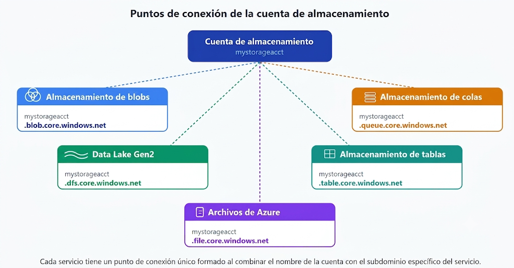

## Descripción de la redundancia de almacenamiento de Azure

Azure Storage mantiene varias copias de datos para protegerse frente a errores de hardware, interrupciones y desastres regionales. Las opciones de redundancia determinan la disponibilidad, la durabilidad y el costo.

Al seleccionar una opción de redundancia, hay que equilibrar el menor costo con respecto a una mayor disponibilidad.

- Cómo se replican los datos en la región primaria.
- Si los datos se replican en una segunda ubicación, alejada geográficamente de la región primaria, para protegerse frente a desastres naturales.

## Redundancia en la región primaria

Los datos de Azure Storage siempre se replican **3 veces** en la región primaria. Las opciones de región primaria son almacenamiento con redundancia local (LRS) y almacenamiento con redundancia de zona (ZRS).

## Almacenamiento con redundancia local

El almacenamiento con redundancia local (LRS) replica los datos tres veces dentro de un único centro de datos en la región primaria. LRS ofrece una durabilidad mínima de 11 nueves (99,999999999 %) de los objetos en un año determinado.

LRS es la opción más económica y protege contra errores en los bastidores de servidores y en las unidades de disco de un centro de datos. Dado que todas las réplicas permanecen en ese centro de datos, un desastre de nivel de centro de datos todavía puede causar pérdida de datos.

Para mayor resiliencia se utilizan:

- ZRS
- GRS
- GZRS

## Almacenamiento con redundancia de zona

Para las regiones con **zona de disponibilidad habilitada**, el almacenamiento con redundancia de zona (ZRS) replica los datos de Azure Storage sincrónicamente en tres zonas de disponibilidad de Azure en la región primaria. (O sea, sigue estando en la misma región, pero en centros de datos aislados).

Con ZRS, los datos permanecen disponibles para las operaciones de lectura y escritura, incluso si una zona no está disponible. Microsoft recomienda ZRS para escenarios de alta disponibilidad en la región y para los requisitos que mantienen la replicación dentro de un país o región.

## Redundancia en una región secundaria

Para una mayor durabilidad, los datos pueden replicarse en una región secundaria que esté geográficamente distante de la región primaria. Al crear una cuenta de almacenamiento, eliges la región primaria; Azure asigna la región secundaria emparejada en función de los pares de regiones.

## Almacenamiento con redundancia geográfica

GRS copia los datos de forma sincrónica tres veces en la región primaria (LRS) y, a continuación, de forma asincrónica en la región secundaria (también LRS). Ofrece una fiabilidad de al menos 99,999999999 % a lo largo de un año.

## Almacenamiento con redundancia de zona geográfica

GZRS combina resistencia de nivel de zona en la región primaria con replicación geográfica en una región secundaria. Los datos se copian en tres zonas de disponibilidad de la región primaria y se replican en la región secundaria emparejada mediante LRS. Microsoft recomienda GZRS para cargas de trabajo que necesiten máxima coherencia, disponibilidad y resistencia de recuperación ante desastres.

## **Acceso de lectura a los datos de la región secundaria**

GRS y GZRS protegen contra interrupciones regionales mediante la replicación de datos en una ubicación secundaria. Para leer los datos de la región secundaria antes de la conmutación por error, habilita el almacenamiento con redundancia geográfica con acceso de lectura (RA-GRS) o el almacenamiento con redundancia de zona geográfica con acceso de lectura (RA-GZRS).

# **Descripción de los servicios de almacenamiento de Azure**

- **Azure Table Storage**: sirve como almacenamiento NoSQL para datos en tablas no relacionales.
- **Azure Files**: una carpeta compartida de red tradicional. Sirve para compartir archivos en red, es similar al FTP.
- **Azure Queue Storage**: permite almacenar grandes cantidades de mensajes y su función es la entrega de mensajes (cola y entrega). Ayuda a que, si una parte de la aplicación se satura de trabajo, los mensajes no se pierdan, sino que esperen pacientemente en la fila.
- **Azure Blob Storage**: proporciona almacenamiento de datos no estructurados, es decir, archivos pesados y grandes.
- **Azure Data Lake**: es un repositorio escalable diseñado para almacenar grandes volúmenes de datos en diferentes formatos para análisis y procesamiento.
- **Azure SQL Database**: es un sistema de gestión de bases de datos relacional administrado que se ejecuta en la nube, donde Microsoft se encarga del mantenimiento del servicio.

## Ventajas de Azure Storage

Azure Storage proporciona estas ventajas:

- **Duradero y altamente disponible**. Las opciones de redundancia protegen los datos frente a errores de hardware, interrupciones e incidentes regionales.
- **Seguro**. Todos los datos escritos en una cuenta de Azure Storage se cifran mediante el servicio. Azure Storage proporciona un control pormenorizado sobre quién tiene acceso a los datos.
- **Escalable**. Azure Storage está diseñado para poderse escalar de forma masiva para satisfacer las necesidades de rendimiento y almacenamiento de datos de las aplicaciones de hoy en día.
- **Administrado**. Azure controla automáticamente el mantenimiento, las actualizaciones y los problemas críticos del hardware.
- **Accesible**. Se puede acceder a datos globalmente a través de HTTP o HTTPS mediante API REST, SDK, CLI de Azure, Azure PowerShell, Azure Portal o el explorador de Azure Storage.

#### **Blobs de Azure**

Azure Blob Storage es un servicio de almacenamiento de objetos no estructurados para grandes volúmenes de texto o datos binarios. Está diseñado para escenarios como cargas grandes, contenido multimedia, archivos de registro y conjuntos de datos de análisis.

### Niveles de acceso de Azure Blob Storage

- **Hot (frecuente):** para datos a los que accedes constantemente. Ofrece acceso inmediato, tiene el **mayor costo de almacenamiento** y el **menor costo de acceso**. Ideal para imágenes, aplicaciones y archivos de uso diario.
- **Cool (esporádico):** para datos a los que accedes ocasionalmente. Se recomienda almacenarlos **al menos 30 días**. Tiene **menor costo de almacenamiento que Hot**, pero **mayor costo de acceso**. Ideal para facturas, reportes y respaldos recientes.
- **Cold (frío):** para datos a los que accedes muy rara vez. Se recomienda almacenarlos **al menos 90 días**. Su almacenamiento es **más económico que Cool**, pero acceder a ellos cuesta más. Es adecuado para registros antiguos y respaldos de mediano plazo.
- **Archive (archivo):** para datos que casi nunca se consultan. Se recomienda almacenarlos **al menos 180 días**. Tiene el **menor costo de almacenamiento**, pero el **mayor costo de acceso** y **no se puede acceder de inmediato**; primero debe rehidratarse antes de poder utilizarse. Ideal para copias de seguridad a largo plazo y datos históricos.

Notas:

- Costo de almacenamiento: lo que pagas por guardar los datos (por GB al mes).
- Costo de acceso: lo que pagas cuando usas esos datos (leer, descargar o recuperarlos).

## **Azure Files**

Azure Files ofrece recursos compartidos de archivos totalmente administrados en la nube a los que se puede acceder a través de los protocolos estándar del bloque de mensajes del servidor (SMB) o del sistema de archivos de red (NFS) estándar del sector. Los recursos compartidos de archivos de Azure se pueden montar simultáneamente, ya sea en la nube o en las instalaciones. A los recursos compartidos de archivos SMB de Azure se puede acceder desde clientes Windows, Linux y macOS.

### **Ventajas clave de Azure Files**

- **Acceso compartido**: la compatibilidad con el protocolo SMB y NFS permite la compatibilidad con las aplicaciones existentes.
- **Totalmente administrado**: no hay hardware de servidor ni actualización del sistema operativo que administrar.
- **Scripting y herramientas**: administra los recursos compartidos con la CLI de Azure, Azure PowerShell, Azure Portal y el Explorador de Storage.
- **Resiliencia**: diseñada para alta disponibilidad.
- **Programación familiar**: las aplicaciones pueden usar API de E/S de archivos estándar, además de SDK de Azure y API REST.

## **Azure Queue Storage**

Permite almacenar grandes cantidades de mensajes y su función es la entrega de mensajes (cola y entrega). Ayuda a que, si una parte de la aplicación se satura de trabajo, los mensajes no se pierdan, sino que esperen pacientemente en la fila.

## **Azure Disks**

Azure Disk Storage (discos administrados) proporciona volúmenes de nivel de bloque para máquinas virtuales de Azure. Azure los virtualiza y administra para mejorar la resistencia y simplificar las operaciones.

## **Tablas de Azure**

Azure Table Storage es un almacén NoSQL para grandes cantidades de datos estructurados y no relacionales, accesibles a través de llamadas autenticadas desde entornos híbridos y en la nube.

## **Identificación de las opciones de migración de datos de Azure**

Ahora que comprendes las distintas opciones de almacenamiento dentro de Azure, es importante comprender también cómo obtener los datos en Azure. Azure admite la migración en tiempo real de la infraestructura, las aplicaciones y los datos mediante Azure Migrate, así como la migración asincrónica de datos mediante Azure Data Box.

## Azure Migrate

Es un servicio para **planificar, evaluar y migrar** recursos desde un entorno **on-premises** hacia Azure.

No migra solo datos; también puede migrar:

- Máquinas virtuales.
- Servidores físicos.
- Bases de datos.
- Aplicaciones.
- Dependencias entre servidores.

Su objetivo es facilitar la migración completa de la infraestructura a Azure.

**Piensa:** “Quiero mover mis servidores y aplicaciones a Azure.”

## **Azure Data Box**

Se utiliza cuando tienes **cantidades muy grandes de datos** y transferirlos por Internet sería demasiado lento o costoso.

Microsoft te envía un dispositivo físico (Data Box). Tú copias los datos al dispositivo, lo envías de vuelta a Microsoft y ellos cargan la información en tu cuenta de Azure Storage.

**Piensa:** “Tengo decenas o cientos de terabytes de datos y no quiero subirlos por Internet.”

### **Casos de uso**

Data Box es ideal para mover conjuntos de datos muy grandes (a menudo decenas de terabytes o más) cuando el ancho de banda de red está limitado.

Entre los escenarios comunes de Data Box se incluyen:

- Migración masiva de una única vez de datos locales a Azure.
- Cargas periódicas de datos grandes en las que la transferencia en línea es demasiado lenta.
- Exportación de grandes conjuntos de datos desde Azure para las necesidades de recuperación o normativas.

Una vez que los datos del pedido de importación se cargan en Azure, los discos del dispositivo se limpian según las normas NIST 800-88r1.

## **Identificación de las opciones de movimiento de archivos de Azure**

## AzCopy

**¿Qué es?**

Una herramienta de **línea de comandos (CLI)** para copiar archivos o blobs.

**¿Cuándo se usa?**

Cuando quieres automatizar tareas o mover muchos archivos mediante comandos o scripts.

**Puede:**

- Subir archivos a Azure.
- Descargar archivos desde Azure.
- Copiar entre Storage Accounts.
- Sincronizar archivos.

**Importante para el examen:**

La sincronización de **AzCopy es unidireccional**.

Es decir:

```
PC  -------------> Azure
```

o

```
Azure -----------> PC
```

Pero **no en ambos sentidos al mismo tiempo**.

Si cambias un archivo en Azure, AzCopy no actualizará automáticamente el del PC.

## Azure Storage Explorer

**¿Qué es?**

Un programa con **interfaz gráfica (GUI)** para administrar Azure Storage.

Es como el **Explorador de archivos de Windows**, pero para Azure.

En lugar de escribir comandos, haces clic.

Puedes:

- Subir archivos.
- Descargar archivos.
- Crear carpetas.
- Eliminar archivos.
- Administrar blobs.

**Dato importante:**

Internamente usa **AzCopy**, pero tú no ves los comandos.

## **Azure File Sync**

Azure File Sync es una herramienta que permite centralizar los archivos compartidos en Azure Files y mantener la flexibilidad, el rendimiento y la compatibilidad de un servidor de archivos de Windows. Es casi como convertir el servidor de archivos de Windows en una red de entrega de contenido en miniatura. Una vez que instales Azure File Sync en el servidor local de Windows, se mantendrá sincronizado bidireccionalmente con los archivos en Azure de forma automática.

Con Azure File Sync, puedes:

- Usar cualquier protocolo disponible en Windows Server para acceder a tus datos de forma local, como SMB, NFS y FTPS.
- Tener todas las cachés que necesites en todo el mundo.
- Reemplazar un servidor local con errores instalando Azure File Sync en un nuevo servidor del mismo centro de datos.

# Descripción de la identidad, el acceso y la seguridad de Azure

En este módulo se te presentará la identidad, el acceso y las herramientas y servicios de seguridad de Azure. Obtendrás información sobre los servicios de directorio en Azure, los métodos de autenticación y el control de acceso.

## Descripción de los servicios de directorio de Azure

Microsoft Entra ID es el servicio de administración de identidades y acceso basado en la nube de Microsoft. Si has trabajado con Active Directory local, Microsoft Entra ID te resultará familiar.

Conectar ambos desbloquea protección adicional. Por sí solo, Active Directory local no supervisa el comportamiento de inicio de sesión. Una vez conectado a Microsoft Entra ID, Microsoft puede detectar intentos de inicio de sesión sospechosos sin costo adicional, por ejemplo, inicios de sesión desde ubicaciones inesperadas o dispositivos desconocidos.

## ¿Quién usa Microsoft Entra ID?

Esto sería útil para los siguientes tipos de personas:

- **Administradores de TI**. Los administradores pueden usar Microsoft Entra ID para controlar el acceso a aplicaciones y recursos en función de los requisitos de carga de trabajo y seguridad.
- **Desarrolladores de aplicaciones**. Con Microsoft Entra ID, los desarrolladores pueden agregar funcionalidad a las aplicaciones que compilan mediante un enfoque basado en estándares. Por ejemplo, pueden agregar funcionalidad de SSO a una aplicación o habilitar una aplicación para que funcione con las credenciales existentes de un usuario.
- **Usuarios**. Los usuarios pueden administrar sus identidades y realizar acciones de mantenimiento como el autoservicio de restablecimiento de contraseña.
- **Suscriptores de servicios en línea**. Los suscriptores de Microsoft 365, Microsoft Office 365, Azure y Microsoft Dynamics CRM Online ya usan Microsoft Entra ID para autenticarse en su cuenta.

Ejemplo:

Cuando entras a **Outlook**, **Word Online**, **Excel Online** o el portal de **Microsoft 365**, realmente **no es Outlook quien verifica tu contraseña**.

El proceso es este:

```
Usuario
   ↓
Outlook / Microsoft 365
   ↓
Microsoft Entra ID
   ↓
✔ Verifica usuario y contraseña
✔ Comprueba si la cuenta existe
✔ Aplica MFA (si está configurado)
✔ Evalúa políticas de acceso condicional
✔ Emite un token de autenticación
   ↓
Outlook permite el acceso
```

## ¿Qué hace Microsoft Entra ID?

- **Autenticación**: comprueba la identidad antes de conceder acceso. Incluye autoservicio de restablecimiento de contraseña, autenticación multifactor, listas de contraseñas prohibidas y bloqueo inteligente.
- **Inicio de sesión único (SSO):** permite que una identidad acceda a varias aplicaciones. Las ventajas y el comportamiento de SSO se abarcan en la unidad de métodos de autenticación.
- **Administración de aplicaciones**: administra aplicaciones locales y en la nube a través de características como Application Proxy, integración de aplicaciones SaaS y el portal Mis aplicaciones.
- **Administración de dispositivos**: admite el registro y la administración de dispositivos a través de herramientas como Microsoft Intune. Habilita las directivas de acceso condicional basadas en dispositivos que restringen el acceso a dispositivos conocidos.

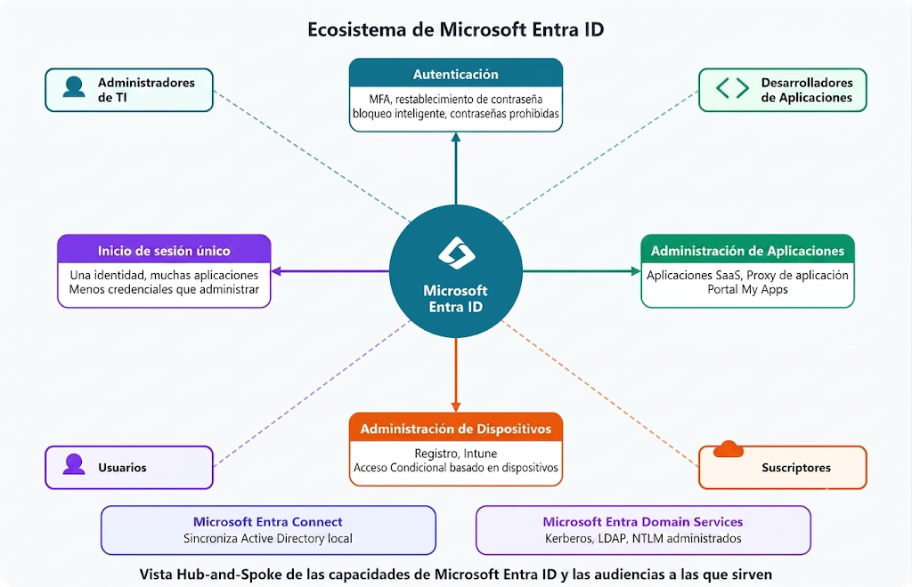

## ¿Puedo conectar mi Active Directory local con mi Microsoft Entra ID? Microsoft Entra Connect

Sin una conexión, un despliegue de AD local y un despliegue de identidades en Microsoft Entra ID en la nube requieren mantener dos conjuntos de identidades independientes. Microsoft Entra Connect puentea esa brecha.

Microsoft Entra Connect sincroniza las identidades de usuario entre Active Directory local y Microsoft Entra ID. Dado que los cambios fluyen entre ambos sistemas, los usuarios obtienen una experiencia coherente (incluido el inicio de sesión único, la autenticación multifactor y el autoservicio de restablecimiento de contraseña), tanto si acceden a recursos locales como en la nube.

## ¿Qué es Microsoft Entra Domain Services?

Microsoft Entra Domain Services es un dominio administrado en Azure que ofrece funcionalidades similares a las de Active Directory tradicional, pero como servicio en la nube (PaaS).

## **¿Cómo funciona Microsoft Entra Domain Services?**

Cuando creas un dominio administrado de Microsoft Entra Domain Services, defines un espacio de nombres único. Este “namespace” es el nombre de dominio. Después, se implementan dos controladores de dominio de Windows Server en la región de Azure seleccionada. Esta implementación de controladores de dominio se conoce como “conjunto de réplicas”.

Nota: Azure gestiona los controladores de dominio como parte del dominio administrado, incluyendo copias de seguridad y el cifrado en reposo mediante Azure Disk Encryption.

## **¿La información está sincronizada?**

La **fuente principal de identidad** debe ser **Microsoft Entra ID** (o el AD local si es un entorno híbrido). No se recomienda crear usuarios directamente en **Microsoft Entra Domain Services**, porque esos cambios **no se sincronizan de vuelta** hacia Entra ID.

# Descripción de los métodos de autenticación de Azure

**Autenticación (AuthN):** proceso mediante el cual se verifica que una entidad es quien dice ser (¿quién eres?). Algunos métodos comunes incluyen contraseñas, inicio de sesión único (SSO), autenticación multifactor (MFA) e inicio de sesión sin contraseña. Los enfoques modernos están diseñados para mejorar la seguridad sin sacrificar la comodidad.

## ¿Qué es el inicio de sesión único?

El inicio de sesión único (SSO) permite al usuario iniciar sesión una vez y acceder a varias aplicaciones de confianza. El inicio de sesión único reduce la proliferación de contraseñas, lo que disminuye el riesgo de incidentes relacionados con credenciales y disminuye el bloqueo de cuentas y la carga de restablecimientos.

## ¿Qué es la autenticación multifactor?

La autenticación multifactor (MFA) solicita a un usuario un factor adicional durante el inicio de sesión, por lo que una contraseña en peligro no es suficiente para el acceso. Estos factores se dividen en tres categorías:

- **Algo que el usuario sabe**: una contraseña o una pregunta de desafío.
- **Algo que el usuario tiene**: un código enviado a un teléfono móvil.
- **Algo que el usuario es**: una señal biométrica, como una huella digital o un examen facial.

Con MFA habilitado, un atacante que logre obtener la contraseña deberá cumplir además con un segundo factor, ya sea un OTP, un PIN o un rasgo biométrico.

## **¿Qué es la autenticación multifactor de Microsoft Entra?**

La autenticación multifactor de Microsoft Entra es un servicio de Microsoft que proporciona funcionalidades de autenticación multifactor. La autenticación multifactor de Microsoft Entra permite a los usuarios elegir una forma adicional de autenticación durante el inicio de sesión, como una llamada telefónica o una notificación de aplicación móvil.

Por ejemplo:

- Un inicio de sesión al entrar a nuestra cuenta del ITLA, donde nos piden un código OTP.
- Un inicio de sesión al entrar a nuestra cuenta de Microsoft Outlook, donde nos piden una llamada.

## ¿Qué es la autenticación sin contraseña?

Aunque MFA agrega seguridad, las contraseñas en sí mismas siguen siendo un desafío en cuanto a facilidad de uso y riesgo.

- Los métodos sin contraseña eliminan la contraseña por completo y la reemplazan por un dispositivo de confianza más una señal biométrica o un PIN.

Después del registro inicial, el usuario inicia sesión con un factor que sabe o es, como un PIN o una huella digital, en lugar de escribir una contraseña.

Microsoft Entra ID admite tres opciones sin contraseña:

- Windows Hello para empresas
- Aplicación Microsoft Authenticator
- Claves de seguridad FIDO2

## Windows Hello para empresas

Windows Hello for Business usa autenticación basada en claves asimétricas. La clave privada se almacena en el dispositivo del usuario y la clave pública se registra en Microsoft Entra ID, permitiendo una autenticación sin contraseña mediante PIN o biometría.

## **Aplicación Microsoft Authenticator**

La aplicación Microsoft Authenticator también puede servir como credencial sin contraseña, convirtiendo cualquier teléfono iOS o Android en un factor de inicio de sesión seguro. Para iniciar sesión, el usuario recibe una notificación en su teléfono, coincide con un número mostrado en la pantalla y confirma con una señal biométrica (entrada táctil o cara) o PIN. No se necesita ninguna contraseña.

## **Claves de seguridad FIDO2**

FIDO2 es un estándar abierto para la autenticación sin contraseña basada en la especificación de autenticación web (WebAuthn). Las claves de seguridad FIDO2 son dispositivos de hardware resistentes al phishing (normalmente USB, aunque también disponibles con Bluetooth o NFC) que permiten la autenticación sin necesidad de nombre de usuario ni contraseña.

Por ejemplo, una YubiKey.

- La YubiKey almacena la clave privada criptográfica asociada a la identidad del usuario.

# **Descripción de identidades externas de Azure**

Una identidad externa es una persona, dispositivo o servicio que existe fuera del inquilino/entorno.

## **¿Por qué importan las identidades externas?**

A menudo, las organizaciones necesitan colaborar con asociados, proveedores y contratistas. Las identidades externas permiten a esos usuarios acceder a los recursos aprobados mediante sus credenciales existentes, mientras que el equipo sigue aplicando directivas de acceso.

Por ejemplo, un equipo de proyecto puede invitar a los usuarios de un proveedor a espacios de colaboración específicos sin crear y administrar credenciales locales independientes para cada invitado.

El proveedor de identidades externo administra la autenticación y administra la autorización para las aplicaciones con el identificador de Microsoft Entra o Azure AD B2C.

## **Funcionalidades de identidades externas**

Las siguientes funcionalidades componen identidades externas:

- **Microsoft Entra B2B Collaboration (Business-to-Business):** permite que una organización invite a **usuarios externos** para que colaboren con sus recursos sin tener que crearles una cuenta interna completa.

Nota: Usuario miembro (Member) → pertenece a la organización. / Usuario invitado (Guest) → es externo y tiene acceso limitado para colaboración.

- **Microsoft Entra B2B Direct Connect:** permite establecer una relación de confianza entre dos organizaciones de Microsoft Entra ID para colaborar directamente sin crear usuarios invitados en el directorio. Cada organización mantiene el control y administración de sus propios usuarios, mientras los usuarios externos pueden acceder a recursos compartidos (como canales compartidos de Microsoft Teams) usando su propia identidad.
- **Id. externo de Microsoft Entra para clientes:** Microsoft Entra External ID para clientes permite a las organizaciones administrar la identidad y el acceso de clientes que utilizan sus aplicaciones SaaS o aplicaciones personalizadas, sin convertirlos en usuarios internos de la organización.

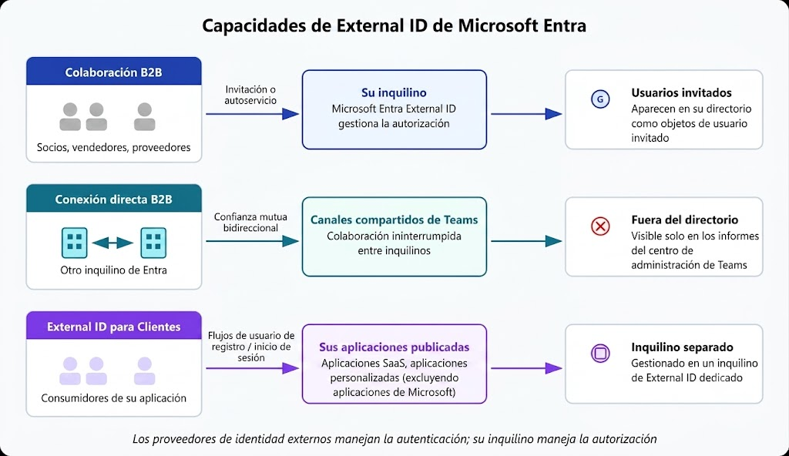

## **Gestionar el acceso de invitados a lo largo del tiempo**

Microsoft Entra ID permite gestionar el acceso de usuarios invitados mediante revisiones periódicas de acceso, verificando que los permisos asignados sigan siendo necesarios y eliminando accesos que ya no cumplen una función. Es como una auditoría de vez en cuando para validar que los permisos y accesos estén funcionando bien.

## **Descripción del acceso condicional de Azure**

El acceso condicional es una herramienta que usa Microsoft Entra ID para permitir (o denegar) el acceso a los recursos en función de señales de identidad. Estas señales incluyen lo siguiente:

- quién es el usuario
- dónde se encuentra
- desde qué dispositivo solicita el acceso

Con el acceso condicional, los administradores de TI pueden:

- permitir a los usuarios ser productivos en cualquier momento y lugar;
- proteger los recursos críticos.

El acceso condicional también proporciona una experiencia de autenticación multifactor más pormenorizada para los usuarios.

Por ejemplo:

Es posible que a un usuario no se le pida un segundo factor de autenticación si se encuentra en una ubicación conocida (empresa). Pero si sus señales de inicio de sesión son inusuales o su ubicación es inesperada (exterior, China), es posible que se le exija un segundo factor de autenticación.

Nota: durante el inicio de sesión, el acceso condicional recopila señales del usuario, toma decisiones basadas en esas señales y, después, aplica esa decisión para permitir o denegar la solicitud de acceso, o bien exigir una respuesta de autenticación multifactor.

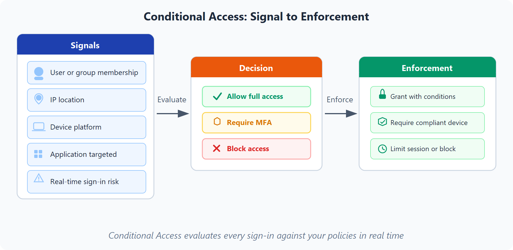

## **¿Cuándo se puede usar el acceso condicional?**

Exige la autenticación multifactor (MFA) para acceder a una aplicación en función del rol, la ubicación o la red del solicitante.

- Por ejemplo, podrías requerir MFA para administradores o para personas que se conectan desde ubicaciones de red externas de confianza.

Permite controlar el acceso a servicios mediante aplicaciones cliente aprobadas, asegurando que los usuarios solo utilicen aplicaciones autorizadas y que cumplan los requisitos de seguridad definidos por la organización.

- Por ejemplo, desde Outlook oficial → permitido, pero desde una aplicación de correo desconocida o insegura → bloqueado.

Exige que los usuarios accedan a la aplicación solo desde dispositivos administrados. Un dispositivo administrado es un dispositivo que cumple los estándares de seguridad y cumplimiento.

- Por ejemplo, podría acceder desde el dispositivo asignado por la empresa; sin embargo, desde un dispositivo raro no identificado no podría acceder.

Para bloquear el acceso desde orígenes que no son de confianza, como ubicaciones desconocidas o inesperadas.

- Por ejemplo, podría acceder desde la misma zona o empresa, pero lugares raros y remotos se bloquean o piden autenticación.

Nota: las buenas prácticas comunes de TI incluyen requerir MFA para roles con privilegios, restringir el acceso a aplicaciones confidenciales desde dispositivos no administrados y bloquear inicios de sesión de riesgo desde ubicaciones inesperadas.

# **Descripción del control de acceso basado en roles de Azure**

Cuando tenemos varios equipos de TI e ingeniería, ¿cómo podemos controlar el acceso que tienen a los recursos del entorno de nube? El principio de privilegios mínimos indica que solo debes conceder acceso al nivel necesario para completar una tarea. Si solo necesitas acceso de lectura a un blob de almacenamiento, solo se te debe conceder acceso de lectura a ese blob de almacenamiento, no acceso de escritura ni acceso a otros blobs.

Azure permite controlar el acceso a través del control de acceso basado en roles de Azure (RBAC de Azure). Azure proporciona roles integrados que describen las reglas de acceso comunes de los recursos en la nube. También podemos definir nuestros propios roles. Cada rol tiene un conjunto asociado de permisos de acceso relacionados con ese rol.

Cuando se asignan usuarios o grupos a uno o varios roles, estos reciben todos los permisos de acceso asociados. Por lo tanto, si contratas a un nuevo ingeniero y lo agregas al grupo RBAC de Azure para ingenieros, obtiene automáticamente el mismo acceso que los demás ingenieros de ese grupo.

## **¿Cómo se aplica el control de acceso basado en roles a los recursos?**

El ámbito define el nivel de recursos donde se aplican los permisos asignados a una identidad. Los permisos pueden aplicarse desde una suscripción completa hasta un recurso específico, controlando dónde un usuario o grupo puede realizar acciones.

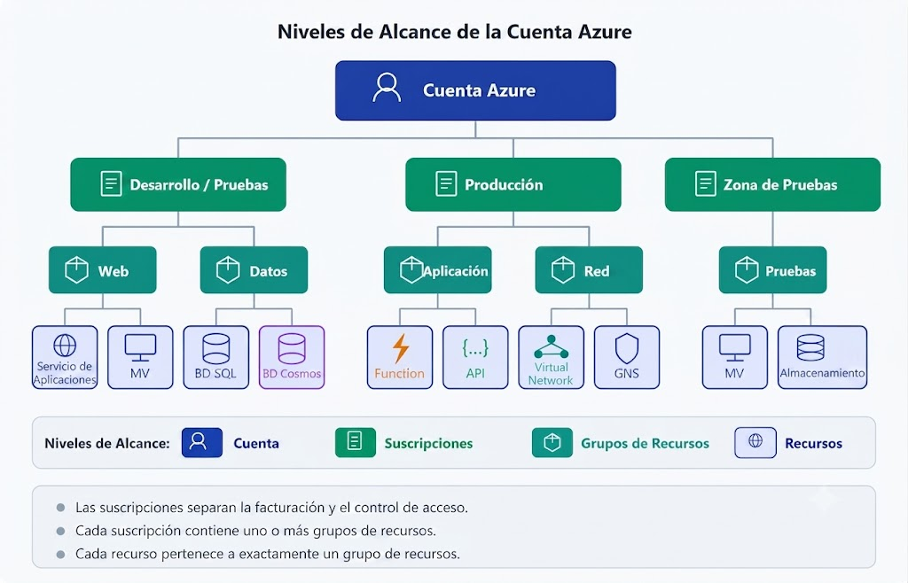

Los ámbitos pueden ser lo siguiente:

- Un grupo de administración (un conjunto de varias suscripciones)
- Una sola suscripción
- Un grupo de recursos
- Un solo recurso

RBAC de Azure es jerárquico, ya que al conceder acceso en un ámbito primario, todos los ámbitos secundarios heredan esos permisos. Por ejemplo:

- Cuando asignamos el rol Propietario a un usuario en el ámbito del grupo de administración, dicho usuario podrá administrar todo el contenido de todas las suscripciones dentro de ese grupo de administración.
- Cuando asignamos el rol Lector a un grupo en el ámbito de suscripción, los miembros de dicho grupo podrán ver todos los grupos de recursos y recursos dentro de esa suscripción.

## **¿Cómo se aplica RBAC de Azure?**

**Resource Manager** es un servicio de administración que proporciona una forma de organizar y proteger nuestros recursos en la nube.

Normalmente, se accede a Resource Manager a través de Azure Portal, Azure Cloud Shell, Azure PowerShell y la CLI de Azure. RBAC de Azure no aplica permisos de acceso en el nivel de aplicación ni de datos. La seguridad de la aplicación debe controlarla la propia aplicación.

# **Describir el modelo de confianza cero**

Confianza cero es un modelo de seguridad que supone el peor de los escenarios posibles y protege los recursos con esa expectativa. Confianza cero presupone que hay una vulneración y comprueba todas las solicitudes como si provinieran de una red no controlada.

Para abordar este nuevo mundo informático, Microsoft recomienda encarecidamente el modelo de seguridad de Confianza cero, que se basa en estos principios rectores:

- **Comprobar explícitamente**: realiza siempre las operaciones de autorización y autenticación en función de todos los puntos de datos disponibles.
- **Usar el acceso de privilegios mínimos**: JIT (Just-In-Time) proporciona privilegios elevados únicamente durante el tiempo necesario, mientras que JEA (Just-Enough-Access) limita los permisos al mínimo requerido para realizar una tarea, aplicando el principio de privilegios mínimos.
- **Asumir la brecha**: el principio de asumir brechas de Zero Trust consiste en diseñar la seguridad considerando que un atacante puede obtener acceso, por lo que se aplican segmentación, cifrado, monitoreo y análisis continuo para reducir el impacto y detectar amenazas rápidamente.

## **Adaptación a confianza cero**

Tradicionalmente, las redes basadas en perímetros estaban restringidas, protegidas y, por lo general, eran seguras. Solo los equipos administrados se podían unir a la red, el acceso VPN estaba estrechamente controlado y los dispositivos personales estaban restringidos o bloqueados con frecuencia.

El modelo de Confianza cero revoluciona ese escenario. En lugar de suponer que un dispositivo es seguro porque está dentro de una red interna de confianza, requiere que todos los usuarios se autentiquen. Después, concede acceso basado en la autenticación, no en la ubicación.

# **Descripción de defensa en profundidad**

El objetivo de la defensa en profundidad es proteger la información y evitar que personas no autorizadas puedan sustraerla. Una estrategia de defensa en profundidad usa una serie de mecanismos para ralentizar el avance de un ataque dirigido a adquirir acceso no autorizado a los datos.

## **Capas de defensa en profundidad**

La defensa en profundidad es un enfoque de seguridad que utiliza múltiples capas de protección independientes para proteger los datos y recursos. Si una capa falla, las demás continúan reduciendo la posibilidad de acceso no autorizado o daño.

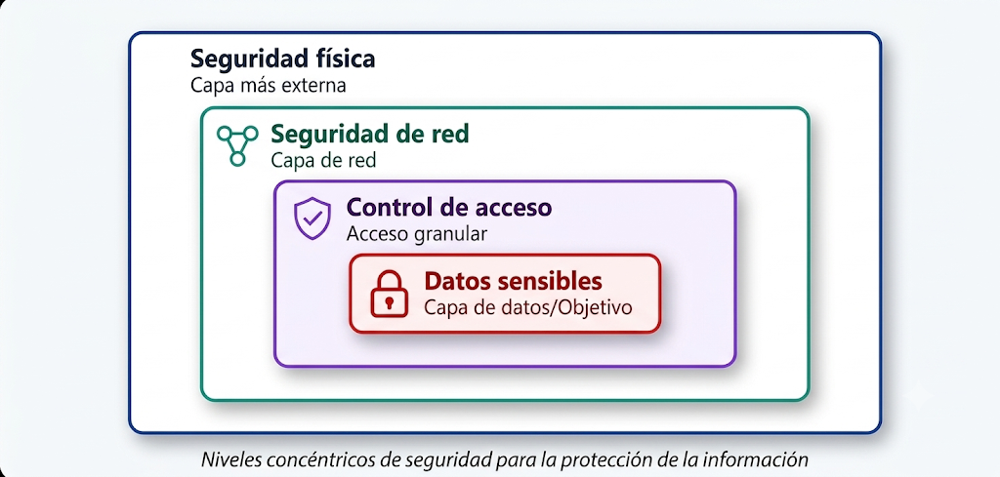

Niveles de capas de seguridad:

Aquí tienes una breve descripción del rol de cada capa:

- La capa de seguridad física es la primera línea de defensa para proteger el hardware informático del centro de datos.
- La capa de identidad y acceso controla el acceso a la infraestructura y al control de cambios.
- La capa perimetral usa protección frente a ataques de denegación de servicio distribuido (DDoS) para filtrar los ataques a gran escala antes de que puedan causar una denegación de servicio para los usuarios.
- La capa de red limita la comunicación entre los recursos a través de controles de acceso y segmentación.
- La capa de proceso protege el acceso a las máquinas virtuales.
- La capa de aplicación ayuda a garantizar que las aplicaciones sean seguras y estén libres de vulnerabilidades de seguridad.
- La capa de datos controla el acceso a los datos operativos y de cliente que necesitas proteger.

Desglose:

- **Seguridad física:** es la primera línea de defensa. Protege los centros de datos, edificios y hardware contra acceso no autorizado, robo o pérdida.
- **Identidad y acceso:** protege las identidades y controla quién puede acceder a los recursos. Utiliza mecanismos como SSO, MFA, RBAC, auditoría de eventos y control de cambios.
- **Perímetro:** protege contra ataques externos basados en red. Incluye protección DDoS, firewalls y monitoreo de amenazas.
- **Red:** controla la comunicación entre recursos para reducir la propagación de ataques. Aplica segmentación, denegación predeterminada y conexiones seguras.
- **Cómputo:** protege los recursos de procesamiento como máquinas virtuales y dispositivos. Incluye actualizaciones, protección de endpoints y controles de acceso.
- **Aplicación:** integra seguridad durante el desarrollo de software para reducir vulnerabilidades. Incluye desarrollo seguro, protección de secretos con herramientas como Azure Key Vault y seguridad desde el diseño.
- **Datos:** es la capa central que busca proteger la información. Incluye control de acceso, cifrado en reposo y en tránsito, y protección de claves mediante servicios como Azure Key Vault.

# **Descripción del cifrado y la administración de claves en Azure**

El cifrado ayuda a proteger la confidencialidad de los datos, haciendo que no sean legibles para usuarios no autorizados. A este proceso también se le conoce como encriptación.

## **Cifrado en reposo y en tránsito**

En Azure, el cifrado se describe normalmente en dos formas:

- El cifrado en reposo protege los datos cuando se almacenan, como en bases de datos, discos y cuentas de almacenamiento.
- El cifrado en tránsito protege los datos mientras se mueven entre servicios, aplicaciones y usuarios.

Por lo general, una postura de seguridad sólida incluye ambos.

#### **Ejemplo práctico**

Considera una aplicación de línea de negocio que almacena los registros de clientes en Azure Storage y Azure SQL. Los datos deben cifrarse mientras se almacenan en esos servicios y mientras se mueven entre los niveles de aplicación, las API y los dispositivos de usuario.

## **Administración de claves con Azure Key Vault**

Azure Key Vault es un servicio para almacenar y controlar de forma segura el acceso a:

- Secretos (como cadenas de conexión y contraseñas)
- Claves de cifrado
- Certificados

El uso de Key Vault ayuda a centralizar la administración de secretos y claves en lugar de almacenar valores confidenciales directamente en archivos de configuración o código de aplicación.

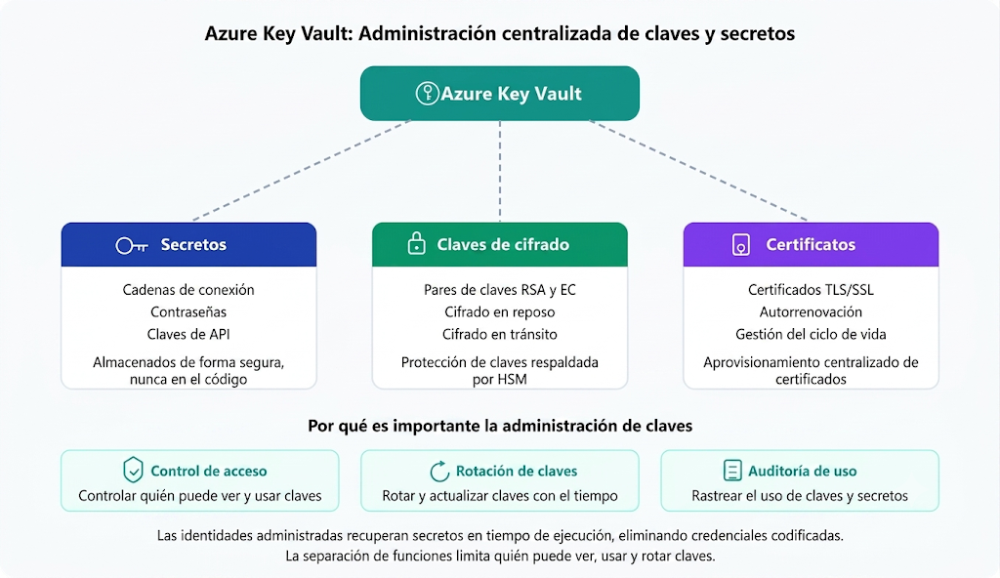

#### **¿Por qué es importante la administración de claves?**

La administración de claves admite objetivos de seguridad y cumplimiento al ayudarte a:

- Controlar quién puede acceder a las claves y los secretos.
- Rotar y actualizar claves a lo largo del tiempo.
- Auditar el uso de claves y secretos.

También puedes separar las tareas limitando quién puede ver, usar y rotar claves. Este enfoque ayuda a reducir el riesgo y admite los informes de cumplimiento. Otra práctica habitual es establecer directivas de rotación de claves y alertas para que los equipos se notifiquen antes de que expiren las claves. Esto ayuda a evitar interrupciones del servicio al mantener una higiene segura de las claves.

# **Descripción de Microsoft Defender for Cloud**

Defender for Cloud es un servicio de administración de seguridad y protección contra amenazas. Supervisa los recursos en la nube, locales, híbridos y multinube, y proporciona recomendaciones y alertas para mejorar la postura de seguridad. También te ayuda a proteger los recursos, hacer seguimiento del riesgo y responder a las amenazas.

## **Cobertura en entornos híbridos y en la nube**

Dado que Defender for Cloud es nativo de Azure, muchos servicios de Azure se pueden supervisar sin implementación adicional. En el caso de las infraestructuras híbridas y multinube, Defender for Cloud amplía la visibilidad para que los equipos de seguridad puedan trabajar desde una única plataforma de control.

Defender for Cloud puede implementar componentes de recopilación de datos para obtener información de seguridad. Azure Arc puede ampliar los planes de Microsoft Defender a máquinas que no son de Azure, y las funcionalidades de Administración de posturas de seguridad en la nube (CSPM) pueden evaluar los recursos multinube sin agente.

### **Protecciones nativas de Azure**

Defender for Cloud te permite detectar amenazas en:

- Servicios PaaS de Azure: detecta amenazas en servicios como App Service, Azure SQL y Azure Storage.
- Servicios de datos de Azure: proporciona evaluaciones y recomendaciones de seguridad de datos para servicios como Azure SQL y Storage.
- Redes: ayuda a reducir la exposición por fuerza bruta a través de controles como el acceso a máquinas virtuales Just-In-Time y las directivas de puerto restrictivas.

### **Defensa de los recursos híbridos**

Además de la cobertura de Azure, Defender for Cloud puede proteger los servidores que no son de Azure en entornos híbridos y priorizar las alertas en función de su entorno. Para ampliar la protección a las máquinas locales, implementa Azure Arc y habilita las características de seguridad mejoradas de Defender for Cloud.

### **Defensa de los recursos que se ejecutan en otras nubes**

Defender for Cloud también puede proteger los recursos de otras nubes, incluidos Amazon Web Services (AWS) y Google Cloud (GCP).

Para entornos de AWS conectados, Defender for Cloud puede:

- Ampliar las recomendaciones de CSPM y las evaluaciones de cumplimiento a los recursos de AWS.
- Ampliar las protecciones de Defender for Containers a los clústeres de Amazon EKS.
- Ampliar las protecciones de Defender para servidores a instancias EC2.

## **Evaluación, protección y defensa**

Defender for Cloud cubre tres necesidades vitales a medida que administras la seguridad de los recursos y las cargas de trabajo en la nube y en el entorno local:

### **Evaluación continua**

Defender for Cloud te ayuda a evaluar continuamente tu entorno. Incluye la evaluación de vulnerabilidades para máquinas virtuales, registros de contenedor y servidores SQL Server.

Microsoft Defender para servidores incluye integración nativa automática con Microsoft Defender para punto de conexión. Con esta integración habilitada, tendrás acceso a los hallazgos de vulnerabilidades de la Administración de Vulnerabilidades de Microsoft Defender.

Juntas, estas herramientas proporcionan visibilidad de vulnerabilidades normales en el proceso, los datos y la infraestructura a partir de una experiencia unificada.

### **Seguridad**

Defender for Cloud evalúa la seguridad de los recursos mediante Azure Policy, proporciona recomendaciones basadas en buenas prácticas y utiliza una puntuación de seguridad para medir y mejorar la postura de seguridad en Azure.

### **Defensa**

Las dos primeras áreas se centraron en evaluar, supervisar y mantener tu entorno. Defender for Cloud también defiende tu entorno proporcionando alertas de seguridad y características de protección contra amenazas avanzadas mediante la comparación de firmas digitales.

#### **Alertas de seguridad**

Cuando Defender for Cloud detecta una amenaza en cualquier área del entorno, genera una alerta de seguridad. Las alertas de seguridad incluyen:

- Descripción de los detalles de los recursos afectados.
- Sugerencia de pasos para la corrección.
- En algunos casos, una opción para desencadenar una aplicación lógica en la respuesta.

Defender for Cloud también usa análisis de cadena de eliminación para correlacionar automáticamente las alertas relacionadas, lo que te ayuda a ver la historia completa de un ataque: dónde se inició, qué recursos se vieron afectados y qué impacto tuvo.

#### **Protección contra amenazas avanzada**

Defender for Cloud proporciona protección contra amenazas avanzada para recursos como máquinas virtuales, bases de datos SQL, contenedores, aplicaciones web y redes. Entre las protecciones se incluyen el acceso a máquinas virtuales Just-In-Time y los controles de aplicación adaptables.
