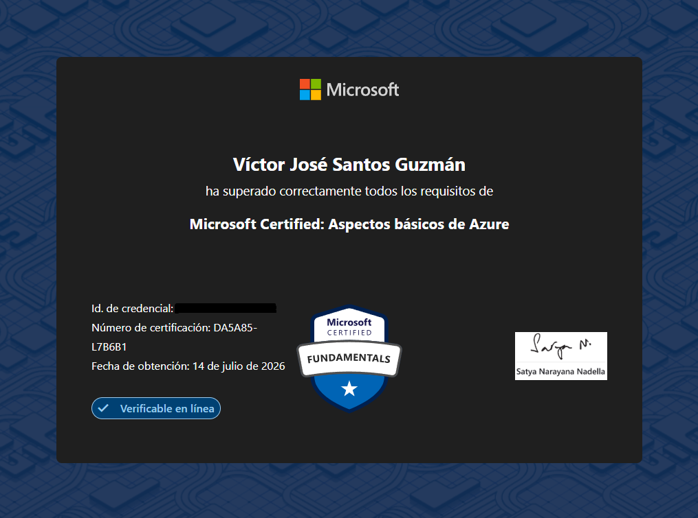

# Azure Fundamentals (AZ-900)

## Sobre la certificación

La **Microsoft Azure Fundamentals (AZ-900)** es una certificación de nivel inicial orientada a los fundamentos de la computación en la nube y los servicios de Microsoft Azure. Para mí, fue una buena oportunidad para comprender mejor cómo funciona Azure, sus principales servicios y conceptos, además de reforzar conocimientos relacionados con infraestructura, redes, seguridad y administración de recursos en la nube.

## Resultado

**Estado:** Aprobado  
**Puntaje:** 921/1000  
**Fecha:** 16 de julio de 2026

## Preparación

Mi preparación tomó aproximadamente **4 semanas**, estudiando alrededor de **2 horas al día**.

Durante el estudio intenté no depender únicamente de la memorización. Me enfoqué principalmente en comprender los conceptos de cloud computing, identificar cuándo utilizar determinados servicios de Azure y relacionarlos con escenarios prácticos.

Los temas que más trabajé fueron:

* Conceptos fundamentales de la nube
* Modelos de implementación y servicio
* Arquitectura y componentes de Azure
* Servicios de cómputo, almacenamiento y redes
* Identidad, acceso y seguridad
* Administración y gobernanza de Azure
* Costos, SLA y herramientas de administración

## Recursos

Utilicé principalmente el contenido oficial de **Microsoft Learn**, complementándolo con apuntes personales, repasos y preguntas de práctica para identificar los temas que necesitaba reforzar.

También organicé mis apuntes y recursos visuales por sección para facilitar el repaso de los diferentes objetivos de la certificación.

## Documentación

He organizado mis apuntes y material de estudio en las principales áreas de conocimiento de AZ-900:

* [01 - Conceptos de la Nube](./01-Conceptos-de-la-Nube/)
* [02 - Arquitectura y Servicios de Azure](./02-Arquitectura-y-Servicios-de-Azure/)
* [03 - Administración y Gobernanza de Azure](./03-Administracion-y-Gobernanza-de-Azure/)

Cada sección contiene conceptos, explicaciones, ejemplos y material visual utilizado durante mi preparación.

Si estás preparando la **Microsoft Azure Fundamentals (AZ-900)**, espero que estos apuntes puedan servirte como material complementario para estudiar y reforzar los fundamentos de Azure.
