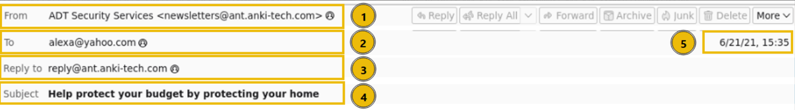
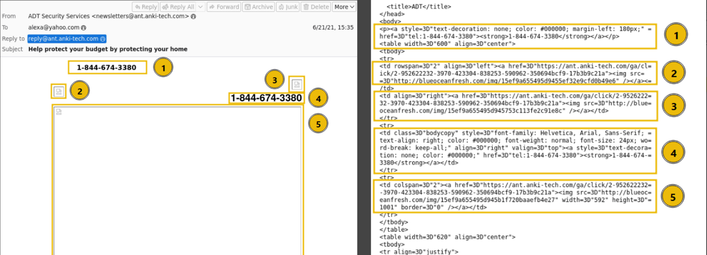

## Principios de Ingeniería Social

### Factores psicológicos

La ingeniería social aprovecha comportamientos humanos normales para conseguir que una persona realice una acción.

- **Trust (Confianza)** → generar confianza para que la víctima coopere.
- **Authority (Autoridad)** → hacerse pasar por una persona con autoridad.
- **Urgency (Urgencia)** → crear presión para que la víctima actúe rápidamente.
- **Fear (Miedo)** → provocar temor a una consecuencia.
- **Curiosity (Curiosidad)** → utilizar información llamativa para conseguir una interacción.
- **Persuasion (Persuasión)** → convencer a la víctima de realizar una acción.

Ejemplo:

- "Soy del departamento de TI, necesito que me proporciones el código MFA para validar tu cuenta."

El atacante combina **autoridad + urgencia + confianza**.

### Technical Exploitation vs Social Engineering

- **Technical Exploitation** → explota vulnerabilidades técnicas de sistemas, aplicaciones o redes.
- **Social Engineering** → explota el comportamiento y las decisiones de las personas.

Ejemplo:

- Vulnerabilidad en un servidor → Technical Exploitation.
- Convencer a un empleado para entregar sus credenciales → Social Engineering.

### Ataque de Ingeniería Social

Flujo común:

1. Reconocimiento de la víctima
2. Preparación de la historia o pretexto
3. Contacto con la víctima
4. Generación de confianza
5. Manipulación
6. Acción de la víctima
7. Obtención del objetivo

# Business Email Compromise (BEC)

Concepto:

Ataque donde el atacante utiliza la identidad o cuenta de una persona o empresa para engañar a empleados y conseguir información, dinero o realizar acciones no autorizadas.

Características:

- Suplantación de ejecutivos o empleados
- Solicitudes de transferencias
- Cambio de cuentas bancarias
- Solicitud de información confidencial
- Uso de correos aparentemente legítimos
- Puede realizarse sin malware

Ejemplo:

- Un atacante suplanta al CEO y solicita al departamento financiero realizar una transferencia urgente.

### Abuso de procesos legítimos

El atacante puede aprovechar procesos que normalmente son legítimos dentro de una empresa.

Ejemplo:

- Solicitar un cambio de cuenta bancaria de un proveedor
- Solicitar un password reset
- Solicitar acceso a un sistema
- Solicitar información de un cliente

El problema puede no estar en el sistema, sino en **cómo se valida la solicitud**.

### Verificación fuera de banda

Cuando una solicitud es sospechosa o de alto riesgo, se puede verificar mediante otro canal.

Ejemplo:

- Recibir un correo solicitando una transferencia
- Llamar directamente al responsable utilizando un número conocido
- Confirmar la solicitud antes de realizarla

# Email Authentication

## Estructura de un email recibido

### Email Header (Encabezado)

Contiene información técnica:

- From
- To
- Received (ruta del correo)
- Servidores intermedios
- IPs de origen

### Email Body (Contenido)

- Texto del mensaje
- Formato: plain text o HTML

### Anatomia de un Mail

- **From (Remitente)**
Quién envía el correo. Puede estar falsificado (spoofing).
- **To (Destinatario)**
A quién va dirigido el correo. Puede ser uno o varios usuarios.
- **Reply-To**
Dirección a la que se responde. En phishing suele ser diferente al From.
- **Subject (Asunto)**
Título del correo. Se usa para llamar atención o generar urgencia.
- **Date (Fecha)**
Fecha y hora de envío. Puede ayudar a detectar inconsistencias.



## Análisis de phishing (headers)

Se usa para identificar:

- Spoofing (remitente falso)
- Ruta real del correo
- Servidores intermedios
- IP de origen
- Inconsistencias en autenticación

## Visualización del correo

Herramientas:

- Ver original del correo
- Ctrl + U (código fuente)
- Buscar con Ctrl + F



Permite analizar:

- Headers completos
- URLs ocultas
- Código HTML malicioso

## SPF

**Sender Policy Framework**

Permite indicar qué servidores están autorizados para enviar correos en nombre de un dominio.

Ejemplo:

```
dominio.com → servidores autorizados para enviar correo
```

Características:

- Ayuda a detectar spoofing
- Se publica mediante DNS
- Verifica el servidor que envía el correo
- No garantiza que el contenido sea legítimo

Importante:

**SPF válido ≠ correo legítimo**

## DKIM

**DomainKeys Identified Mail**

Utiliza una firma criptográfica para verificar que el correo está asociado con un dominio y que determinadas partes del mensaje no fueron modificadas.

Características:

- Utiliza criptografía
- Permite validar la firma del dominio
- Ayuda a detectar modificaciones
- Utiliza registros DNS

Importante:

**DKIM válido ≠ correo seguro**

Un atacante puede utilizar un dominio que controla y enviar un correo malicioso con una firma DKIM válida.

## DMARC

**Domain-based Message Authentication, Reporting and Conformance**

Permite establecer una política para los correos que no pasan las comprobaciones de autenticación y ayuda a proteger contra la suplantación de dominios.

Políticas:

- `none` → solamente monitorear
- `quarantine` → tratar el correo como sospechoso
- `reject` → rechazar el correo

DMARC utiliza principalmente:

- SPF
- DKIM
- Domain Alignment

### Diferencia clave

- **SPF** → ¿el servidor está autorizado?
- **DKIM** → ¿el correo tiene una firma válida?
- **DMARC** → ¿el correo cumple con la política de autenticación del dominio?

Importante:

**Autenticación ≠ legitimidad**

Un correo puede pasar SPF/DKIM/DMARC y seguir siendo una estafa.

# Human Decision-Making Under Pressure

## Cognitive Load

Concepto:

Cantidad de información y decisiones que una persona debe procesar en un momento determinado.

Cuando existe demasiada información, la capacidad de analizar correctamente puede disminuir.

Ejemplo:

- Muchos correos
- Muchas tareas
- Poco tiempo
- Una alerta urgente

El usuario puede actuar sin revisar correctamente la solicitud.

## Time Pressure

La presión de tiempo puede hacer que una persona tome decisiones rápidamente sin verificar la información.

Ejemplo:

> "Su cuenta será bloqueada en 5 minutos."
> 

El atacante intenta evitar que la víctima analice la situación.

## Distracción

El atacante puede utilizar una situación que distraiga a la víctima para reducir su capacidad de análisis.

Ejemplo:

- El usuario está ocupado
- recibe una llamada inesperada
- recibe una solicitud urgente
- realiza la acción sin verificar

## Social Norms

Las personas normalmente intentan:

- Ayudar a otros
- Ser educadas
- Respetar autoridades
- Cumplir con solicitudes laborales
- Evitar conflictos

Los atacantes pueden aprovechar estos comportamientos.

### Importante

Incluso un usuario capacitado puede cometer errores debido a:

- Presión
- Fatiga
- Distracción
- Urgencia
- Autoridad aparente
- Sobrecarga de trabajo

# Vishing & Interactive Attacks

## Vishing

Concepto:

Ataque de ingeniería social realizado mediante llamadas de voz para engañar a una persona.

Características:

- Suplantación de identidad
- Presión psicológica
- Urgencia
- Solicitud de información
- Manipulación en tiempo real

Ejemplo:

> "Soy del departamento de seguridad, detectamos un inicio de sesión sospechoso y necesitamos verificar su código."
> 

## Caller ID

El número mostrado en una llamada **no debe considerarse una prueba absoluta de identidad**.

Puede existir **Caller ID Spoofing**, donde el atacante manipula el número mostrado.

### Identity Assumptions

Las personas pueden asumir que alguien es legítimo porque:

- Conoce su nombre
- Conoce su puesto
- Conoce información de la empresa
- Utiliza un número aparentemente legítimo
- Utiliza lenguaje profesional

Pero esta información puede haber sido obtenida previamente mediante reconocimiento.

# Help Desk & Support Attacks

Los departamentos de soporte pueden ser objetivos de ingeniería social porque tienen capacidad para realizar acciones administrativas.

Un atacante puede intentar:

- Resetear una contraseña
- Registrar un nuevo dispositivo
- Cambiar información de una cuenta
- Desactivar MFA
- Obtener información interna
- Obtener acceso a una cuenta

Ejemplo:

> "Perdí mi teléfono y no puedo acceder al MFA. Necesito que lo desactives para poder entrar."
> 

Defensa:

- Verificación de identidad
- Procedimientos establecidos
- No confiar únicamente en información proporcionada por el solicitante
- Escalación de solicitudes sensibles
- Registro de acciones administrativas

# MFA Abuse

Aunque MFA mejora significativamente la seguridad, también puede ser objetivo de ingeniería social.

## MFA Fatigue

Concepto:

Técnica donde el atacante genera múltiples solicitudes MFA esperando que la víctima acepte una por error o cansancio.

Ejemplo:

1. Atacante obtiene usuario y contraseña.
2. Intenta iniciar sesión.
3. La víctima recibe múltiples solicitudes MFA.
4. La víctima acepta una.
5. El atacante obtiene acceso.

## OTP / TOTP

Los códigos temporales también pueden ser obtenidos mediante ingeniería social.

Ejemplo:

> "Necesito el código que acaba de llegar para completar la verificación."
> 

Importante:

**Nunca asumir que un MFA prompt o código significa que la persona que lo solicita es legítima.**

# Authentication & Authorization

## Authentication

Proceso utilizado para comprobar **quién eres**.

Ejemplo:

- Usuario
- Password
- MFA
- Biometría

## Authorization

Determina **qué tienes permitido hacer** después de autenticarte.

Ejemplo:

- Usuario autenticado → puede acceder a su correo.
- Administrador autenticado → puede modificar configuraciones.

### Diferencia clave

- **Authentication → Who are you?**
- **Authorization → What are you allowed to do?**

# Web Impersonation & Domain Trust

## Lookalike Domains

Dominios creados para parecerse a dominios legítimos.

Ejemplo:

```
empresa.com
empresaa.com
empresa-support.com
empresa-login.com
```

También pueden utilizar:

- Typosquatting
- Caracteres similares
- Subdominios engañosos
- Palabras adicionales

## Fake Login Pages

Páginas creadas para imitar servicios legítimos.

Características:

- Logo real
- Colores similares
- Formularios de login
- URLs parecidas
- HTTPS activo

Objetivo:

- Robar usuario
- Robar password
- Robar códigos MFA
- Capturar información

# HTTPS & Certificate Trust

HTTPS:

- Cifra la comunicación entre cliente y servidor
- Ayuda a proteger los datos durante el tránsito
- Utiliza certificados digitales

Pero:

**HTTPS no significa que el sitio sea legítimo.**

Un sitio malicioso también puede utilizar HTTPS.

Ejemplo:

```
https://sitio-malicioso.com
```

Puede tener:

- HTTPS
- Certificado válido
- Candado del navegador

Y seguir siendo malicioso.

### Importante

**Candado ≠ sitio legítimo**

Siempre verificar:

- Dominio
- URL completa
- Contexto
- Identidad del sitio

# AI & Emerging Social Engineering

## AI-Assisted Phishing

La inteligencia artificial puede utilizarse para crear ataques de phishing más convincentes.

Características:

- Mejor gramática
- Personalización
- Traducción automática
- Generación rápida de mensajes
- Automatización
- Mayor cantidad de víctimas

Importante:

Los errores gramaticales ya **no son un indicador suficiente** para determinar que un correo es phishing.

## Voice Cloning

Tecnología utilizada para generar una voz sintética similar a una persona real.

Puede utilizarse para:

- Suplantar ejecutivos
- Suplantar familiares
- Realizar llamadas falsas
- Solicitar transferencias

## Deepfakes

Contenido de audio, video o imágenes generado o manipulado mediante IA para representar falsamente a una persona.

Ejemplo:

- Video falso de un ejecutivo solicitando una acción urgente.

### Impacto

Las técnicas de IA aumentan:

- Credibilidad
- Personalización
- Escalabilidad
- Velocidad de los ataques

# Detection & Reporting

## Indicadores de comportamiento sospechoso

No todos los ataques necesitan malware.

Indicadores:

- Solicitudes inesperadas
- Urgencia
- Cambios de procedimiento
- Solicitudes de credenciales
- Solicitudes financieras inusuales
- Cambios de cuentas bancarias
- Solicitudes fuera del horario habitual
- Persona que intenta evitar los procedimientos normales
- Solicitud de mantener la acción en secreto

## Reporting

Si se detecta una posible campaña de ingeniería social:

- Reportar el incidente
- No continuar interactuando con el atacante
- No eliminar información que pueda servir como evidencia
- Seguir el procedimiento de la organización
- Informar al equipo correspondiente

## Escalation

Las situaciones de mayor riesgo deben escalarse.

Ejemplo:

- Solicitud de transferencia
- Compromiso de credenciales
- Acceso administrativo
- Información sensible
- Suplantación de un ejecutivo

### Importante

**Reportar rápidamente puede ayudar a proteger a otros usuarios.**

# Organizational Visibility

La organización necesita conocer cuándo están ocurriendo ataques de ingeniería social.

Se puede obtener información mediante:

- Reportes de usuarios
- Logs
- Sistemas de correo
- Alertas de seguridad
- Incidentes registrados
- Simulaciones de phishing

Esto permite identificar:

- Campañas activas
- Usuarios afectados
- Técnicas utilizadas
- Patrones de ataque
- Áreas más vulnerables

# Defense-in-Depth

Concepto:

Uso de múltiples capas de seguridad para evitar depender de un único control.

Ejemplo:

```
Security Awareness
        ↓
MFA
        ↓
Least Privilege
        ↓
Access Control
        ↓
Approval Process
        ↓
Monitoring
        ↓
Incident Response
```

Si una capa falla, otra puede reducir el impacto.

# Role-Based Risk

No todos los usuarios representan el mismo nivel de riesgo.

Ejemplos:

- **Finance** → acceso a pagos y cuentas bancarias
- **Help Desk** → capacidad para resetear cuentas
- **Administrator** → privilegios elevados
- **CEO/CFO** → autoridad y capacidad de aprobar acciones
- **Empleado común** → menor nivel de privilegios

Por esto, los controles deben considerar:

- Rol
- Privilegios
- Acceso
- Impacto potencial

# Least Privilege

Concepto:

Cada usuario debe tener únicamente los permisos necesarios para realizar su trabajo.

Ejemplo:

Un empleado que solamente necesita consultar información no debería tener permisos para:

- Eliminar información
- Modificar configuraciones
- Crear administradores

Beneficio:

Si la cuenta es comprometida mediante ingeniería social, se limita el impacto.

# Separation of Duties

Concepto:

Dividir una acción crítica entre varias personas para evitar que una sola persona pueda realizar todo el proceso.

Ejemplo:

- Empleado solicita transferencia
- Supervisor la aprueba
- Finanzas ejecuta la operación

Esto reduce el riesgo de fraude mediante ingeniería social.

# Limiting Impact

La seguridad no debe enfocarse únicamente en **evitar que ocurra el ataque**, sino también en limitar el daño si el atacante consigue engañar a una persona.

Controles:

- Least Privilege
- MFA
- RBAC
- Approval processes
- Monitoring
- Logging
- Segregación de funciones
- Alertas
- Backups

# Security Posture

Concepto:

Estado general de seguridad de una organización y su capacidad para prevenir, detectar, responder y recuperarse de incidentes.

Una organización madura debe contar con:

- Security Awareness
- Políticas
- Procedimientos
- MFA
- Control de acceso
- Least Privilege
- Monitoring
- Logging
- Incident Response
- Reporting
- Entrenamiento
- Simulaciones
- Mejora continua

### Importante

Una buena postura de seguridad no depende únicamente de la tecnología.

Debe existir una combinación de:

**Personas + Procesos + Tecnología**

# Security Awareness Training

El entrenamiento de seguridad debe preparar a los usuarios para reconocer y reportar ataques.

Debe incluir:

- Phishing
- Vishing
- Smishing
- BEC
- MFA attacks
- Password security
- Social engineering
- Reporting procedures

El objetivo no es solamente:

> "Que el usuario no caiga."
> 

También:

> **Que el usuario pueda detectar, reportar y limitar el impacto del ataque.**
> 

# Métricas de Security Awareness

La efectividad de un programa de concientización no debe medirse únicamente por:

> "¿Cuántas personas hicieron clic?"
> 

También puede medirse:

- Cantidad de reportes
- Tiempo de reporte
- Tiempo de respuesta
- Cantidad de usuarios que identifican ataques
- Reincidencia de usuarios
- Tiempo de escalación
- Resultados de simulaciones
