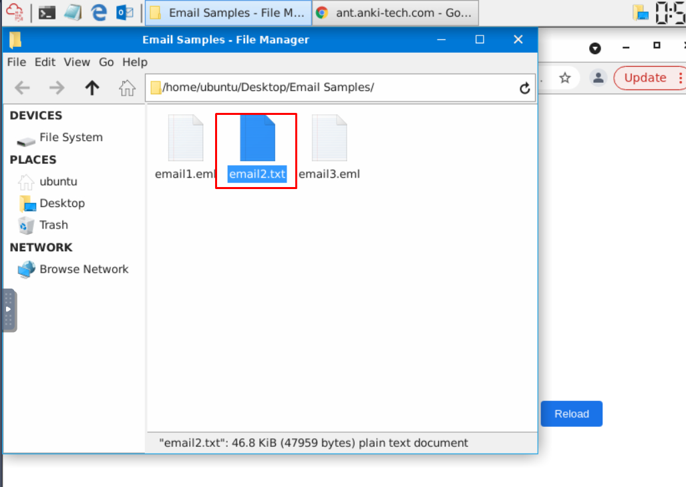
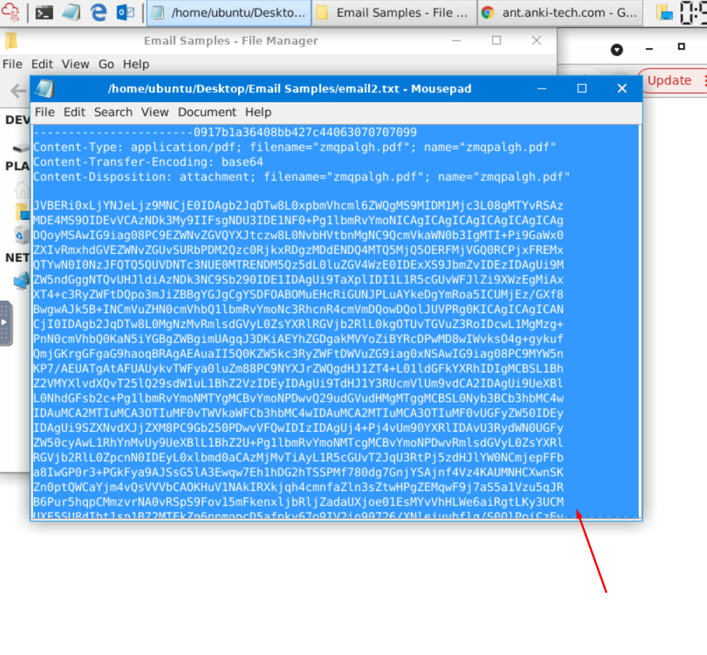
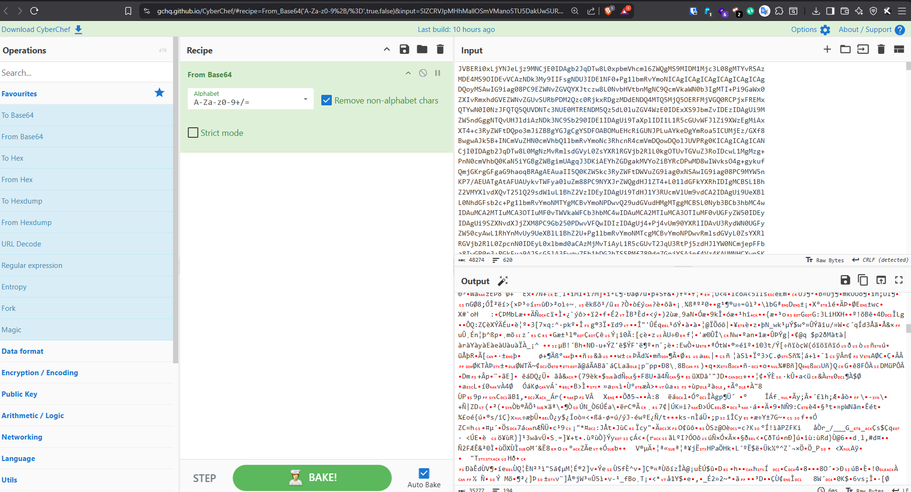
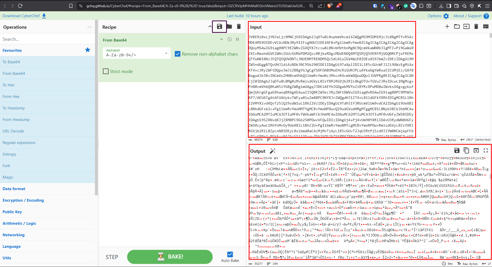
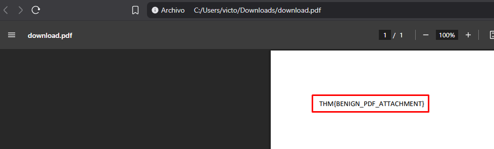

## EVIDENCIAS DE ANÁLISIS (MINI CTF)

### Paso 1: Identificación del correo sospechoso

Se identifica un correo sospechoso dentro del panel de análisis. El correo es seleccionado para realizar una inspección más detallada de su contenido y posibles elementos ocultos.

### Paso 2: Inspección del archivo del correo

Se abre el archivo `email2.txt` para revisar el contenido del correo y analizar su código fuente. Durante la inspección se buscan elementos que puedan indicar contenido oculto, ofuscado o sospechoso.

### Paso 3: Identificación de la cadena codificada

Dentro del contenido del correo se identifica una cadena codificada en **Base64**. Esta cadena no representa directamente el contenido final, por lo que es necesario decodificarla para determinar qué información contiene.

### Paso 4: Decodificación mediante CyberChef

Se utiliza **CyberChef** para realizar la decodificación de la cadena Base64. Después de aplicar la operación correspondiente, se consigue reconstruir el archivo original contenido en la cadena.

### Paso 5: Obtención del archivo y análisis de la evidencia

Después de decodificar y reconstruir el contenido, se obtiene la evidencia necesaria para completar el desafío. En este paso se identifica directamente la **flag** del Mini CTF.

### Resultado

Después de completar el análisis del correo y recuperar el archivo oculto, se obtiene la siguiente flag:

**FLAG:** `THM{BENIGN_PDF_ATTACHMENT}`
