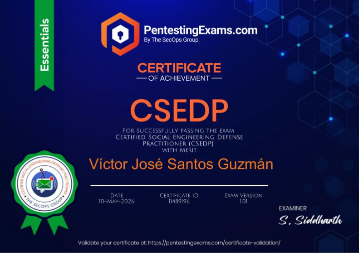

# Certified Social Engineering Defense Practitioner (CSEDP)

Este repositorio contiene mis **apuntes, material de estudio y prácticas** relacionados con la certificación **Certified Social Engineering Defense Practitioner (CSEDP)**.

El objetivo es documentar los conceptos aprendidos y utilizarlos como material de consulta y repaso.

## Certificación



## Contenido

### Apuntes

Apuntes personales sobre los principales temas de la certificación:

- [APUNTE-CSEDP](./APUNTE-CSEDP/)

### Prácticas

- [Mini CTF - Phishing Email Analysis](./Mini-CTF-Phishing-Email-Analysis/)

Práctica enfocada en el análisis de un correo electrónico sospechoso, identificación de contenido codificado, decodificación mediante **CyberChef** y recuperación de la evidencia necesaria para completar el desafío.

## Estructura

```text
Apuntes-CSEDP/
├── Images/
│   └── Certification.png
├── APUNTE-CSEDP/
│   └── README.md
├── Mini-CTF-Phishing-Email-Analysis/
│   ├── Images/
│   └── README.md
└── README.md
