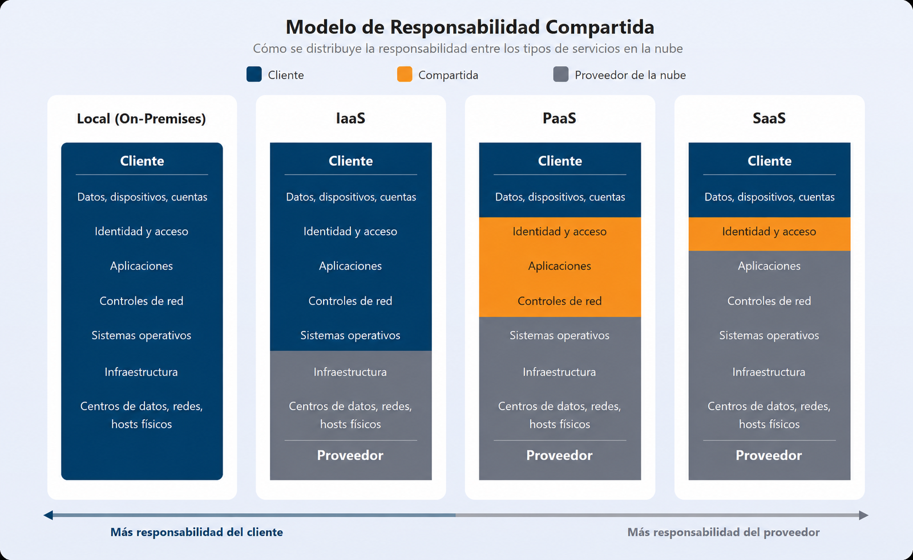
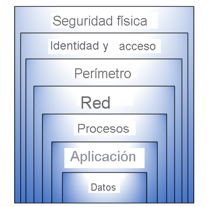
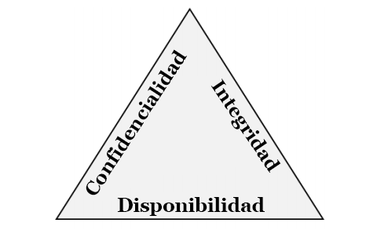
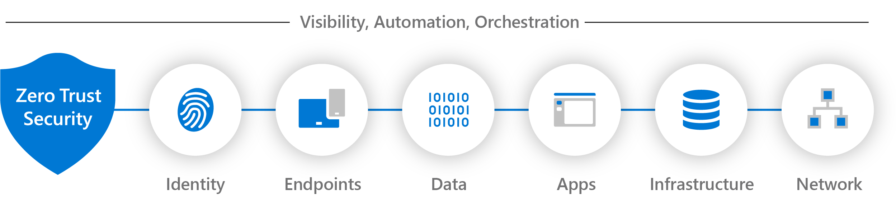
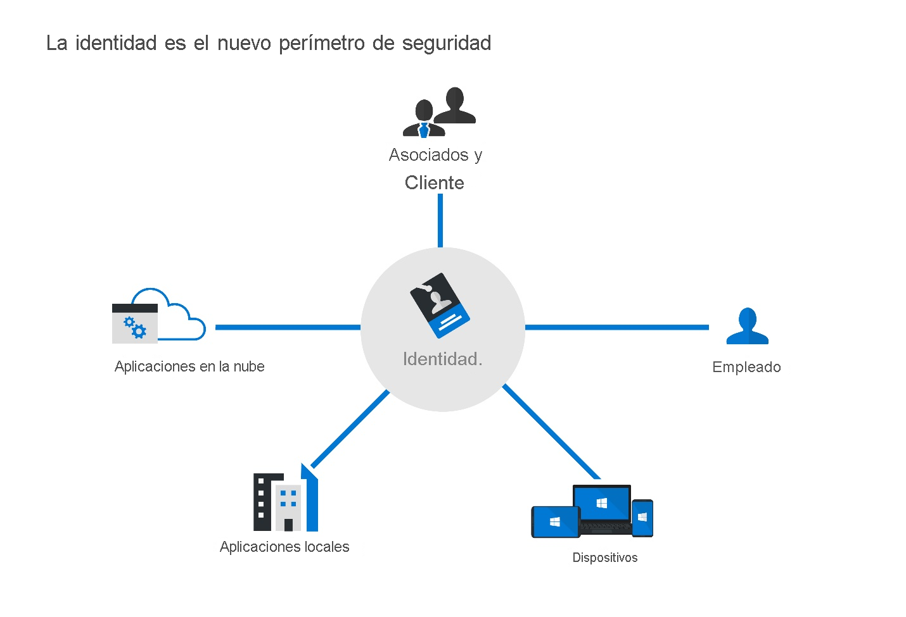

# Capitulo 1: Introducción a los conceptos de seguridad, cumplimiento e identidad

# Descripción de conceptos de seguridad y cumplimiento

### Introducción

A medida que se accede a más datos empresariales desde ubicaciones fuera de la red corporativa, la seguridad y el cumplimiento se convierten en aspectos críticos para las organizaciones de todos los tamaños. Las organizaciones deben comprender cómo proteger sus datos, ya sea en servicios de nube o con tecnologías de IA, además de cumplir con el creciente número de requisitos normativos y estándares.

### Modelo de responsabilidad compartida

Cuando se usan servicios en la nube, parte de las responsabilidades de seguridad recae sobre el proveedor. La división exacta depende del modelo de servicio en la nube utilizado:

- **En las instalaciones (On-Premises):** La organización administra y protege toda la pila tecnológica, desde las instalaciones físicas y el hardware hasta el sistema operativo, las aplicaciones y los datos.
- **Infraestructura como servicio (IaaS):** El proveedor de nube protege el centro de datos físico, el hardware de red y las máquinas host. El cliente es responsable de los sistemas operativos, las aplicaciones, los controles de red configurados y sus datos.
- **Plataforma como servicio (PaaS):** El proveedor administra la infraestructura física, el hardware, el sistema operativo y la plataforma subyacente. El cliente se encarga de las aplicaciones, los datos y la configuración de seguridad de acceso, controlando quién puede utilizar la aplicación y acceder a la información.
- **Software como servicio (SaaS):** El proveedor de nube administra toda la aplicación y su infraestructura subyacente. El cliente es responsable de la gestión de identidades y accesos, el control del uso del servicio, la gobernanza de sus datos y las configuraciones a nivel de inquilino (tenant).



#### Responsabilidades que siempre conserva el cliente

Independientemente del modelo de servicio utilizado, las siguientes responsabilidades se mantienen con nosotros como clientes:

- **Datos:** Somos responsables de los datos, incluida la clasificación de su confidencialidad, la elección de controles de seguridad, las decisiones de cifrado y el cumplimiento de los requisitos de gobernanza de datos.

> **Nota:** El proveedor de nube protege la infraestructura física donde se almacenan los datos (como los discos duros).
> 
- **Identidad y acceso:** Administrar cuentas de usuario, métodos de autenticación y permisos de acceso siempre es responsabilidad del cliente. Implementar MFA y el principio de privilegios mínimos son obligaciones clave de seguridad.
- **Puntos de conexión (Endpoints):** Un punto de conexión es un dispositivo final desde el cual un usuario o sistema accede a una red o servicio (por ejemplo, laptops, computadoras de escritorio, teléfonos móviles y tabletas). Proteger estos dispositivos recae sobre el cliente.

> **Nota:** Un atacante que comprometa un punto de conexión puede usarlo para acceder a los servicios en la nube actuando como un usuario legítimo.
> 
- **Opciones de configuración:** Las configuraciones de seguridad dentro del inquilino en la nube (cómo configurar servicios, permisos de recursos y directivas de red) son responsabilidad del cliente. Una mala configuración de privacidad o de control de acceso puede provocar la exposición de datos o un acceso no autorizado.

#### Ventajas de la seguridad en la nube

El uso de servicios en la nube no solo transfiere responsabilidades operativas, sino que también ofrece capacidades avanzadas de seguridad:

- Proveedores de nube como Microsoft invierten continuamente en seguridad física, hardware confiable, certificaciones de cumplimiento normativo, inteligencia contra amenazas (*threat intelligence*) y supervisión de seguridad a gran escala.
- Al usar servicios en la nube, nos beneficiamos automáticamente de esas inversiones en las áreas que administra el proveedor.
- En entornos locales, las brechas de seguridad suelen originarse porque los equipos operativos están sobrecargados: las actualizaciones se retrasan, el hardware queda obsoleto y sin soporte del fabricante, y las herramientas de monitoreo no cubren todos los sistemas. Al migrar a un proveedor de servicios en la nube, este asume la gestión de esa base de infraestructura.

### Modelo de responsabilidad compartida de IA

- **Plataforma de IA:** Es la base sobre la que funciona la inteligencia artificial. El proveedor (como Microsoft u OpenAI) es responsable de proteger la infraestructura física, el modelo base de IA y los controles de seguridad integrados, como la autenticación y el filtrado de contenido.
- **Aplicación de IA:** Es la solución desarrollada o configurada por la organización sobre la plataforma de IA. El cliente es responsable de los datos que utiliza, los permisos, los conectores y la configuración de la aplicación para que opere de forma segura.
- **Uso de la IA:** Se refiere a cómo los usuarios interactúan con la inteligencia artificial. La organización debe establecer políticas de uso, capacitar a los usuarios y supervisar que no se compartan datos sensibles ni se haga un uso indebido de la tecnología.

#### Lo que normalmente controla el proveedor en IA

- **Protección de la infraestructura:** El proveedor protege los centros de datos, los servidores y el entorno donde se ejecuta el modelo de IA. El cliente no gestiona la seguridad física ni el mantenimiento de esa infraestructura.
- **Controles de seguridad de la plataforma:** El proveedor incorpora mecanismos como filtros de contenido, autenticación y protecciones para mitigar riesgos y prevenir usos indebidos de la IA.
- **Administración del servicio de IA:** Mantiene disponible y seguro el servicio aplicando actualizaciones, corrigiendo vulnerabilidades y gestionando la infraestructura operativa.

#### Lo que gestiona la organización

- **Protección de los datos:** Decidimos qué información puede utilizar la IA y a qué datos tiene acceso. Si trabaja con información confidencial, debemos configurar permisos y controles para evitar accesos no autorizados.
- **Administración de identidades y acceso:** Definimos quién puede usar la IA y qué acciones puede realizar, evitando conceder permisos genéricos o excesivos.
- **Configuración segura:** Configuramos la solución de IA limitando accesos, habilitando únicamente los conectores necesarios y definiendo directivas de retención y protección de los datos generados.
- **Mitigación de riesgos de IA:** Implementamos medidas para evitar ataques específicos, como la inyección de prompts (*Prompt Injection*), donde un atacante intenta manipular a la IA mediante instrucciones maliciosas para que revele información o eluda restricciones.
- **Capacitación y políticas de uso:** Establecemos reglas claras sobre qué información se puede introducir en los sistemas de IA y capacitamos al personal en su uso seguro.

> **Resumen:**
> 
> - **Proveedor:** Protege la plataforma (infraestructura, servicio y seguridad integrada).
> - **Cliente:** Protege los datos, las identidades, la configuración y el uso de la IA.
> 
> El modelo de responsabilidad compartida, tanto en servicios de nube tradicionales como en cargas de trabajo de IA, define claramente el alcance de gobernanza y protección de cada parte.
> 

### Descripción de la defensa en profundidad

La defensa en profundidad es una estrategia que utiliza un enfoque por capas para proteger los recursos. En lugar de depender de un único perímetro, combina controles superpuestos de modo que, si una capa se ve comprometida, la siguiente impide o retrasa el avance del atacante.

*Ejemplo:* Un almacén protegido por una cerca perimetral exterior, cámaras de vigilancia, sensores de movimiento, control de acceso biométrico en la puerta principal y cerraduras individuales en los contenedores interiores.

#### Capas de defensa en profundidad

- **Seguridad física:** Limita el acceso físico a la infraestructura informática. Incluye centros de datos protegidos, personal de seguridad, reglas de dos personas (*two-person rule* / *dual control*), lectores de credenciales y sistemas de videovigilancia (CCTV) para asegurar que solo personal autorizado ingrese a las instalaciones.
- **Identidad y acceso:** Autentica y autoriza a usuarios y servicios antes de concederles acceso a los recursos. Incluye autenticación multifactor (MFA), control de acceso basado en roles (RBAC) y directivas de Acceso Condicional (*Conditional Access*) que evalúan señales como ubicación, estado del dispositivo y nivel de riesgo.
- **Seguridad perimetral:** Es la primera línea de defensa de la red. Protege el límite entre la red interna y las redes externas (Internet), evitando que amenazas externas penetren o afecten los servicios. Incluye firewalls perimetrales, sistemas de detección y prevención de intrusiones (IDS/IPS), Web Application Firewalls (WAF) y protección contra ataques de denegación de servicio distribuido (DDoS).
- **Seguridad de red:** Controla y restringe la comunicación entre recursos dentro de la red. Incluye la segmentación de redes virtuales (VNETs) y el uso de grupos de seguridad de red (NSG) para filtrar el tráfico mediante reglas de entrada y salida.
- **Seguridad de proceso (Compute):** Protege las máquinas virtuales, contenedores y demás recursos de cómputo. Incluye la aplicación periódica de parches al sistema operativo y al software, el cierre de puertos innecesarios (*hardening*), la restricción del acceso administrativo y el monitoreo de la actividad del sistema.
- **Seguridad de las aplicaciones:** Garantiza que el software se diseñe, desarrolle e implemente de forma segura. Contempla prácticas de desarrollo seguro, validación y sanitización de entradas para prevenir vulnerabilidades comunes (como inyección SQL o Cross-Site Scripting / XSS), además de controles de autenticación y autorización en la propia aplicación.
- **Seguridad de los datos:** Es la capa más interna y crítica, enfocada en proteger la información en sí misma. Incluye controles de acceso estrictos, cifrado de datos y clasificación de información para aplicar las protecciones adecuadas según su sensibilidad.



#### Importancia de la defensa en capas

La defensa en profundidad evita puntos únicos de fallo. Si un control se ve comprometido por una vulnerabilidad o un error de configuración, las capas restantes mantienen la protección. Además, facilita la detección temprana, ralentiza al atacante y limita el alcance del daño potencial (*blast radius*).

### Tríada de la CIA: Confidencialidad, integridad y disponibilidad

Las capas de defensa en profundidad convergen en los tres objetivos fundamentales de la seguridad de la información:



#### Confidencialidad

Garantiza que la información solo sea accesible para personas, procesos o sistemas autorizados. Se protege mediante cifrado, listas de control de acceso (ACL) y directivas de privilegios mínimos.

#### Integridad

Asegura que los datos se mantengan exactos, completos y libres de modificaciones o eliminaciones no autorizadas. Se protege mediante funciones hash, firmas digitales, certificados y registros de auditoría.

#### Disponibilidad

Garantiza que los sistemas, servicios y datos estén accesibles para los usuarios autorizados cuando los requieran. Se logra mediante redundancia, copias de seguridad (backups), planes de recuperación ante desastres (DR) y mitigación de ataques DDoS.

### Modelo de Confianza Cero (Zero Trust)

Zero Trust es una estrategia de seguridad basada en el principio rector: **"Nunca confiar, siempre verificar"** (*Never trust, always verify*). En lugar de asumir que todo lo que está dentro de la red corporativa es seguro, Zero Trust exige que cada solicitud de acceso sea autenticada, autorizada y cifrada explícitamente, sin importar su origen.

El enfoque tradicional utilizaba el modelo de "castillo y foso" (*castle-and-moat*): se protegía fuertemente el perímetro y se confiaba implícitamente en cualquier usuario o dispositivo dentro de la red interna. Con el auge del trabajo remoto, los servicios en la nube y los dispositivos personales (BYOD), ese límite perimetral desapareció.

Zero Trust asume que ninguna red, dispositivo, usuario o aplicación debe considerarse confiable por defecto, incluso si ya completó una autenticación previa o está conectado dentro de la red corporativa.

#### Principios rectores de Zero Trust

1. **Comprobar explícitamente:** Autenticar y autorizar siempre basándose en todos los puntos de datos y señales disponibles, en lugar de depender únicamente de una contraseña o de la ubicación de red.
    - *Señales evaluadas:* Identidad del usuario, ubicación geográfica de inicio de sesión, estado de cumplimiento y seguridad del dispositivo, servicio o aplicación solicitada, clasificación de los datos y detección de anomalías de comportamiento o riesgo de sesión.
2. **Usar acceso con privilegios mínimos:** Limitar el acceso de usuarios y servicios otorgando únicamente los permisos indispensables para la tarea, durante el tiempo necesario.
    - *Acceso justo a tiempo (JIT - Just-In-Time):* Concede permisos temporales que se revocan automáticamente una vez finalizada la tarea.
    - *Acceso suficientemente justo (JEA - Just-Enough-Administration):* Otorga solo los privilegios específicos requeridos en lugar de roles administrativos amplios.
3. **Asumir brecha de seguridad (*Assume Breach*):** Operar bajo la premisa de que los atacantes ya tienen acceso al entorno. En lugar de depender exclusivamente de las defensas perimetrales, se busca minimizar el impacto y evitar el movimiento lateral mediante:
    - Microsegmentación de redes y aplicaciones.
    - Cifrado de extremo a extremo en tránsito y en reposo.
    - Monitoreo, análisis de telemetría y detección de amenazas en tiempo real.

#### Siete pilares de Zero Trust

- **Identidades:** Verifica y autentica la identidad de usuarios, servicios y dispositivos antes de otorgar acceso, aplicando directivas de privilegios mínimos.
- **Dispositivos:** Evalúa la postura de seguridad y el cumplimiento del dispositivo (antivirus, parches, cifrado). Los equipos no conformes o comprometidos se bloquean o se aíslan.
- **Aplicaciones:** Controla qué aplicaciones se usan, detecta software no autorizado (*Shadow IT*) y gestiona los permisos y accesos dentro de cada aplicación.
- **Datos:** Identifica, clasifica, etiqueta y cifra los datos sensibles dondequiera que residan o viajen.
- **Infraestructura:** Supervisa y protege servidores, máquinas virtuales, contenedores y servicios en la nube contra vulnerabilidades y configuraciones incorrectas.
- **Redes:** Segmenta y microsegmenta la red para impedir el movimiento lateral de los atacantes, protegiendo todo el tráfico mediante cifrado.
- **Visibilidad, automatización y orquestación (VAO):** Centraliza la telemetría, eventos y alertas de todos los pilares para correlacionar amenazas y habilitar respuestas automatizadas mediante herramientas SIEM y SOAR.

| **Pilar** | **Pregunta clave** |
| --- | --- |
| **Identidades** | ¿Quién solicita acceso? |
| **Dispositivos** | ¿Desde qué equipo se conecta y qué estado tiene? |
| **Aplicaciones** | ¿A qué aplicación intenta acceder y qué permisos usa? |
| **Datos** | ¿Qué información está en uso y cómo está protegida? |
| **Infraestructura** | ¿Dónde se procesan los recursos y están protegidos? |
| **Redes** | ¿Cómo viaja el tráfico y está segmentado? |
| **VAO (SIEM/SOAR)** | ¿Cómo se monitoriza, correlaciona y responde a los incidentes? |

> **Evaluación de madurez:** Los 7 pilares permiten medir la madurez de la estrategia Zero Trust en una organización: a mayor cobertura, integración e interoperabilidad automatizada entre los pilares, mayor es el nivel de madurez y resiliencia de la organización.
> 



### Descripción de cifrado y funciones hash

#### Cifrado

El cifrado es el proceso de transformar datos legibles (texto en claro) en un formato ilegible (texto cifrado) para evitar el acceso no autorizado. Para volver a leer los datos, es necesario descifrarlos mediante una clave criptográfica.

#### Cifrado simétrico

Utiliza la misma clave secreta tanto para cifrar como para descifrar la información.

- Es computacionalmente rápido y eficiente.
- Es ideal para cifrar grandes volúmenes de datos (por ejemplo, discos duros, bases de datos o almacenamiento masivo).
- Su principal desafío es la distribución segura de la clave entre las partes.

#### Cifrado asimétrico

Utiliza un par de claves matemáticamente vinculadas:

- **Clave pública:** Se puede compartir abiertamente con cualquier persona; se usa comúnmente para cifrar datos o verificar firmas.
- **Clave privada:** Se mantiene en secreto por el propietario; se usa para descifrar datos o generar firmas digitales.
- Es más lento computacionalmente que el simétrico, por lo que suele usarse para el intercambio inicial de claves, autenticación y firmas digitales.

#### Firma digital

Mecanismo basado en criptografía asimétrica que garantiza:

- **Autenticidad:** Confirma la identidad del emisor.
- **Integridad:** Asegura que el mensaje o archivo no fue alterado durante el tránsito.
- **No repudio:** Evita que el emisor niegue haber firmado o enviado la información.

#### Estados de los datos y su cifrado

- **Datos en reposo (*Data at Rest*):** Información almacenada en un soporte físico o digital (discos duros, bases de datos, almacenamiento en la nube). Se protege mediante cifrado de almacenamiento (por ejemplo, BitLocker en sistemas Windows o directivas de cifrado del proveedor de nube).
- **Datos en tránsito (*Data in Transit*):** Información que viaja a través de una red (Internet, red local o entre centros de datos). Se protege mediante protocolos de comunicación seguros como TLS (Transport Layer Security) sobre HTTPS o túneles VPN para evitar intercepciones (*Man-in-the-Middle* / MitM).
- **Datos en uso (*Data in Use*):** Información que está siendo procesada activamente por la memoria (RAM) o el procesador (CPU). Se protege mediante tecnologías de computación confidencial (*Confidential Computing*), que aíslan los datos en enclaves seguros basados en hardware durante su procesamiento.

#### Administración de claves criptográficas

La seguridad del cifrado depende directamente de la protección y administración de las claves. Si una clave es comprometida, el cifrado pierde toda su efectividad.

Buenas prácticas en la gestión de claves:

- **Separación de claves y datos:** Almacenar siempre las claves en un entorno independiente del lugar donde residen los datos cifrados.
- **Uso de módulos HSM (*Hardware Security Modules*):** Dispositivos de hardware dedicados y resistentes a manipulaciones físicas y lógicas, diseñados para generar, almacenar y gestionar claves criptográficas.
- **Rotación periódica de claves:** Cambiar las claves de forma regular para limitar la cantidad de datos expuestos si una clave llegase a verse comprometida.
- **Control de acceso estricto:** Aplicar autenticación robusta y privilegios mínimos sobre quién o qué servicio puede solicitar operaciones criptográficas con las claves.
- **Servicios centralizados de claves:** Uso de herramientas de gestión como Azure Key Vault para centralizar el almacenamiento seguro de claves, secretos y certificados.

#### Funciones hash (Hashing)

El hashing utiliza un algoritmo matemático para transformar una entrada de datos de cualquier tamaño en una cadena de longitud fija llamada hash o resumen (*digest*).

Propiedades del hashing:

- **Unidireccional:** Es un proceso de una sola vía; no es posible revertir un valor hash para recuperar los datos originales.
- **Determinista:** La misma entrada procesada con el mismo algoritmo siempre producirá exactamente el mismo valor hash.
- **Efecto avalancha:** Un cambio mínimo en la entrada (incluso un solo bit) genera un hash completamente diferente.

#### Protección de contraseñas mediante hash

Los sistemas modernos no almacenan contraseñas en texto claro; almacenan su valor hash:

1. El usuario ingresa su contraseña.
2. El sistema calcula el hash de la contraseña ingresada.
3. Compara el nuevo hash con el hash almacenado en la base de datos.
4. Si coinciden, se concede el acceso.

> **Riesgo:** Si una base de datos de hashes se filtra, los atacantes pueden utilizar ataques de diccionario o tablas de contraseñas precalculadas (*Rainbow Tables*) para averiguar las contraseñas originales.
> 

#### Salting

El *salt* consiste en añadir una cadena aleatoria y única a la contraseña antes de aplicarle la función hash. Esto hace que contraseñas idénticas generen hashes completamente diferentes, neutralizando el uso de tablas arcoíris (*Rainbow Tables*) y complicando los ataques de diccionario.

### Gobernanza, riesgo y cumplimiento (GRC)

GRC es un marco integrado de prácticas mediante el cual las organizaciones gestionan su estrategia de ciberseguridad, evalúan riesgos y garantizan el cumplimiento de las normativas aplicables.

#### Gobernanza

Es el sistema de directivas, procesos y responsabilidades utilizado para dirigir y controlar la seguridad de una organización. Define la dirección estratégica y las políticas internas.

Actividades clave de gobernanza:

- Definición de directivas de clasificación, retención y protección de datos.
- Establecimiento de estándares de administración de identidades y accesos (IAM).
- Implementación de procesos de aprobación para accesos con privilegios.
- Asignación de roles y responsabilidades sobre los controles de seguridad.

#### Riesgo

La gestión de riesgos es el proceso continuo de identificar, evaluar y responder a amenazas que puedan comprometer la seguridad o la continuidad de la organización.

- **Riesgos externos:** Ciberataques, desastres naturales, fallos de proveedores terceros y cambios normativos.
- **Riesgos internos:** Fuga de datos accidental por empleados, amenazas internas (*insider threats*), errores de configuración y brechas en procesos.

Fases del ciclo de gestión de riesgos:

1. **Identificar:** Detectar amenazas y vulnerabilidades que puedan afectar los activos de información.
2. **Evaluar:** Determinar la probabilidad y el impacto potencial de cada riesgo para priorizar su atención.
3. **Responder:** Aplicar una estrategia de tratamiento según la tolerancia al riesgo:
    - *Mitigar:* Implementar controles para reducir la probabilidad o el impacto.
    - *Aceptar:* Asumir el riesgo residual cuando su impacto está dentro de los límites tolerables.
    - *Transferir:* Trasladar el impacto financiero o legal a un tercero (por ejemplo, mediante pólizas de ciberseguro).
    - *Evitar:* Eliminar la actividad o el proceso que genera el riesgo.
4. **Supervisar:** Monitorear continuamente los riesgos y la efectividad de los controles implementados.

#### Cumplimiento normativo

Es la adhesión a las leyes, reglamentos, estándares de la industria y directivas contractuales aplicables según el sector y la ubicación geográfica de la organización.

Marcos y normativas frecuentes:

- **HIPAA:** Regulación estadounidense enfocada en la privacidad y seguridad de los datos médicos y de salud.
- **ISO/IEC 27001:** Estándar internacional para la implementación y certificación de Sistemas de Gestión de Seguridad de la Información (SGSI).
- **SOC 2:** Marco de auditoría para proveedores de servicios que evalúa controles de seguridad, disponibilidad, integridad, confidencialidad y privacidad.

> **Cumplimiento vs. Seguridad:** El cumplimiento establece una línea base obligatoria de requisitos legales y regulatorios. La seguridad abarca el conjunto completo de prácticas, tecnologías y procesos necesarios para proteger la organización frente a amenazas reales, yendo habitualmente más allá del cumplimiento mínimo.
> 

#### Residencia, soberanía y privacidad de datos

- **Residencia de datos:** Se refiere a la ubicación geográfica física donde se almacenan y procesan los datos.
- **Soberanía de datos:** Principio legal que establece que los datos están sujetos a las leyes y jurisdicciones del país donde se recopilan, almacenan o procesan.
- **Privacidad de datos:** Derechos de los individuos respecto al control, recopilación, uso y divulgación de su información de identificación personal (PII).

## Descripción de los conceptos de identidad

### Autenticación y autorización

Son los dos pilares del control de acceso en cualquier infraestructura tecnológica:

```
[Usuario / Entidad] ──(1. Autenticación: ¿Quién eres?)──> [Proveedor / Sistema] ──(2. Autorización: ¿Qué puedes hacer?)──> [Recursos]
```

#### Autenticación

Es el proceso de verificar y confirmar que una identidad es quien afirma ser mediante la presentación de credenciales válidas.

Factores de autenticación:

- **Algo que sabes:** Información conocida (contraseña, PIN, clave de paso).
- **Algo que tienes:** Un objeto físico o digital en posesión (dispositivo móvil, token de seguridad FIDO2, tarjeta inteligente).
- **Algo que eres:** Biometría inherente al usuario (huella dactilar, reconocimiento facial, escaneo de iris).

Tipos de esquema:

- **Autenticación de un solo factor (SFA):** Requiere un único elemento (como una contraseña). Es susceptible a robo de credenciales y ataques de fuerza bruta.
- **Autenticación multifactor (MFA):** Exige dos o más factores pertenecientes a distintas categorías (por ejemplo, contraseña + notificación push o token en dispositivo).

#### Autorización

Es el proceso que evalúa los permisos asignados a una identidad previamente autenticada para determinar a qué recursos específicos (archivos, aplicaciones, APIs) puede acceder y qué operaciones tiene permitido ejecutar (lectura, escritura, modificación, eliminación).

Criterios comunes de autorización:

- **Roles (RBAC):** Permisos asociados a una función dentro del sistema o la organización.
- **Atributos (ABAC):** Políticas basadas en atributos como departamento, ubicación, tipo de dispositivo o nivel de riesgo.
- **Permisos directos:** Asignaciones explícitas sobre un recurso particular.

#### Relación entre autenticación y autorización

Siempre se ejecutan en secuencia:

1. La **autenticación** ocurre primero para validar la identidad.
2. La **autorización** ocurre a continuación para definir el alcance de acceso permitido a esa identidad.

### La identidad como perímetro de seguridad principal

En los modelos de trabajo modernos, los usuarios acceden a recursos distribuidos en múltiples nubes y centros de datos desde dispositivos remotos y redes públicas. El perímetro de red tradicional (firewalls y VPNs) ya no es suficiente para delimitar el acceso seguro.

La **identidad** se convierte en el nuevo límite de control principal: la seguridad ya no asume confianza basada en la ubicación física o de red del usuario, sino en la validación continua y dinámica de la identidad y del contexto de cada solicitud de acceso.

#### Tipos de identidades

- **Identidades humanas:** Personas físicas (empleados, contratistas, clientes, proveedores) que inician sesión para interactuar con sistemas y datos.
- **Identidades de dispositivos:** Equipos físicos o virtuales (laptops, teléfonos móviles, servidores, dispositivos IoT) que se inscriben en sistemas de gestión para validar su postura de seguridad y cumplimiento.
- **Identidades de carga de trabajo (*Workload Identities*):** Software, servicios, aplicaciones, procesos desatendidos o contenedores que requieren autenticarse para interactuar con bases de datos y APIs sin intervención humana directa.
- **Identidades de agentes (*Agent Identities*):** Agentes de IA o procesos autónomos que ejecutan tareas, acceden a recursos o interactúan con otros sistemas en representación de usuarios o servicios.



#### Cuatro pilares de una infraestructura de identidad

1. **Administración (Gobernanza del ciclo de vida):** Aprovisionamiento, actualización de roles y desaprovisionamiento de identidades conforme los usuarios entran, cambian de función o salen de la organización.
2. **Autenticación:** Comprobación rigurosa de que la entidad es quien afirma ser mediante credenciales válidas y MFA.
3. **Autorización:** Asignación y evaluación contextual de privilegios y accesos a los recursos.
4. **Auditoría y supervisión:** Registro y análisis de los eventos de inicio de sesión y uso de permisos para detectar anomalías y garantizar la trazabilidad.

### Rol del proveedor de identidades (IdP)

Un proveedor de identidades (IdP) es un servicio centralizado que crea, mantiene y gestiona la información de identidad, encargándose de la autenticación de usuarios y entidades para delegar de forma segura esa validación a diferentes aplicaciones y servicios.

#### Beneficios de centralizar la autenticación

- **Elimina la dispersión de credenciales:** Evita que los usuarios utilicen contraseñas distintas o reutilizadas en cada aplicación individual.
- **Directivas de seguridad homogéneas:** Permite aplicar políticas consistentes de MFA, complejidad y Acceso Condicional a todas las aplicaciones desde un único punto.
- **Reducción de sobrecarga operativa:** Al desvincular o deshabilitar un usuario en el IdP, se revoca inmediatamente su acceso a todos los servicios conectados.
- **Supervisión unificada:** Permite centralizar los registros de inicio de sesión y correlacionar comportamientos anómalos en todo el ecosistema tecnológico.

#### Tokens de seguridad y notificaciones (*Claims*)

Cuando el IdP autentica con éxito a un usuario, emite un token de seguridad firmado digitalmente. Este token contiene notificaciones (*claims*), que son fragmentos de información sobre el usuario (nombre, ID, correo electrónico, grupos, roles y vigencia del token).

- **Token de identificación (ID Token):** Utilizado por la aplicación para conocer la identidad del usuario autenticado (autenticación).
- **Token de acceso (Access Token):** Presentado a una API o servicio para demostrar que la identidad tiene autorización para ejecutar determinadas operaciones (autorización).

#### Protocolos de autenticación y federación

- **OpenID Connect (OIDC):** Capa de identidad construida sobre OAuth 2.0; se utiliza para autenticar usuarios mediante la emisión de ID Tokens.
- **OAuth 2.0:** Marco de autorización que permite a aplicaciones delegar accesos a recursos sin compartir las credenciales del usuario.
- **SAML 2.0 (*Security Assertion Markup Language*):** Estándar basado en XML ampliamente utilizado en entornos empresariales para habilitar inicio de sesión único y federación entre dominios.

#### Inicio de sesión único (SSO)

El inicio de sesión único (*Single Sign-On*) permite que un usuario se autentique una sola vez ante el IdP y acceda automáticamente a múltiples aplicaciones y recursos autorizados sin necesidad de reintroducir sus credenciales.

### Servicios de directorio y Active Directory

Un directorio es un repositorio estructurado y jerárquico que almacena y organiza información sobre los objetos de una red (usuarios, grupos, equipos, impresoras, directivas y aplicaciones).

#### Active Directory Domain Services (AD DS)

Es el servicio de directorio tradicional de Microsoft para entornos locales, introducido en Windows 2000 Server. Un servidor que ejecuta el rol de AD DS se denomina **Controlador de Dominio (DC)**.

Características y ventajas de AD DS:

- **Identidad centralizada local:** Permite administrar accesos a recursos locales (carpetas compartidas, servidores, estaciones de trabajo) con una sola cuenta de dominio.
- **Directivas de grupo (GPO):** Permite configurar y asegurar de forma masiva los sistemas operativos y configuraciones de usuario en el dominio.
- **Protocolos tradicionales:** Utiliza protocolos de autenticación locales basados en Kerberos y NTLM, además de LDAP para consultas al directorio.
- **Unidades organizativas (OU):** Contenedores lógicos dentro del dominio para estructurar objetos por departamentos, ubicaciones o funciones.

Limitaciones de AD DS frente a entornos modernos:

- No está diseñado de forma nativa para autenticar aplicaciones SaaS ni servicios en la nube sin componentes adicionales.
- No gestiona de forma nativa dispositivos móviles (iOS, Android).
- No utiliza protocolos web modernos como OIDC o SAML de manera directa.
- Los usuarios remotos requieren conectividad de red directa (como VPN) para alcanzar los controladores de dominio.

#### Microsoft Entra ID

Microsoft Entra ID es la solución de administración de identidades y accesos basada en la nube de Microsoft (modelo IDaaS - *Identity as a Service*).

- Ofrece compatibilidad nativa con protocolos web modernos (OIDC, OAuth 2.0, SAML).
- Permite el acceso seguro a aplicaciones SaaS, servicios en la nube y recursos locales sin necesidad obligatoria de VPNs tradicionales.
- Admite escenarios de **identidad híbrida**, permitiendo sincronizar identidades de AD DS local hacia Microsoft Entra ID (mediante herramientas como Microsoft Entra Connect) para que los usuarios mantengan una única identidad en ambos entornos.

### Concepto de federación

La federación es un mecanismo que establece una relación de confianza entre dos o más dominios o proveedores de identidad independientes. Permite que usuarios de una organización accedan a recursos de otra utilizando sus credenciales de origen, sin necesidad de crear una cuenta duplicada en el destino.

1. **Colaboración empresa a empresa (B2B):**
    - Dos organizaciones independientes necesitan compartir aplicaciones o datos.
    - El usuario se autentica contra el IdP de su propia empresa y accede a los recursos compartidos en la organización externa mediante tokens de confianza.
2. **Inicio de sesión con proveedores sociales e identidades externas:**
    - Las aplicaciones delegan la autenticación en proveedores públicos reconocidos (como Google, Microsoft o GitHub).
    - La aplicación confía en el token devuelto por el proveedor social tras validar al usuario.
3. **Integración con identidad local (mediante AD FS o federación en la nube):**
    - Organizaciones con AD DS local configuran servicios de federación (como Active Directory Federation Services - AD FS o federación directa con Microsoft Entra ID).
    - El usuario se valida contra su directorio local y el servicio de federación genera los tokens necesarios para consumir aplicaciones en la nube de forma transparente.
