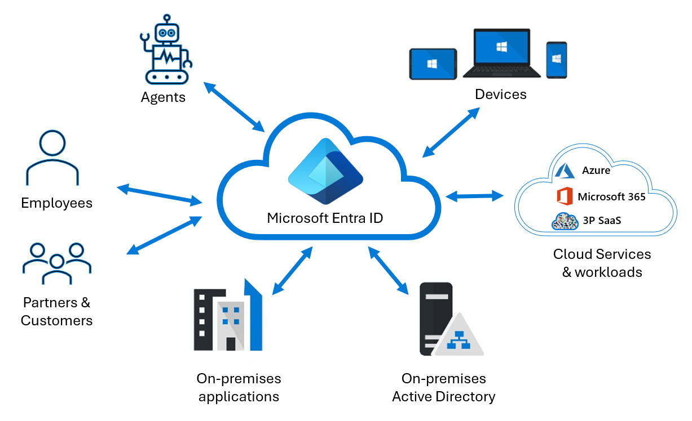
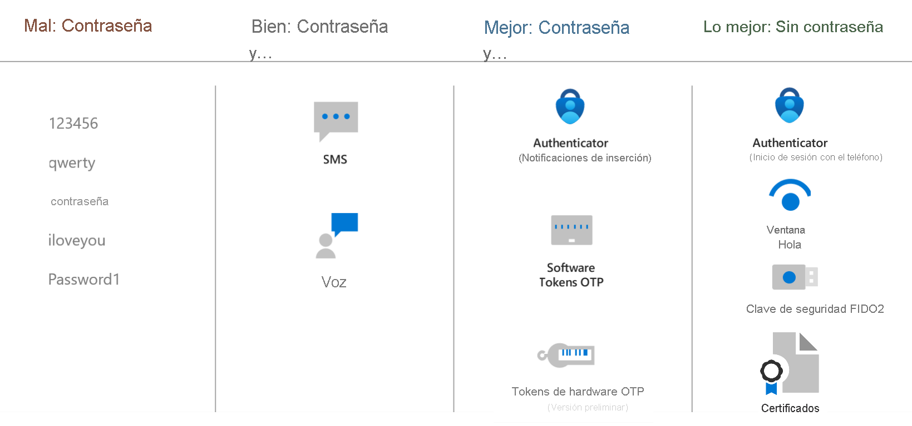
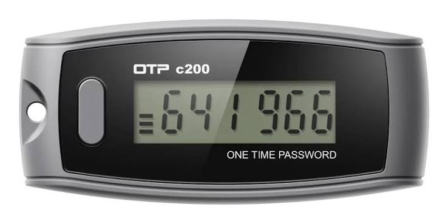
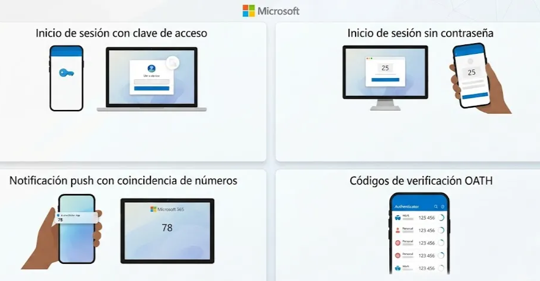
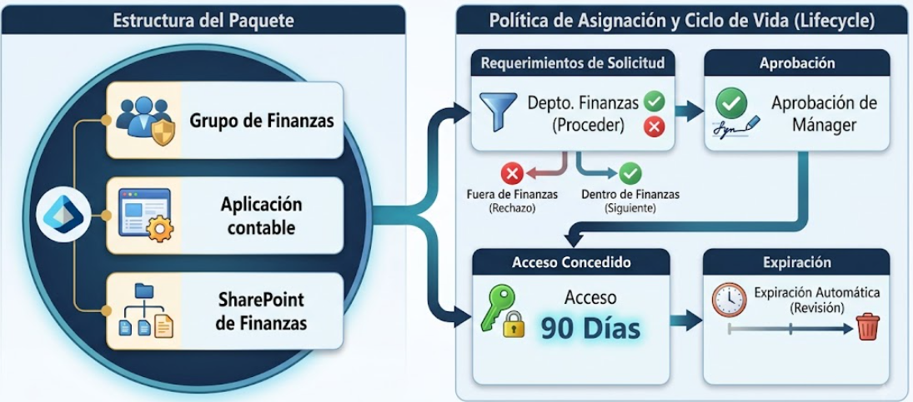

# Capítulo 2: Introducción a Microsoft Entra

# Función y tipos de identidad en Microsoft Entra ID

En este módulo aprenderás sobre Microsoft Entra y Microsoft Entra ID, el servicio de administración de identidades y acceso basado en la nube de Microsoft.

### Descripción de Microsoft Entra

Microsoft Entra es la familia de productos de identidad y acceso a la red de Microsoft. Se organiza en torno a los escenarios de acceso que protege dentro de una organización.

### Familia de productos de Microsoft Entra

En las empresas siempre existen distintos escenarios de acceso. Las soluciones de la familia Microsoft Entra se agrupan en las siguientes categorías:

#### Establecer controles de acceso Zero Trust (Confianza Cero)

- **Microsoft Entra ID:** Es el producto fundamental de la familia. Es un servicio de administración de identidades y acceso basado en la nube (IDaaS) que proporciona:
    - Autenticación.
    - Inicio de sesión único (SSO).
    - Cumplimiento de directivas.
    - Protección para usuarios, dispositivos, aplicaciones y recursos.
    
    *Ejemplo:* Cuando entras al portal institucional de Microsoft OneDrive con tu correo y contraseña corporativos, Microsoft Entra ID verifica tu identidad (autenticación) y, una vez comprobado quién eres, determina si tienes permiso para acceder a los recursos como OneDrive (autorización). De esta manera, la organización gestiona tu identidad y controla tu acceso a los servicios de Microsoft 365.
    
- **Microsoft Entra Domain Services:** Proporciona servicios de dominio tradicionales de Active Directory en Azure (como unión a un dominio, directivas de grupo mediante LDAP, Kerberos y NTLM), permitiendo que aplicaciones heredadas (*legacy*) funcionen en la nube sin que la organización tenga que desplegar ni administrar sus propios controladores de dominio.

#### Protección del acceso seguro para los empleados

Esta categoría agrupa los productos que utilizan las organizaciones para controlar, proteger y conectar a sus colaboradores:

- **Microsoft Entra Private Access:** Permite a los usuarios acceder de forma remota y segura a aplicaciones y recursos privados de la organización (servidores, aplicaciones internas, recursos compartidos) sin necesidad de utilizar VPN tradicionales. El acceso se basa en la identidad y en los permisos necesarios, permitiendo conectarse únicamente a los recursos específicos en lugar de dar acceso a toda la red corporativa.
- **Microsoft Internet Access (Microsoft Entra Internet Access):** Es una solución que permite controlar y proteger el acceso de los usuarios a Internet, aplicaciones SaaS y servicios de Microsoft 365. Los administradores pueden aplicar directivas de acceso y filtrado web para determinar qué sitios y recursos pueden utilizar los usuarios.
- **Microsoft Entra ID Governance:** Se centra en gestionar el ciclo de vida de las identidades y sus permisos, desde que un usuario entra a la organización hasta que cambia de puesto o abandona la empresa.
- **Microsoft Entra ID Protection:** Detecta, evalúa e informa sobre riesgos basados en identidades, identificando inicios de sesión sospechosos y usuarios comprometidos.
- **Microsoft Entra Verified ID:** Permite que una organización emita una credencial digital verificable que el usuario almacena y puede presentar posteriormente a otras organizaciones. Estas entidades pueden comprobar que la credencial es auténtica y que realmente fue emitida por la entidad correspondiente.

#### Protección del acceso para clientes y asociados

- **Microsoft Entra External ID:** Permite que personas externas a la organización (como invitados, socios comerciales o clientes) accedan de forma segura a determinadas aplicaciones o recursos sin formar parte de la organización de manera interna.

#### Protección del acceso en cualquier nube

- **Microsoft Entra Workload ID:** Es la solución de administración de identidades y acceso para identidades de cargas de trabajo: aplicaciones, servicios y contenedores que necesitan directivas de autenticación y autorización.

#### Acceso seguro para agentes de IA

- **Microsoft Entra Agent ID:** Es un marco de seguridad e identidad que amplía las funcionalidades de Microsoft Entra a los agentes de inteligencia artificial. Cuando una organización implementa agentes de IA que acceden a datos corporativos en nombre de los usuarios o de forma autónoma, Agent ID proporciona a cada agente una identidad regulada, aplica el acceso con privilegios mínimos y mantiene un registro de auditoría de sus acciones.

### Cómo funcionan juntos los productos de Microsoft Entra

La fortaleza de la familia Microsoft Entra radica en la integración de sus productos. Considera el escenario en el que un nuevo empleado se une a la organización:

1. **Microsoft Entra ID** autentica al empleado y proporciona inicio de sesión único (SSO) en las aplicaciones corporativas.
2. **Microsoft Entra ID Governance** aprovisiona automáticamente el acceso adecuado en función del rol del empleado.
3. **Microsoft Entra ID Protection** evalúa cada inicio de sesión por riesgo y solicita una autenticación más sólida cuando es necesario.
4. **Microsoft Entra Internet Access** protege la conexión del empleado a los recursos en la nube e Internet.
5. **Microsoft Entra Private Access** proporciona acceso seguro a las aplicaciones locales sin necesidad de una VPN.

### Licencias de Microsoft Entra

Los productos de Microsoft Entra pueden utilizarse por separado o combinarse según las necesidades de la organización:

- **Microsoft Entra ID Free:** Funciones básicas de identidad, administración de usuarios y grupos, y autoservicio de cambio de contraseñas.
- **Microsoft Entra ID P1:** Agrega Acceso Condicional, identidad híbrida, grupos dinámicos y funciones avanzadas de administración de acceso.
- **Microsoft Entra ID P2:** Agrega protección de identidades basada en riesgos (Identity Protection) y Privileged Identity Management (PIM).
- **Microsoft Entra Suite:** Agrupa varias capacidades avanzadas de Entra para proporcionar una estrategia completa de identidad y acceso a la red.

#### Centro de administración de Microsoft Entra

Los administradores configuran y gestionan todos los productos de Microsoft Entra desde un único portal web: el **Centro de administración de Microsoft Entra** (`entra.microsoft.com`).

## Conceptos fundamentales de Microsoft Entra ID

Microsoft Entra ID es el servicio de administración de identidades y acceso basado en la nube de Microsoft. Las organizaciones lo utilizan para permitir que sus empleados, invitados, cargas de trabajo y agentes de IA inicien sesión y accedan a los recursos que necesitan:



- **Recursos internos:** Aplicaciones de la red corporativa y la intranet, junto con las aplicaciones en la nube desarrolladas por la propia organización.
- **Servicios externos:** Microsoft 365, Azure Portal y cualquier aplicación SaaS que utilice la organización.

Microsoft Entra ID puede sincronizarse con el Active Directory local (On-Premises), permitiendo gestionar las identidades de ambos entornos desde una misma identidad central.

#### Puntuación de seguridad de la identidad (Identity Secure Score)

Microsoft Entra ID incluye una puntuación de seguridad de identidad, que es un porcentaje que funciona como indicador para medir el nivel de seguridad del entorno frente a las recomendaciones y procedimientos recomendados de Microsoft.

#### Terminología básica

- **Inquilino (Tenant):** Es el espacio dedicado y aislado de una organización donde se administran sus identidades, usuarios, grupos, dispositivos, aplicaciones y políticas de acceso. Tiene un Tenant ID único y funciona como límite de seguridad y administración.
- **Directorio:** Es el contenedor lógico dentro de un inquilino de Microsoft Entra que contiene y organiza los distintos objetos y recursos de identidad (usuarios, grupos, aplicaciones y dispositivos).
- **Multiinquilino (Multitenant):** Arquitectura en la que varios inquilinos comparten un mismo servicio o aplicación, manteniendo sus datos, identidades y configuraciones aislados entre sí.

#### ¿Quién usa Microsoft Entra ID?

- **Administradores de TI:** Gestionan identidades, accesos, directivas de MFA y directivas de seguridad.
- **Desarrolladores:** Integran SSO, autenticación y llamadas a APIs de Microsoft Graph / Entra ID en sus aplicaciones.
- **Usuarios de Azure, Microsoft 365 y Dynamics 365:** Utilizan las funciones de identidad base de Microsoft Entra ID para acceder a sus suscripciones y servicios.

## Tipos de identidades en Microsoft Entra ID

### Identidades de usuario

Representan a personas individuales, como empleados y usuarios externos (clientes, consultores, proveedores y asociados). En Microsoft Entra ID, las identidades de usuario se caracterizan por la forma en que se autentican y la propiedad de tipo de usuario:

- **Miembro interno:** Usuario de nuestra organización cuya identidad se crea y autentica directamente en nuestro inquilino (por ejemplo, un empleado).
- **Invitado externo:** Usuario externo (como un proveedor o socio comercial) que utiliza su propia identidad externa para acceder a nuestros recursos.
- **Miembro externo:** Usuario que pertenece a otro inquilino externo, pero a quien nuestra organización le asigna permisos y tipo de miembro.
- **Invitado interno:** Usuario cuya cuenta fue creada localmente en nuestro inquilino, pero está clasificada como invitado (escenario heredado).

> **Clave:**
> 
> - **Interno / Externo:** Indica el origen de la identidad.
> - **Miembro / Invitado:** Indica la clasificación y nivel de permisos dentro del inquilino.

### Identidades de cargas de trabajo

Las identidades de cargas de trabajo permiten que aplicaciones, servicios y recursos tengan una identidad propia para autenticarse y acceder a otros recursos sin utilizar credenciales de un usuario humano:

- **Entidades de servicio (Service Principals):** Representación de una aplicación dentro de un inquilino específico para gestionar sus permisos y accesos.
- **Identidades administradas (Managed Identities):** Identidades administradas automáticamente en Microsoft Entra ID para recursos de Azure (como máquinas virtuales o App Services), evitando almacenar credenciales en el código:
    - *Asignada por el sistema:* Vinculada directamente al ciclo de vida de un recurso de Azure.
    - *Asignada por el usuario:* Creada de forma independiente y compartible entre varios recursos compatibles.

### Identidades de dispositivo

Un dispositivo es un equipo físico o virtual (teléfonos móviles, laptops, servidores o impresoras). Registrar la identidad del dispositivo proporciona a los administradores información contextual para tomar decisiones de acceso o evaluar su estado de cumplimiento:

- **Dispositivos registrados en Microsoft Entra:** Dispositivos personales donde el usuario inicia sesión para acceder a recursos de la empresa. Se utiliza para escenarios BYOD (*Bring Your Own Device*) y dispositivos móviles.
- **Dispositivos unidos a Microsoft Entra (Microsoft Entra Joined):** Equipos propiedad de la empresa unidos directamente a Microsoft Entra ID. La organización controla quién inicia sesión y administra el dispositivo desde la nube.
- **Dispositivos híbridos unidos a Microsoft Entra (Microsoft Entra Hybrid Joined):** Equipos unidos simultáneamente al Active Directory local y a Microsoft Entra ID, requiriendo una cuenta corporativa para iniciar sesión.

### Grupos

Si varias identidades tienen las mismas necesidades de acceso, se pueden organizar en grupos para conceder permisos a todos sus miembros de forma unificada:

- **Grupos de seguridad:** Se utilizan principalmente para autorizar el acceso a recursos, aplicaciones, directivas de Acceso Condicional o dispositivos.
- **Grupos de Microsoft 365:** Orientados a la colaboración. Agrupan usuarios para trabajar juntos y aprovisionan de forma compartida recursos como Teams, SharePoint, buzones y calendarios en Outlook.

## Identidades de agentes de IA (Microsoft Entra Agent ID)

Microsoft Entra Agent ID proporciona un marco de seguridad e identidad diseñado específicamente para los agentes de inteligencia artificial que operan en entornos empresariales.

### ¿Por qué los agentes de IA necesitan identidades dedicadas?

Los agentes de inteligencia artificial difieren de las aplicaciones tradicionales: toman decisiones dinámicas, adaptan su comportamiento en función del contexto y pueden operar de forma autónoma, mientras que las aplicaciones convencionales siguen flujos algorítmicos predefinidos.

Riesgos comunes de los agentes de IA:

- **Superficie de ataque expandida:** Los agentes suelen interactuar con múltiples sistemas y fuentes externas. Además, son vulnerables a ataques como la inyección de instrucciones (*prompt injection*), que no afectan a las aplicaciones tradicionales.
- **Riesgos de permisos excesivos:** Si no se aplican controles estrictos, un agente puede recibir privilegios demasiado amplios y acceder a más datos de los necesarios para su tarea.
- **Proliferación incontrolada de agentes (*Shadow AI*):** El crecimiento no supervisado de agentes dentro de una organización, sin visibilidad ni gobernanza del ciclo de vida, genera brechas de seguridad y cumplimiento.

### Funcionamiento de Microsoft Entra Agent ID

- **Plano técnico (Blueprint):** Es una plantilla reutilizable que define las reglas, permisos base y configuraciones predefinidas para crear agentes de IA de un determinado tipo.
- **Identidad del agente:** Identificador único para cada agente creado dentro de Microsoft Entra ID.
- **Patrocinador (Sponsor):** Persona o grupo responsable formalmente de supervisar las actividades y la gobernanza del agente.

#### Escenarios de autenticación

- **Representado (En nombre de / On-Behalf-Of):** El agente de IA actúa en nombre de un usuario, utilizando los permisos delegados por este para interactuar con recursos o servicios.
    - *Clave:* El agente actúa en representación del usuario.
- **Sin supervisión (Autónomo):** El agente de IA actúa de forma independiente, utilizando su propia identidad, roles y permisos asignados para acceder a recursos sin intervención directa del usuario.
    - *Clave:* El agente actúa por sí mismo.

#### Gobernanza y seguridad para agentes

- **Acceso Condicional:** Permite decidir cuándo y bajo qué condiciones un agente puede conectarse a un recurso, evaluando señales y nivel de riesgo.
- **Identity Protection:** Detecta actividades sospechosas relacionadas con la identidad del agente y ejecuta respuestas automáticas.
- **Gobernanza:** Administra el ciclo de vida, los permisos y el cumplimiento del agente bajo la supervisión de su patrocinador.
- **Registro de agentes:** Proporciona un inventario centralizado de los agentes existentes dentro del inquilino.

## Identidad híbrida

Una identidad híbrida permite utilizar una misma identidad de usuario para autenticarse tanto en recursos locales (Active Directory) como en recursos de la nube (Microsoft Entra ID).

- **Aprovisionamiento:** Crea y mantiene una identidad entre diferentes directorios (por ejemplo, un usuario creado en Active Directory se aprovisiona también en Microsoft Entra ID).
- **Sincronización:** Mantiene actualizados los atributos de los usuarios y grupos entre el Active Directory local y Microsoft Entra ID.

#### Herramientas y estándares

- **Microsoft Entra Cloud Sync:** Es la herramienta de sincronización recomendada por Microsoft. Utiliza un agente ligero instalado en el entorno local que actúa como puente hacia Microsoft Entra ID, mientras que la configuración y el procesamiento se gestionan directamente desde la nube.
- **SCIM (System for Cross-domain Identity Management):** Estándar abierto que automatiza el aprovisionamiento y desaprovisionamiento seguro de usuarios y grupos entre diferentes sistemas de identidad y aplicaciones en la nube.

## Identidades externas (Microsoft Entra External ID)

Microsoft Entra External ID permite que personas ajenas a la organización accedan de forma segura a aplicaciones y recursos internos utilizando sus propias identidades comerciales, corporativas o sociales.

### Modalidades de External ID

#### Colaboración B2B (B2B Collaboration)

Se utiliza cuando una organización desea compartir aplicaciones y recursos con personas externas (socios comerciales, proveedores o consultores). El usuario invitado se autentica utilizando su propia identidad de origen, mientras que la organización anfitriona mantiene el control sobre los recursos a los que puede acceder.

- *Enfoque:* Empresa a empresa / Invitados externos.

#### CIAM (Customer Identity and Access Management)

Se utiliza cuando una organización desarrolla aplicaciones destinadas a clientes o consumidores finales y requiere gestionar sus identidades. Permite:

- Registro de clientes.
- Inicio de sesión y SSO.
- Autenticación con cuentas sociales (Google, Facebook, Apple, etc.).
- Administración del autoservicio de cuentas de clientes.
- *Enfoque:* Gestión de la identidad de clientes en aplicaciones empresariales.

#### B2B Direct Connect

Permite que los usuarios de dos organizaciones colaboren directamente utilizando la identidad de su propio inquilino, sin necesidad de crear un objeto de usuario invitado en el directorio de destino (utilizado principalmente para canales compartidos en Microsoft Teams).

> **Para memorizar:**
> 
> - **External ID:** Identidades externas en general.
> - **B2B Collaboration:** Invitados y asociados acceden a recursos de nuestra organización.
> - **CIAM:** Clientes externos acceden a nuestras aplicaciones.
> - **B2B Direct Connect:** Colaboración directa entre dos inquilinos sin crear cuentas de invitado.

## Funcionalidades de autenticación de Microsoft Entra ID

La autenticación es el proceso de comprobar la identidad de una persona o servicio antes de conceder acceso a un recurso, aplicación, dispositivo o red. Microsoft Entra ID admite diversos métodos de autenticación:

### Contraseñas

Son el método de autenticación más común, pero presentan riesgos significativos cuando se usan como único factor: si son fáciles de adivinar facilitan el acceso no autorizado, y si son demasiado complejas pueden afectar la productividad del usuario. Deben complementarse o reemplazarse con métodos más seguros.



### Autenticación basada en telefonía

Microsoft Entra ID admite dos opciones telefónicas, aunque recomienda migrar hacia métodos modernos como Microsoft Authenticator o claves de paso (*passkeys*):

- **Autenticación basada en SMS:** El usuario introduce su número de teléfono registrado, recibe un mensaje de texto con un código de verificación de un solo uso (OTP) y lo escribe en la pantalla de inicio de sesión. También se puede utilizar como método secundario durante el autoservicio de restablecimiento de contraseña (SSPR) o MFA.
- **Comprobación mediante llamadas de voz:** El usuario recibe una llamada automatizada al número registrado y presiona una tecla (por ejemplo `#`) para confirmar su identidad.

### Tokens OATH

OATH (*Open Authentication*) es un estándar abierto que especifica cómo se generan los códigos de contraseña de un solo uso basados en tiempo (TOTP):

- **Tokens OATH de software:** Aplicaciones (como Microsoft Authenticator) que generan códigos OTP que cambian periódicamente.
- **Tokens OATH de hardware:** Dispositivos físicos pequeños (tipo llavero o fob) que muestran un código numérico que se actualiza cada 30 o 60 segundos.



### Otros métodos de autenticación

- **Pase de acceso temporal (TAP - Temporary Access Pass):** Código de acceso temporal con límite de tiempo emitido en Microsoft Entra ID que permite al usuario autenticarse para configurar o registrar sus métodos de autenticación definitivos (como Microsoft Authenticator o claves FIDO2) o recuperar el acceso.
- **Autenticación mediante código QR:** Permite a los usuarios iniciar sesión escaneando un código QR único (impreso en un distintivo o tarjeta) e introduciendo un PIN numérico, evitando escribir contraseñas complejas.
- **Código de acceso de un solo uso (OTP) por correo electrónico:** Código de verificación enviado al correo electrónico del usuario, utilizado como método secundario en procesos de autoservicio de restablecimiento de contraseña (SSPR) o para usuarios invitados B2B.
- **Credencial de plataforma para macOS:** Método de autenticación sin contraseña donde el equipo Mac utiliza una credencial criptográfica protegida en el enclave seguro del dispositivo. Al iniciar sesión, Touch ID desbloquea la credencial y el Mac valida criptográficamente la identidad ante Microsoft Entra ID mediante claves asimétricas.
    
    > **Nota:** No consiste en autocompletar la contraseña; es una autenticación criptográfica directa del dispositivo.
    > 
- **Authenticator Lite:** Permite realizar comprobaciones de MFA directamente desde aplicaciones móviles como Outlook mediante notificaciones push o códigos TOTP, sin necesidad de tener instalada la aplicación completa de Microsoft Authenticator.
- **Métodos de autenticación externos (EAM):** Permite a las organizaciones integrar proveedores de autenticación multifactor de terceros (como Duo Security o RSA SecurID) con Microsoft Entra ID para satisfacer los requisitos de MFA con la infraestructura existente.

### Autenticación sin contraseñas (Passwordless)

Reemplaza el uso de contraseñas por la combinación de algo que posees con algo que sabes o eres:

- **Windows Hello para empresas:** Utiliza un par de claves criptográficas vinculadas al dispositivo (chip TPM) junto con un PIN o factor biométrico, proporcionando una autenticación multifactor integrada y resistente al phishing.
- **Claves de paso (Passkeys / FIDO2):** Estándar de autenticación sin contraseñas resistente al phishing basado en criptografía de clave pública. La clave pública se registra en Microsoft Entra ID y la clave privada permanece protegida en el dispositivo:
    - *Vinculadas al dispositivo:* La clave privada reside exclusivamente en un hardware específico (llave de seguridad física FIDO2 o Microsoft Authenticator).
    - *Sincronizadas:* La clave privada se sincroniza de forma segura entre dispositivos mediante gestores de credenciales en la nube (como Apple iCloud Keychain o Google Password Manager).

#### Microsoft Authenticator

Aplicación de autenticación para dispositivos iOS y Android que admite:

- **Inicio de sesión con clave de acceso (Passkey):** Permite autenticación resistente al phishing mediante PIN o biometría.
- **Inicio de sesión sin contraseña:** El usuario visualiza un número en la pantalla de inicio de sesión, lo selecciona en la aplicación y confirma mediante PIN o biometría.
- **Notificación push con coincidencia de números (*Number Matching*):** Para evitar la fatiga por MFA, el usuario debe escribir en la aplicación el número que aparece en la pantalla de inicio de sesión.
- **Códigos de verificación OATH:** Generación local de códigos OTP de tiempo limitado.



#### Autenticación basada en certificados (CBA)

Permite a los usuarios autenticarse directamente ante Microsoft Entra ID utilizando un certificado digital X.509 instalado en su dispositivo o tarjeta inteligente, sin requerir contraseñas.

#### Autenticación resistente al phishing

Los métodos tradicionales de MFA (como SMS o códigos por correo) pueden ser interceptados mediante ataques de intermediario (*Adversary-in-the-Middle*). Los métodos resistentes al phishing vinculan criptográficamente la autenticación al dominio del sitio web legítimo (*origin-bound*).

Métodos resistentes al phishing en Microsoft Entra ID:

- Windows Hello para empresas.
- Credencial de plataforma para macOS.
- Llaves de seguridad FIDO2 y claves de paso vinculadas al dispositivo.
- Claves de paso en Microsoft Authenticator.
- Autenticación basada en certificados (CBA).

## Autenticación multifactor (MFA)

La autenticación multifactor exige a los usuarios proporcionar dos o más factores de diferentes categorías durante el inicio de sesión:

1. **Algo que sabes:** Una contraseña o un PIN.
2. **Algo que tienes:** Un dispositivo de confianza, teléfono o llave de seguridad física.
3. **Algo que eres:** Factores biométricos como huella dactilar o reconocimiento facial.

### Métodos de verificación admitidos para MFA

- Microsoft Authenticator.
- Authenticator Lite (en Outlook).
- Windows Hello para empresas.
- Claves de paso (FIDO2).
- Autenticación basada en certificados (configurada como multifactor).
- Métodos de autenticación externos (EAM).
- Pase de acceso temporal (TAP).
- Tokens OATH de hardware y software.
- Mensajes SMS y llamadas de voz.

### Valores predeterminados de seguridad (Security Defaults)

Son un conjunto de directivas de seguridad básicas recomendadas y proporcionadas por Microsoft sin costo adicional para proteger inquilinos que no cuentan con licencias P1 o P2:

- Requiere que todos los usuarios se registren en la autenticación multifactor de Microsoft Entra.
- Exige MFA para todas las funciones y roles de administrador.
- Exige MFA a los usuarios cuando se detectan inicios de sesión sospechosos.
- Bloquea el tráfico de protocolos de autenticación heredados (*legacy authentication*).
- Protege el acceso a herramientas de administración como Azure Portal.

> **Dato:** Según datos de Microsoft, la implementación de MFA junto con el bloqueo de la autenticación heredada detiene más del 99.9% de los ataques comunes dirigidos a la identidad.
> 

### Acceso Condicional y MFA

Para organizaciones con requerimientos más avanzados, las directivas de Acceso Condicional permiten exigir MFA de forma granular basándose en condiciones contextuales como la ubicación del usuario, el estado del dispositivo, el nivel de riesgo o la confidencialidad de la aplicación.

## Autoservicio de restablecimiento de contraseña (SSPR)

El autoservicio de restablecimiento de contraseña (*Self-Service Password Reset*) es una característica de Microsoft Entra ID que permite a los usuarios cambiar o restablecer su contraseña de manera autónoma, sin requerir la intervención del departamento de soporte técnico. SSPR genera registros detallados para auditar quién restableció la contraseña, cuándo y el resultado del proceso.

### Flujo de funcionamiento de SSPR

1. **Comprobación de la cuenta:** Microsoft Entra verifica que la cuenta exista, esté activa y tenga asignada la licencia correspondiente.
2. **Validación del servicio:** Comprueba que SSPR esté habilitado para el usuario o su grupo.
3. **Métodos registrados:** Verifica que el usuario haya registrado previamente los métodos de autenticación requeridos.
4. **Ubicación de administración:** Determina si la contraseña se administra exclusivamente en la nube o en un Active Directory local (híbrido).
5. **Verificación de identidad:** SSPR solicita al usuario validar su identidad mediante los métodos configurados.
6. **Restablecimiento:** Una vez validada la identidad, el usuario ingresa su nueva contraseña.

### Métodos de autenticación para SSPR

Se recomienda registrar al menos dos métodos para asegurar alternativas si uno de ellos no está disponible:

- Notificaciones push de Microsoft Authenticator.
- Tokens OATH de software o hardware.
- Servicio de mensajes cortos (SMS).
- Llamadas de voz.
- Código OTP por correo electrónico.
- Preguntas de seguridad *(método en desuso que será retirado por completo en marzo de 2027)*.

#### Registro y reconfirmación

- **Registro:** Proceso inicial donde el usuario configura sus métodos de contacto y verificación para habilitar SSPR en su cuenta.
- **Reconfirmación:** Proceso periódico en el que Microsoft Entra solicita al usuario comprobar que sus métodos registrados (teléfono, aplicación, correo) siguen siendo válidos y accesibles.

#### Notificaciones

- Los usuarios reciben un correo electrónico cuando su contraseña es restablecida.
- Los Administradores Globales reciben una notificación por correo cuando otro administrador restablece su contraseña mediante SSPR.

### Integración local y escritura diferida de contraseñas (Password Writeback)

- **Password Writeback:** Permite que las contraseñas cambiadas o restablecidas mediante SSPR en la nube se sincronicen y escriban de vuelta inmediatamente en el Active Directory local.
- **Desbloqueo de cuenta (Account Unlock):** Permite a los usuarios desbloquear su cuenta en el Active Directory local desde el portal de SSPR sin necesidad de cambiar su contraseña.

## Recuperación de cuentas en Microsoft Entra ID

La recuperación de cuentas se aplica en situaciones de bloqueo total, cuando el usuario ha perdido el acceso a todos sus métodos de autenticación registrados y no puede utilizar SSPR convencional.

### Características principales

- **Solución ante bloqueo total:** Permite recuperar el acceso cuando no se tiene disponible el teléfono, la aplicación de autenticación ni métodos alternativos.
- **Sin dependencia de métodos previos:** No requiere que los factores previamente configurados estén operativos.
- **Proveedores de verificación de identidad (IDV):** Valida la identidad del usuario mediante proveedores especializados externos.
- **Documentos oficiales:** Permite validar la identidad mediante documentos gubernamentales oficiales (como cédula, pasaporte o licencia de conducir).
- **Verificación facial (Face Check):** Compara mediante visión computacional una fotografía tomada en tiempo real (*selfie*) con la imagen del documento oficial presentado.
- **Restablecimiento de confianza:** Valida de forma rigurosa la titularidad real de la cuenta y emite un Pase de acceso temporal (TAP) para volver a registrar las credenciales sin sobrecargar al equipo de soporte técnico.

## Administración y protección de contraseñas

Microsoft Entra Password Protection ayuda a evitar que los usuarios elijan contraseñas débiles, predecibles o fáciles de adivinar.

> **Nota:** Microsoft Entra Password Protection complementa las medidas de seguridad, pero no reemplaza el uso de MFA.
> 

### Lista global de contraseñas prohibidas

- Mantenida y actualizada continuamente por Microsoft a partir del análisis de telemetría de amenazas y ataques reales (como *password spraying*).
- Se aplica automáticamente a todos los usuarios del inquilino.
- Está siempre activa y no se puede deshabilitar.
- Utiliza algoritmos de coincidencia aproximada para detectar variaciones que utilicen sustituciones comunes de caracteres, números o mayúsculas.

### Listas personalizadas de contraseñas prohibidas

Permiten a las organizaciones agregar hasta 1,000 términos específicos propios para bloquear su uso en contraseñas:

- Nombres de la organización y marcas internas.
- Nombres de productos y proyectos.
- Ubicaciones físicas y sedes corporativas.
- Abreviaturas internas.

### Proceso de evaluación de contraseñas

Cuando un usuario cambia o crea una contraseña, Microsoft Entra ID:

1. **Normaliza:** Convierte caracteres visualmente similares (por ejemplo `@` en `a`, `0` en `o`).
2. **Busca similitudes:** Compara la entrada con las listas globales y personalizadas.
3. **Analiza datos contextuales:** Comprueba que no contenga el nombre, apellido o nombre del inquilino.
4. **Calcula una puntuación:** Asigna una calificación de complejidad para determinar si la contraseña es aceptada.

#### Protección contra Password Spraying

El *password spraying* es un ataque en el que el atacante prueba unas pocas contraseñas comunes contra una gran cantidad de cuentas de usuario, evitando los bloqueos automáticos por intentos fallidos que ocurrirían si atacara una sola cuenta con múltiples combinaciones. Microsoft Entra Password Protection neutraliza estos ataques bloqueando las contraseñas conocidas más utilizadas por los atacantes.

### Integración con Active Directory local

En entornos híbridos, la protección de contraseñas se extiende a los controladores de dominio locales mediante dos componentes:

- **Microsoft Entra Password Protection Proxy Service:** Recibe las directivas y listas de contraseñas prohibidas desde Microsoft Entra ID.
- **Microsoft Entra Password Protection DC Agent:** Se instala en cada controlador de dominio de Active Directory local y valida las solicitudes de cambio de contraseña contra las directivas recibidas.

## Administración de acceso y Acceso Condicional

El Acceso Condicional es el motor de políticas de Microsoft Entra ID que evalúa señales contextuales para aplicar controles de seguridad antes de permitir el acceso a los recursos.

Las directivas funcionan bajo la lógica de instrucciones **if-then** (si se cumple esta condición, entonces se aplica este control).

### Componentes de una directiva de Acceso Condicional

#### 1. Asignaciones (Señales)

Definen el *quién*, *qué*, *dónde* y *cuándo* de la directiva. Utilizan una operación lógica `AND` (todas las asignaciones especificadas deben coincidir para activar la directiva):

- **Usuarios:** Aplica a todos los usuarios, grupos específicos, roles del directorio, invitados externos o identidades de cargas de trabajo.
- **Recursos de destino:** Define a qué aplicaciones en la nube (como Microsoft 365), acciones de usuario (como registrar información de seguridad o unir un dispositivo) o contextos de autenticación se dirige la directiva.
- **Red (Network):** Evalúa la ubicación física o de red del usuario mediante intervalos IP de confianza, ubicaciones con nombre o redes compatibles.
- **Condiciones:**
    - *Riesgo al iniciar sesión y riesgo de usuario:* Evalúa el nivel de riesgo detectado por Microsoft Entra ID Protection (actividad sospechosa en la sesión o posible compromiso de la cuenta).
    - *Riesgo interno:* Señales de riesgo asociadas a comportamientos anómalos o de cumplimiento interno.
    - *Plataforma de dispositivo:* Dirige la directiva según el sistema operativo (Windows, macOS, iOS, Android, Linux).
    - *Aplicaciones cliente:* Identifica el tipo de software utilizado para acceder (explorador web, clientes de correo modernos o aplicaciones con autenticación heredada).
    - *Filtros para dispositivos:* Permite aplicar reglas a dispositivos con atributos específicos (por ejemplo, estaciones de trabajo de administración privilegiada).

#### 2. Controles de acceso

Determinan la acción que se ejecuta cuando se cumplen las asignaciones:

- **Bloquear acceso:** Decisión restrictiva que impide la conexión bajo las condiciones detectadas.
- **Conceder acceso:** Permite la conexión exigiendo uno o varios requisitos:
    1. Requerir autenticación multifactor (MFA).
    2. Requerir una intensidad de autenticación específica (*Authentication Strength*).
    3. Requerir que el dispositivo esté marcado como conforme (*compliant*) en la solución MDM (Intune).
    4. Requerir un dispositivo híbrido unido a Microsoft Entra.
    5. Requerir una aplicación cliente aprobada o una directiva de protección de aplicaciones (MAM).
    6. Requerir un cambio de contraseña.
    7. Requerir la aceptación de términos de uso.
- **Controles de sesión:** Permiten el acceso pero limitan las operaciones durante la sesión (por ejemplo, impedir la descarga, copia o impresión de documentos confidenciales, o forzar la evaluación continua de acceso - CAE).

### Intensidad de autenticación (Authentication Strengths)

Permite a los administradores definir con precisión qué combinaciones de métodos de autenticación son válidas para acceder a recursos según su criticidad:

- **Seguridad de autenticación multifactor:** Permite cualquier combinación válida de métodos que satisfagan MFA (por ejemplo, contraseña combinada con SMS, llamada o notificación push).
- **Seguridad de MFA sin contraseñas:** Admite únicamente métodos de autenticación multifactor que no utilizan contraseñas (como Microsoft Authenticator con inicio de sesión telefónico, llaves FIDO2 o Windows Hello para empresas).
- **Fuerza de MFA resistente al phishing:** Admite exclusivamente métodos resistentes a la interceptación y al phishing (como Windows Hello para empresas, llaves de seguridad FIDO2 o autenticación basada en certificados).

### Protección de servicios de IA con Acceso Condicional

Las directivas de Acceso Condicional pueden proteger servicios de IA generativa (como Microsoft 365 Copilot o Microsoft Security Copilot):

- Requerir MFA resistente al phishing a los usuarios que interactúan con herramientas de IA generativa.
- Exigir dispositivos conformes cuando el riesgo interno es moderado.
- Bloquear el acceso a herramientas de IA corporativas si el nivel de riesgo de usuario es elevado.

> **Licenciamiento:** El Acceso Condicional requiere licencias Microsoft Entra ID P1 o P2. Los inquilinos con licencias gratuitas pueden utilizar los Valores predeterminados de seguridad (*Security Defaults*).
> 

## Global Secure Access (GSA)

Global Secure Access es la solución Security Service Edge (SSE) de Microsoft. Funciona como un punto central de control que asegura y gestiona el tráfico de red de las entidades hacia cualquier aplicación o recurso, aplicando los principios de Zero Trust: verificar explícitamente, usar privilegios mínimos y asumir la brecha de seguridad.

### Desafíos que resuelve SSE

- Reduce el riesgo de desplazamiento lateral dentro de la red corporativa si una conexión remota es comprometida.
- Aplica perímetros de seguridad sobre recursos expuestos a Internet.
- Optimiza y protege las conexiones desde sucursales y trabajadores remotos sin depender exclusivamente de túneles VPN tradicionales.

### Cliente de Global Secure Access

Se instala en el dispositivo final para interceptar y enrutar el tráfico de red hacia el servicio de Global Secure Access, donde se evalúa continuamente según la identidad, el dispositivo, la ubicación, la aplicación y el riesgo.

### Componentes de Global Secure Access

#### 1. Microsoft Entra Internet Access

Es una puerta de enlace web segura (SWG) centrada en la identidad que protege el acceso a Internet y a aplicaciones SaaS:

- **Filtrado de contenido web:** Controla la navegación según categorías y nombres de dominio.
- **Acceso Condicional universal:** Permite aplicar políticas de Acceso Condicional a cualquier destino web o aplicación SaaS en Internet.
- **Inspección TLS:** Descifra e inspecciona el tráfico seguro para detectar amenazas ocultas.
- **Inteligencia contra amenazas:** Bloquea destinos IP y dominios catalogados como maliciosos.
- **Protección contra inyección de prompts:** Detecta y mitiga manipulaciones maliciosas contra modelos de IA.
- **Evaluación continua del acceso (CAE):** Revoca el acceso en tiempo real si cambian las condiciones de seguridad o el riesgo del usuario.

#### 2. Microsoft Entra Internet Access para servicios de Microsoft

Optimiza y protege específicamente el tráfico dirigido a cargas de trabajo de Microsoft 365 (Exchange Online, SharePoint Online, Microsoft Teams):

- **Comprobación de red compatible:** Garantiza que los usuarios solo accedan a los recursos de Microsoft 365 si su tráfico pasa por Global Secure Access.
- **Restricciones de inquilino universales:** Evita la fuga de información impidiendo el acceso a inquilinos externos o cuentas personales no autorizadas desde dispositivos corporativos.
- **Restauración de IP de origen:** Mantiene la dirección IP original del usuario para que las directivas de ubicación y los análisis de riesgo sigan operando correctamente a pesar del enrutamiento por el proxy SSE.
- **Registros enriquecidos:** Proporciona telemetría avanzada y registros de eventos sobre el tráfico hacia Microsoft 365.

#### 3. Microsoft Entra Private Access

Solución ZTNA (Zero Trust Network Access) que permite a los usuarios conectarse a aplicaciones y recursos privados corporativos sin necesidad de una VPN:

- **Acceso rápido (Quick Access):** Permite definir rangos de IP, FQDN y puertos para agrupar múltiples recursos privados bajo una directiva general de Acceso Condicional.
    - *Esquema:* Varios recursos relacionados → Una aplicación de acceso rápido → Una directiva.
- **Acceso por aplicación:** Permite configurar directivas granulares e independientes para aplicaciones empresariales específicas.
    - *Esquema:* Aplicación A → Directiva A | Aplicación B → Directiva B.

| **Componente** | **¿Qué protege?** | **Concepto clave** |
| --- | --- | --- |
| **Global Secure Access** | Acceso general a recursos y servicios | Perímetro SSE y control central |
| **Microsoft Entra Internet Access** | Internet y aplicaciones SaaS | Puerta de enlace web segura (SWG) |
| **Internet Access para Microsoft 365** | Microsoft 365 y servicios Microsoft | Optimización, control de inquilinos e IP |
| **Microsoft Entra Private Access** | Recursos privados y redes internas | Acceso Zero Trust (ZTNA) sin VPN |

#### Panel de Global Secure Access

Integrado en el Centro de administración de Microsoft Entra, proporciona visibilidad centralizada sobre el tráfico de red adquirido, permitiendo supervisar conexiones de usuarios, estado de los dispositivos, filtrado web y eventos anómalos.

#### Protección de cargas de trabajo de IA con controles de red

Aplica directivas de red a servicios y agentes de IA:

- **Protección contra inyección de prompts:** Filtra entradas maliciosas a nivel de tráfico de red.
- **Detección de Shadow AI:** Identifica el uso de aplicaciones de inteligencia artificial no autorizadas.
- **Controles para agentes:** Aplica reglas de seguridad y aislamiento al tráfico generado entre diferentes agentes de IA.

## Control de acceso basado en roles (RBAC) en Microsoft Entra

Los roles de Microsoft Entra permiten delegar y controlar permisos administrativos sobre los recursos del directorio bajo el modelo de control de acceso basado en roles (RBAC).

### Roles integrados (Built-in Roles)

Son roles preconfigurados por Microsoft con un conjunto fijo de permisos que no pueden modificarse. Algunos de los más utilizados son:

- **Administrador global:** Posee acceso total a todas las funciones administrativas de Microsoft Entra y servicios en la nube de Microsoft.
- **Administrador de usuarios:** Crea y administra usuarios y grupos, gestiona solicitudes de soporte técnico y supervisa el estado del servicio.
- **Administrador de facturación:** Administra suscripciones, compras y tickets de soporte técnico relacionados con la facturación.

### Roles personalizados (Custom Roles)

Permiten a las organizaciones definir roles específicos con un conjunto exacto de permisos (por ejemplo, permitir únicamente el aprovisionamiento de usuarios).

1. El administrador define el rol y selecciona los permisos requeridos.
2. El rol se asigna a los usuarios o grupos correspondientes.
- *Requisito:* Licencia Microsoft Entra ID P1 o P2.

### Principio de privilegios mínimos en la administración

Procedimiento recomendado de seguridad que consiste en asignar únicamente los permisos indispensables para la tarea asignada (por ejemplo, otorgar el rol de *Administrador de usuarios* en lugar de *Administrador global* a quien solo gestiona cuentas).

### Categorías de roles

- **Roles específicos de Microsoft Entra:** Conceden permisos exclusivamente sobre objetos del directorio (como Administrador de aplicaciones, Administrador de grupos o Administrador de usuarios).
- **Roles específicos de servicio:** Conceden permisos para administrar un servicio concreto de Microsoft 365 (como Administrador de Exchange, Administrador de SharePoint, Administrador de Intune o Administrador de Teams).
- **Roles entre servicios:** Abarcan varios servicios de la plataforma (como Administrador de seguridad o Administrador de cumplimiento en Microsoft Purview).

### Diferencias entre el RBAC de Microsoft Entra y el RBAC de Azure

- **RBAC de Microsoft Entra:** Controla permisos sobre objetos del directorio de identidades (usuarios, grupos, dominios, licencias y aplicaciones).
- **RBAC de Azure:** Controla permisos de administración sobre los recursos de infraestructura en Azure (máquinas virtuales, redes virtuales, cuentas de almacenamiento y suscripciones).

## Gobernanza de identidades (Microsoft Entra ID Governance)

La gobernanza de identidades equilibra la seguridad con la productividad de los usuarios, garantizando que el acceso adecuado esté disponible de forma justificada y auditable.

Responde a cuatro preguntas clave:

1. ¿Qué identidades deben tener acceso a qué recursos?
2. ¿Qué hacen esas identidades con ese acceso?
3. ¿Cuenta la organización con controles eficaces para administrar dicho acceso?
4. ¿Pueden los auditores comprobar que los controles funcionan adecuadamente?

### Ciclo de vida de las identidades

Modela el proceso de permanencia de los usuarios en la organización mediante el esquema **Joiner, Mover, Leaver**:

1. **Incorporación (Joiner):** El usuario ingresa a la organización; se crea su identidad digital y se le asignan los permisos iniciales requeridos para su trabajo.
2. **Movimiento (Mover):** El usuario cambia de puesto, departamento o responsabilidades; sus permisos se actualizan, agregando los nuevos accesos y revocando los que ya no necesita.
3. **Salida (Leaver):** El usuario deja la organización; se revocan todos sus accesos inmediatamente para evitar accesos no autorizados, conservando la identidad si es requerida para auditoría.

#### Automatización del ciclo de vida de identidades

- **Aprovisionamiento entrante:** Crea y actualiza identidades en Microsoft Entra ID y Active Directory a partir de los datos emitidos por sistemas de recursos humanos (RR. HH.).
- **Flujos de trabajo del ciclo de vida (*Lifecycle Workflows*):** Automatizan tareas asociadas a eventos clave (como ejecutar tareas de bienvenida antes del primer día del empleado o revocar licencias en su fecha de salida).
- **Directivas de asignación automática:** Asignan o quitan membresías a grupos y roles de aplicación automáticamente basándose en los atributos del usuario.
- **Aprovisionamiento de usuarios:** Crea, actualiza y elimina cuentas de usuario en aplicaciones SaaS externas compatibles.

### Ciclo de vida de los accesos

Gestiona cómo se otorgan, mantienen y retiran los permisos durante la estancia del usuario:

- **Grupos estáticos:** La pertenencia se administra de forma manual por un administrador o propietario.
- **Grupos dinámicos:** La pertenencia se evalúa automáticamente mediante reglas basadas en atributos del usuario o dispositivo (por ejemplo, si el departamento es "Finanzas", se incluye automáticamente en el grupo).
- **Administración de derechos (*Entitlement Management*):** Gestiona solicitudes, aprobaciones y asignaciones empaquetadas de recursos.
- **Revisiones de acceso (*Access Reviews*):** Permite validar periódicamente si los usuarios aún requieren los accesos asignados y revocar los innecesarios.

### Privileged Identity Management (PIM)

Servicio que controla, supervisa y administra el acceso a roles privilegiados en Microsoft Entra ID, recursos de Azure y Microsoft 365, proporcionando acceso Just-In-Time (JIT) y mitigando el riesgo de permisos permanentes excesivos.

### Gobernanza de identidades para agentes de IA

Extiende las directivas de gobernanza a los agentes de inteligencia artificial mediante identidades reguladas, asignación de patrocinadores y control de ciclo de vida para evitar la proliferación de agentes desatendidos.

## Revisiones de acceso (Access Reviews)

Permiten a las organizaciones comprobar periódicamente quién tiene acceso a grupos, aplicaciones y roles administrativos, asegurando que solo las personas que realmente necesitan los recursos conserven los permisos.

### Casos de uso comunes

- **Revisión de roles con privilegios:** Auditar periódicamente a los usuarios con permisos administrativos mediante PIM.
- **Acceso a datos y aplicaciones críticas:** Exigir a los usuarios que justifiquen periódicamente por qué necesitan acceso a recursos confidenciales.
- **Excepciones de directivas:** Comprobar si las excepciones otorgadas a directivas de seguridad siguen estando justificadas.
- **Gestión de usuarios invitados:** Validar con los propietarios de grupos si los colaboradores externos aún requieren acceso.
- **Revisiones periódicas y automáticas:** Configurar revisiones con periodicidad semanal, mensual, trimestral o anual con aplicación automática de resultados (retirar el acceso si la revisión es rechazada o no completada).

### Características avanzadas de las revisiones de acceso

- **Revisiones de varias fases:** Permiten estructurar revisiones en hasta tres etapas consecutivas con diferentes revisores en cada una.
- **Recomendaciones basadas en IA:** Analizan señales como la última fecha de inicio de sesión o la frecuencia de actividad del usuario para sugerir al revisor si debe aprobar o denegar la solicitud.

## Administración de derechos (Entitlement Management)

Automatiza el ciclo de vida del acceso a recursos a gran escala mediante la gestión centralizada de solicitudes, aprobaciones, asignaciones y expiraciones.

### Paquetes de acceso (Access Packages)

Un paquete de acceso es un contenedor que agrupa todos los recursos (grupos de seguridad, grupos de Microsoft 365, aplicaciones empresariales y sitios de SharePoint) que un usuario necesita para trabajar en un proyecto o función específica, junto con las políticas de solicitud y aprobación.



### Capacidades clave

- **Gestión de usuarios externos:** Facilita la solicitud de paquetes de acceso por parte de socios comerciales B2B y automatiza la eliminación de la cuenta de invitado cuando expira el acceso al paquete.
- **Gestión de agentes de IA:** Permite asignar y retirar paquetes de acceso a identidades de agentes de IA de forma controlada.

### Términos de uso de Microsoft Entra

Permite presentar acuerdos legales, políticas corporativas o avisos de cumplimiento en formato PDF que los usuarios deben leer y aceptar explícitamente antes de acceder a una aplicación o recurso protegido.

## Funcionalidades de Privileged Identity Management (PIM)

Privileged Identity Management es un servicio de Microsoft Entra ID que permite administrar, controlar y supervisar el acceso a recursos críticos en Microsoft Entra ID, Azure, Microsoft 365 e Intune.

### Características principales de PIM

- **Just-In-Time (JIT):** Proporciona privilegios temporales solo cuando son necesarios, eliminando permisos administrativos permanentes.
- **Asignaciones con límite de tiempo:** Define fechas de inicio y finalización para el uso de privilegios.
- **Activación basada en aprobación:** Requiere la autorización explícita de aprobadores designados para activar un rol.
- **Notificaciones de activación:** Envía alertas por correo electrónico cuando se activa un rol con privilegios.
- **Historial de auditoría:** Registra todas las activaciones y asignaciones de roles durante los últimos 30 días.

### ¿Qué puede administrar PIM?

- **Roles de Microsoft Entra:** Controla permisos sobre identidades y servicios del directorio (por ejemplo, activar temporalmente *Administrador de usuarios*).
- **Roles de Azure (Azure RBAC):** Controla permisos sobre suscripciones, grupos de recursos y recursos de Azure.
- **PIM para grupos:** Permite solicitar pertenencia o propiedad temporal a un grupo de seguridad o de Microsoft 365 de forma Just-In-Time.

### Flujo de trabajo de PIM

#### 1. Asignación

Un administrador asigna un rol a un usuario o grupo configurando:

- **Miembros:** Personas o entidades que reciben el rol.
- **Ámbito (Scope):** Límite del recurso donde aplica el rol (directorio completo, suscripción o grupo de recursos).
- **Tipo de asignación:**
    - *Elegible (Eligible):* El usuario tiene derecho a usar el rol, pero debe activarlo cuando lo requiera y cumplir los requisitos de activación.
    - *Activo (Active):* El usuario tiene el rol permanentemente asignado sin necesidad de activarlo.
- **Duración:** Período durante el cual la asignación es válida.

> **Para memorizar:**
> 
> - **Miembros:** ¿Quién?
> - **Ámbito:** ¿Dónde?
> - **Tipo de asignación:** ¿Cómo se activa?
> - **Duración:** ¿Cuánto tiempo?

#### 2. Activación

El usuario con una asignación elegible solicita activar el rol indicando la duración requerida y el motivo de la justificación.

#### 3. Aprobación o denegación

Si la directiva lo exige, los aprobadores designados evalúan y aprueban o rechazan la solicitud desde el portal de PIM.

#### 4. Ampliación y renovación

Permite solicitar la extensión de una asignación antes de que expire (ampliación) o después de su vencimiento (renovación).

## Protección de identidades (Microsoft Entra ID Protection)

Microsoft Entra ID Protection detecta, investiga y mitiga riesgos relacionados con las identidades de usuarios y cargas de trabajo, procesando billones de señales diarias obtenidas de Microsoft Entra ID, cuentas Microsoft y servicios como Xbox.

### Tipos de riesgo

#### Riesgo de inicio de sesión (Sign-in Risk)

Probabilidad de que una solicitud de autenticación no haya sido realizada por el titular legítimo de la cuenta:

- Inicios de sesión desde direcciones IP anónimas (redes Tor, proxies VPN anónimos).
- Viaje imposible (dos inicios de sesión en ubicaciones geográficamente distantes en un intervalo de tiempo incompatible con el transporte físico).
- Propiedades de inicio de sesión no habituales o anómalas.

#### Riesgo de usuario (User Risk)

Probabilidad de que la propia identidad o credencial de la cuenta haya sido comprometida:

- Credenciales filtradas (encontradas en bases de datos públicas de brechas de seguridad o la dark web).
- Patrones de actividad sospechosa confirmados por el usuario o por telemetría avanzada.

> **Diferencia clave:**
> 
> - Contraseña incorrecta = Intento fallido de autenticación.
> - Credencial correcta + actividad anómala = Posible cuenta comprometida (Riesgo detectado).

### Informes de investigación

- **Detecciones de riesgo:** Lista detallada de cada evento de riesgo individual detectado.
- **Inicios de sesión arriesgados:** Registros de sesiones que tienen asociadas una o más detecciones de riesgo.
- **Usuarios de riesgo:** Cuentas que tienen detecciones de riesgo activas o inicios de sesión riesgosos asociados.

### Corrección automática y exportación

- **Acceso Condicional basado en riesgos:** Permite configurar respuestas automáticas; por ejemplo, exigir MFA para inicios de sesión con riesgo medio/alto o exigir un cambio seguro de contraseña si el riesgo de usuario es alto. Al completar el control, el riesgo se corrige automáticamente.
- **Exportación de datos:** Permite enviar los registros de Identity Protection a sistemas SIEM (como Microsoft Sentinel), áreas de trabajo de Log Analytics o almacenamiento externo para análisis y correlación.

## Identidad Verificada de Microsoft Entra (Microsoft Entra Verified ID)

Microsoft Entra Verified ID es un servicio de credenciales verificables descentralizadas basado en estándares abiertos de la W3C. Permite emitir y validar credenciales digitales garantizando la privacidad del usuario, quien decide qué atributos específicos comparte sin exponer toda su información personal.

### Modelo de funcionamiento

- **Emisor (Issuer):** Organización que valida los datos del usuario y emite una credencial digital firmada criptográficamente (por ejemplo, una universidad que emite un título digital).
- **Usuario (Holder):** Recibe la credencial digital, la almacena en su billetera digital (*digital wallet*) y decide cuándo y a quién presentarla.
- **Verificador (Verifier):** Organización que recibe la credencial presentada por el usuario y comprueba criptográficamente su autenticidad y vigencia sin comunicarse directamente con el emisor original.

```
[Emisor] ──(1. Emite credencial)──> [Usuario / Cartera] ──(2. Presenta credencial)──> [Verificador]
```

### Recuperación de cuentas con Verified ID

Permite restablecer el acceso a una cuenta de Microsoft Entra cuando se han perdido todos los métodos de verificación registrados. A través de un proveedor de verificación de identidad (IDV) confiable y verificación facial (*Face Check* con Azure AI), se comprueba la coincidencia entre el usuario y su documento oficial. Una vez verificado, se emite un Pase de acceso temporal (TAP) para recuperar el acceso y volver a enrolar sus métodos de autenticación.

## Integración de Microsoft Entra con Microsoft Security Copilot

Microsoft Security Copilot es una plataforma de análisis y seguridad impulsada por IA generativa que se integra con Microsoft Entra para acelerar la investigación y respuesta ante incidentes de identidad.

### Modos de experiencia

- **Experiencia independiente (Standalone):** Se utiliza desde el portal propio de Security Copilot mediante consultas en lenguaje natural (por ejemplo: *"Muestra los inicios de sesión de riesgo del usuario Juan durante las últimas 48 horas"*). El complemento de Microsoft Entra recupera y correlaciona los datos del inquilino.
- **Experiencia insertada (Embedded):** Las capacidades de Security Copilot se encuentran integradas directamente dentro del Centro de administración de Microsoft Entra (por ejemplo, resumiendo el contexto de un usuario de riesgo directamente dentro del panel de Identity Protection).

### Escenarios compatibles en la familia Microsoft Entra

- **Microsoft Entra ID:** Consulta y correlación de usuarios, grupos, registros de inicio de sesión, auditoría, asignaciones de roles y directivas de Acceso Condicional.
- **Microsoft Entra ID Protection:** Resumen del nivel de riesgo de usuarios, investigación de detecciones y recomendaciones de mitigación.
- **Microsoft Entra ID Governance:** Análisis de revisiones de acceso, paquetes de acceso en Entitlement Management y auditoría de asignaciones de roles en PIM.
- **Global Secure Access:** Análisis de telemetría de red, registros de tráfico y diagnóstico de conexiones.

### Agentes de seguridad de Microsoft Entra

- **Agente de optimización de Acceso Condicional:** Analiza las directivas existentes, identifica brechas de seguridad o configuraciones redundantes y sugiere mejoras basadas en procedimientos recomendados.
- **Identity Risk Management Agent:** Analiza continuamente los riesgos de identidad en Identity Protection y sugiere planes de acción para mitigar amenazas.
- **Security Store:** Espacio centralizado para descubrir, adquirir e implementar agentes y soluciones de seguridad desarrolladas por Microsoft y sus asociados.
