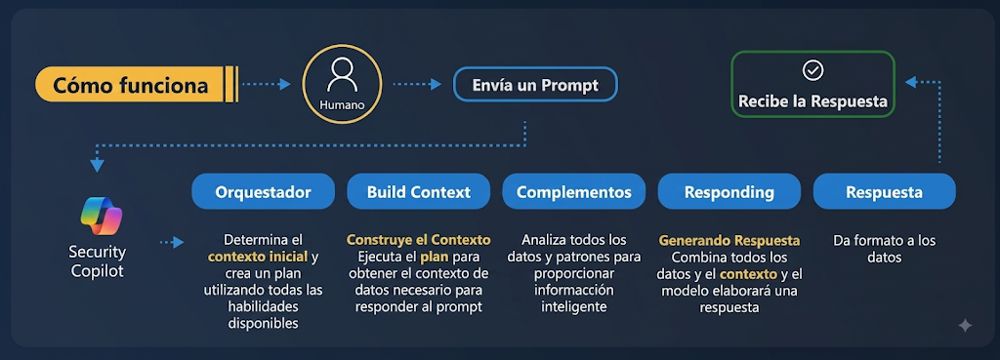
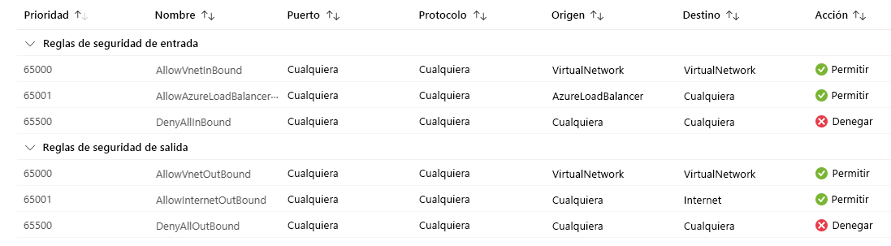
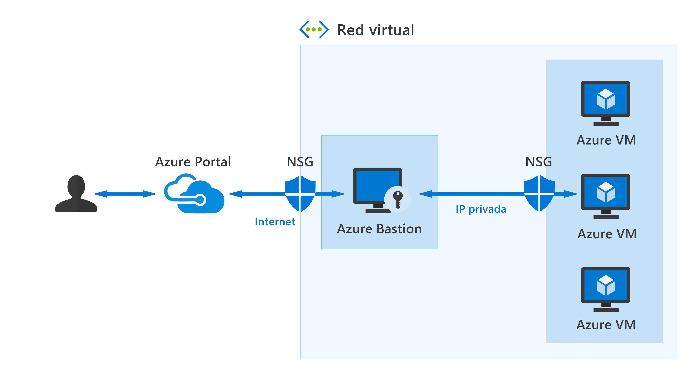

# **Capítulo 3: Introducción a las soluciones de seguridad de Microsoft**

# Descripción de Microsoft Security Copilot

Microsoft Security Copilot es una herramienta de análisis de seguridad basada en la nube con tecnología de IA, diseñada para ayudar a los defensores a abordar los desafíos crecientes de las ciberamenazas.

### Desafíos de seguridad actuales

Entre los principales retos a los que se enfrentan las organizaciones se incluyen:

- El aumento constante en el número y la sofisticación de los ciberataques.
- La escasez global de talento especializado en seguridad, lo que impulsa la necesidad de automatización, integración y consolidación de herramientas.
- La falta de visibilidad unificada sobre la seguridad, la privacidad, el cumplimiento normativo y la gobernanza.

Security Copilot permite a los analistas de seguridad procesar señales y responder a amenazas con mayor rapidez operando a la velocidad y escala de la inteligencia artificial.

### Casos de uso principales

- **Investigar y corregir amenazas:** Analiza alertas complejas, explica qué está ocurriendo en el entorno y proporciona pasos detallados para contener y solucionar el problema.
- **Crear consultas KQL y analizar scripts:** Genera consultas en Kusto Query Language (KQL) a partir de lenguaje natural y desglosa scripts sospechosos (como PowerShell) sin requerir análisis manual exhaustivo.
- **Comprender y administrar riesgos:** Identifica los principales riesgos de seguridad de la organización y sugiere recomendaciones para fortalecer su postura general.
- **Solucionar problemas de TI:** Reúne información contextual relevante para diagnosticar y resolver incidencias operativas de TI con rapidez.
- **Definir y administrar directivas de seguridad:** Ayuda a redactar, comparar y resumir directivas de seguridad para detectar conflictos y garantizar una administración coherente.
- **Configurar flujos de trabajo seguros:** Asiste en la creación de grupos y en la asignación de permisos siguiendo procedimientos recomendados para reducir la superficie de ataque.
- **Crear informes ejecutivos y técnicos:** Genera resúmenes estructurados sobre riesgos, incidentes y medidas de mitigación adaptados al perfil del destinatario (técnico o directivo).

### Modalidades de experiencia: Independiente vs. Insertada

- **Experiencia independiente (*Standalone*):** Se utiliza directamente desde el portal web dedicado de Microsoft Security Copilot (`securitycopilot.microsoft.com`). El analista formula preguntas en lenguaje natural y Copilot responde mediante texto estructurado, diagramas o resúmenes ejecutivos.
- **Experiencia insertada (*Embedded*):** Copilot se encuentra integrado dentro de los propios productos de seguridad de Microsoft (como Microsoft Defender XDR, Microsoft Sentinel, Microsoft Intune o Microsoft Entra). Permite ejecutar funciones contextuales directas, como resumir un incidente activo, analizar un archivo adjunto o generar consultas KQL sin salir de la consola de trabajo.

### Procesamiento de lenguaje natural (NLP) y arquitectura

- **Azure OpenAI Service:** Proporciona acceso a los modelos de lenguaje extenso (LLM) de OpenAI a través de una infraestructura empresarial protegida.
- **NLP (Procesamiento de Lenguaje Natural):** Permite a Security Copilot interpretar las intenciones del usuario expresadas en lenguaje humano cotidiano.
- **LLM (Large Language Model):** Procesa la solicitud, analiza el contexto recopilado y genera respuestas estructuradas y comprensibles.
- **Integración con herramientas de seguridad:** Conecta a Copilot con los datos y la telemetría real del entorno corporativo (mediante complementos), permitiendo responder sobre incidentes, dispositivos e identidades reales.

*Ejemplo:*

1. Preguntas: *«¿Tenemos algún incidente crítico en este momento?»*
2. Copilot consulta la telemetría en Microsoft Defender XDR mediante sus complementos autorizados.
3. El sistema procesa los datos reales y devuelve un resumen con los incidentes de gravedad alta activos y las entidades afectadas.

## Terminología y arquitectura interna de Microsoft Security Copilot

### Términos clave

- **Sesión:** Conversación individual dentro de Security Copilot en la que se mantiene el contexto de los mensajes anteriores.
- **Solicitud (*Prompt*):** Pregunta o instrucción específica enviada por el usuario dentro de una sesión.
- **Libros de solicitudes (*PromptBooks*):** Colecciones preconfiguradas de solicitudes y flujos recomendados para realizar tareas comunes (por ejemplo, un PromptBook para investigación completa de un incidente).
- **Capacidad (*Skill*):** Función elemental o tarea técnica que Copilot ejecuta para resolver una parte del problema (por ejemplo, buscar la reputación de una dirección IP).
- **Complemento (*Plugin*):** Extensión que agrupa un conjunto de capacidades orientadas a un origen de datos o producto específico (como el complemento de Microsoft Defender XDR o el de Microsoft Sentinel).
- **Área de trabajo (*Workspace*):** Límite administrativo y operativo dentro de un inquilino de Microsoft Entra que define la capacidad de procesamiento asignada y los controles de acceso.
- **Agentes:** Componentes de IA capaces de ejecutar secuencias de tareas de seguridad e investigación de forma semiautónoma bajo reglas establecidas.
- **Orquestador:** Motor central que coordina e interpreta la solicitud del usuario, diseña un plan de ejecución, llama a los complementos necesarios y recopila los datos para construir la respuesta final.

### Flujo de procesamiento de una solicitud

Cuando un usuario envía un *prompt*, el sistema ejecuta el siguiente flujo interno:



1. **Usuario envía la solicitud:** Escribe la petición en lenguaje natural (ej. *«Investiga este incidente y dime cómo solucionarlo»*).
2. **Orquestador:** Analiza la solicitud, comprende la intención y genera un plan determinando qué capacidades y complementos debe invocar.
3. **Construcción de contexto (*Build Context*):** Ejecuta el plan recopilando datos del incidente y de la infraestructura.
4. **Complementos (*Plugins*):** Consultan y extraen la telemetría correspondiente desde los servicios de seguridad (como Defender XDR o Sentinel).
5. **Generación de la respuesta (*Responding*):** El LLM sintetiza la información recopilada, evalúa el contexto y formula una respuesta clara.
6. **Entrega de la respuesta y registro de procesos:** Entrega la respuesta estructurada al usuario junto con el **registro de procesos** (*Process Log*), el cual detalla paso a paso qué complementos y fuentes de datos se utilizaron para garantizar la trazabilidad y confianza técnica.

### Elementos de un mensaje eficaz (*Prompt Engineering*)

La calidad técnica de la respuesta depende directamente de la precisión y estructura de la solicitud:

- **Objetivo:** Definir claramente qué resultado específico se espera obtener.
- **Contexto:** Proporcionar los antecedentes, identificadores del incidente o detalles de la situación.
- **Expectativas:** Especificar el formato deseado (resumen en un párrafo, tabla de IoCs, lista con viñetas).
- **Origen:** Indicar qué herramientas, registros o fuentes debe priorizar Copilot.

#### Recomendaciones prácticas para diseñar mensajes

- **Sé específico, claro y conciso:**
    - *Básico:* «Pearl Sleet»
    - *Eficaz:* «Proporcióname un resumen de la actividad reciente del actor de amenazas Pearl Sleet, incluyendo una lista de sus indicadores de compromiso (IoC) y tácticas, técnicas y procedimientos (TTP).»
- **Itera sobre los resultados:** Plantea una solicitud inicial, analiza la respuesta y ajusta en mensajes sucesivos dentro de la misma sesión (*«Ahora enfócate en sus TTPs de persistencia»*).
- **Proporciona contexto explícito:**
    - *Básico:* «Resume el incidente 15134.»
    - *Eficaz:* «Resume el incidente 15134 de Microsoft Defender XDR en un único párrafo e incluye una lista con los dispositivos e identidades involucrados.»
- **Usa instrucciones positivas:** Enfoca la redacción en lo que deseas obtener y define exclusiones específicas (*«Muestra los dispositivos no administrados de alto riesgo y excluye aquellos que contengan la etiqueta 'test'»*).
- **Dirígete de forma directa:** Emplea verbos de acción claros (*«Analiza»*, *«Compara»*, *«Genera una consulta KQL para...»*).

## Habilitación, licencias y gobernanza de Microsoft Security Copilot

### Modelos de incorporación según licenciamiento

- **Organizaciones con licencias Microsoft 365 E5 / E7:**
    - Cuentan con capacidades integradas y activación simplificada sin necesidad de aprovisionar infraestructura base manualmente en Azure.
- **Organizaciones sin Microsoft 365 E5 / E7:**
    - Requieren un proceso de incorporación manual vinculado a una suscripción de Azure para aprovisionar capacidad de procesamiento dedicada mediante **SCUs**.

### Capacidad y unidades de procesamiento (SCU)

- **SCU (*Security Compute Unit*):** Unidad de medida de capacidad de cómputo utilizada por Security Copilot para procesar solicitudes. Las consultas simples consumen menos capacidad que las investigaciones correlacionadas complejas.
- **Capacidad aprovisionada:** Número de SCUs reservadas por la organización (facturadas por hora). Se puede configurar desde un mínimo de 1 SCU hasta 100 SCUs (Microsoft recomienda 3 SCUs para evaluaciones iniciales).
- **Capacidad por encima del límite (*Overage*):** Capacidad adicional bajo demanda que se activa cuando se supera el límite base aprovisionado para absorber picos imprevistos de trabajo.
- **Panel de supervisión de uso:** Proporciona visibilidad sobre el consumo horario de SCUs, los complementos más utilizados, los usuarios activos y las tendencias históricas (hasta 90 días de retención).

### Configuración y seguridad administrativa

- **Almacenamiento y residencia de datos:** Se define a nivel de área de trabajo (*Workspace*), permitiendo seleccionar la región geográfica de procesamiento y almacenamiento de datos.
- **Integración con Microsoft Purview:** Registra y almacena las actividades, consultas, respuestas y acciones de los administradores en Copilot con fines de auditoría y cumplimiento normativo.
- **Uso compartido de datos (*Data Sharing*):** Control administrativo para permitir o restringir si ciertos datos de diagnóstico y comentarios pueden enviarse a Microsoft para mejora del servicio. Los datos del cliente no se utilizan para entrenar los modelos lingüísticos fundamentales.
- **Administración de complementos:** Permite habilitar, deshabilitar o restringir qué complementos y orígenes de datos externos están disponibles para los analistas.

### Control de acceso y modelo On-Behalf-Of (OBO)

- **Roles de Copilot:**
    - *Propietario de Copilot:* Administra configuraciones globales, capacidades, complementos y asignación de usuarios en el servicio.
    - *Colaborador de Copilot:* Rol operativo asignado a los analistas del SOC para interactuar con las sesiones y realizar investigaciones.
- **Permisos efectivos y modelo OBO (*On-Behalf-Of*):**
    
    > **Principio clave:** El acceso a Security Copilot **no** otorga acceso automático a los datos subyacentes. Security Copilot opera bajo el modelo *On-Behalf-Of* (en nombre del usuario): si un analista no tiene permisos en Microsoft Sentinel o en Microsoft Defender for Endpoint, Copilot no podrá consultar ni mostrar datos procedentes de esos servicios para ese usuario.
    > 
- **Independencia administrativa:** El rol de *Administrador Global de Microsoft Entra* administra identidades, pero requiere permisos RBAC específicos en Azure para aprovisionar y gestionar recursos de SCUs.

## Servicios de seguridad de infraestructura de red en Azure

### Amenazas de denegación de servicio distribuido (DDoS)

Un ataque DDoS busca saturar y agotar los recursos de aplicaciones, servidores o enlaces de red para dejarlos inaccesibles a los usuarios legítimos:

- **Ataques volumétricos:** Inundan la infraestructura con cantidades masivas de tráfico aparentemente legítimo o paquetes basura para saturar el ancho de banda disponible (capa de red).
- **Ataques de protocolo:** Explotan debilidades en los protocolos de transporte y red (capas 3 y 4, como *SYN Floods* o amplificación UDP) para agotar tablas de estado de firewalls, balanceadores o servidores.
- **Ataques a la capa de aplicación:** Dirigidos específicamente a la capa 7 (HTTP/HTTPS), generan peticiones complejas (como búsquedas pesadas en bases de datos) que saturan los recursos de cómputo del servidor web.

### Azure DDoS Protection

Servicio de protección nativo de Azure que inspecciona continuamente el tráfico de red en las capas 3 y 4, descartando el tráfico malicioso y reenviando el tráfico limpio hacia los recursos protegidos.

#### Características clave

- **Supervisión continua del tráfico:** Análisis continuo de patrones de red las 24 horas del día, los 7 días de la semana, aplicando mitigación automática e instantánea al detectar anomalías.
- **Ajuste adaptable en tiempo real (*Adaptive Tuning*):** Aprende el comportamiento y perfil de tráfico habitual de la aplicación a lo largo del tiempo, ajustando dinámicamente los umbrales de mitigación para distinguir con precisión el tráfico legítimo del tráfico de ataque.
- **Telemetría, métricas y alertas:** Integración con Azure Monitor para generar alertas y remitir registros de ataque hacia Log Analytics, Azure Storage o Event Hubs.
- **Respuesta rápida ante DDoS (*DDoS Rapid Response - DRR*):** Soporte especializado directo de ingenieros de Microsoft durante un ataque activo para asistir en la investigación y mitigación.

#### Niveles de Azure DDoS Protection

- **DDoS Network Protection:** Se habilita a nivel de red virtual (VNet) y protege automáticamente todos los recursos con direcciones IP públicas vinculados a dicha VNet. Incluye ajuste adaptable, soporte DRR y garantías de protección de costos por escalado durante un ataque.
- **DDoS IP Protection:** Diseñado para proteger direcciones IP públicas individuales bajo un modelo de pago por recurso, ofreciendo capacidades de mitigación esenciales sin todas las ventajas empresariales de Network Protection.

### Azure Firewall

Servicio de firewall de red administrado, con estado (*stateful*), de alta disponibilidad y escalabilidad automática en la nube que controla y filtra el tráfico entre redes virtuales, recursos locales e Internet.

#### Características técnicas

- **Inspección con estado (*Stateful Filtering*):** Rastrea y registra el estado completo de las conexiones de red (IP origen, IP destino, puertos y protocolo), permitiendo automáticamente el tráfico de retorno de las sesiones ya autorizadas.
- **Alta disponibilidad y zonas de disponibilidad:** Se despliega con redundancia nativa en múltiples zonas de disponibilidad para asegurar tolerancia a fallos.
- **Filtrado de red y de aplicaciones:** Reglas de red para capas 3 y 4 (IPs, puertos, protocolos) y reglas de aplicación para capa 7 (como filtrado de FQDNs para tráfico HTTP/HTTPS).
- **Traducción de direcciones de red (NAT):**
    - *SNAT (Source NAT):* Enmascara las IPs privadas internas utilizando las IPs públicas del firewall para permitir la salida segura a Internet.
    - *DNAT (Destination NAT):* Traduce peticiones dirigidas a la IP pública del firewall hacia IPs privadas internas específicas (por ejemplo, publicar un servicio web interno).
- **Inteligencia contra amenazas (*Threat Intelligence*):** Utiliza fuentes globales de inteligencia de Microsoft para alertar o bloquear tráfico procedente o dirigido a IPs y dominios maliciosos conocidos.
- **Azure Firewall Manager:** Consola centralizada para gestionar directivas comunes, reglas de seguridad y centros virtuales seguros (*Secure Virtual Hubs*) a través de múltiples suscripciones y regiones.

#### Niveles de Azure Firewall

- **Azure Firewall Basic:** Diseñado para pequeñas y medianas empresas. Ofrece filtrado básico de capas 3 a 7, inteligencia contra amenazas solo en modo alerta y rendimiento recomendado de hasta 250 Mbps.
- **Azure Firewall Standard:** Diseñado para entornos empresariales de producción. Incluye filtrado L3-L7, reglas de FQDN, categorías web e inteligencia contra amenazas en modo alerta y bloqueo.
- **Azure Firewall Premium:** Diseñado para entornos altamente regulados y confidenciales. Incluye capacidades avanzadas como:
    - Sistema de detección y prevención de intrusiones (**IDPS**) basado en firmas (más de 67,000 firmas actualizadas continuamente).
    - Inspección y descifrado TLS/SSL.
    - Filtrado de URL y categorización web avanzada.

### Azure Web Application Firewall (WAF)

Firewall especializado en la capa de aplicación (capa 7) que protege las aplicaciones web contra vulnerabilidades y ataques comunes de Internet definidos en el catálogo de reglas de **OWASP** (*Open Web Application Security Project*).

#### Amenazas mitigadas por WAF

- **Inyección SQL (SQLi):** Intentos de ejecutar comandos SQL no autorizados en la base de datos a través de formularios o parámetros de entrada.
- **Cross-Site Scripting (XSS):** Inyección de scripts maliciosos en aplicaciones web para ejecutarse en el navegador de otros usuarios.
- **Inundaciones HTTP (HTTP Floods):** Ataques DDoS de capa 7 diseñados para saturar servidores web con peticiones HTTP/S concurrentes.
- **Inclusión remota de archivos (RFI) y falsificación de peticiones:** Intentos de forzar al servidor web a descargar o ejecutar código malicioso remoto.

#### Servicios donde se integra Azure WAF

- **Azure Front Door:** Proporciona protección WAF global en el borde de la red (*edge*), deteniendo los ataques antes de que alcancen la red corporativa.
- **Azure Application Gateway:** Proporciona protección WAF regional y balanceo de carga L7 para aplicaciones web dentro de una suscripción de Azure.
- **Azure Content Delivery Network (CDN):** Protege la distribución de contenidos web estáticos y dinámicos.
- **Application Gateway for Containers:** Extiende la protección WAF a cargas de trabajo y microservicios ejecutados en clústeres de Kubernetes (AKS).

## Segmentación y aislamiento de red en Azure

La segmentación de red consiste en dividir una infraestructura en subredes y zonas aisladas para limitar el movimiento lateral de un atacante, agrupar recursos por función y aplicar directivas de acceso Zero Trust.

### Red virtual de Azure (VNet)

Bloque de construcción fundamental de red privada en Azure. Proporciona aislamiento completo, permitiendo:

- **Salida y entrada a Internet:** Configuración controlada mediante balanceadores de carga, IPs públicas o firewalls.
- **Comunicación privada entre recursos de Azure:** Tráfico interno cifrado dentro de la infraestructura troncal de Microsoft.
- **Conectividad híbrida con redes locales:**
    - *VPN de sitio a sitio (Site-to-Site):* Conexión cifrada entre la red local corporativa y la VNet.
    - *VPN de punto a sitio (Point-to-Site):* Conexión individual segura desde un dispositivo cliente hacia la VNet.
    - *Azure ExpressRoute:* Conexión privada, dedicada y de alta velocidad que no transita por la Internet pública.
- **Enrutamiento del tráfico:** Control de flujo mediante tablas de rutas del sistema y rutas definidas por el usuario (**UDR**).

#### Subredes y emparejamiento (VNet Peering)

- **Subredes:** Divisiones lógicas dentro de una VNet que permiten segmentar recursos según su función (por ejemplo, subred de frontend, subred de aplicaciones y subred de base de datos), aplicando controles de seguridad independientes a cada una.
- **Emparejamiento de redes virtuales (*VNet Peering*):** Conecta dos o más VNets de forma directa a través de la red troncal privada de Azure (incluso entre diferentes regiones), permitiendo que los recursos se comuniquen con baja latencia y sin exponer tráfico a Internet.

### Grupos de seguridad de red (NSG)

Filtro de paquetes de red que opera en las capas 3 y 4 para permitir o denegar el tráfico entrante y saliente a nivel de subred o de interfaz de red (NIC) de una máquina virtual.

#### Estructura de las reglas de seguridad de un NSG

Las reglas se evalúan en orden secuencial según su **prioridad** (un número más bajo indica mayor prioridad). Cuando un paquete coincide con una regla, la evaluación se detiene:

- **Nombre:** Identificador descriptivo de la regla.
- **Prioridad:** Valor numérico entre 100 y 4096.
- **Origen / Destino:** Direcciones IP, rangos CIDR, etiquetas de servicio (*Service Tags*) o Grupos de Seguridad de Aplicaciones (ASG).
- **Protocolo:** TCP, UDP, ICMP o *Any*.
- **Dirección:** Entrada (*Inbound*) o Salida (*Outbound*).
- **Intervalo de puertos:** Puertos individuales o rangos específicos.
- **Acción:** Permitir (*Allow*) o Denegar (*Deny*).



> **Reglas predeterminadas:** Todo NSG incluye reglas por defecto con prioridades altas (números 65000 a 65500) que permiten la comunicación dentro de la VNet y la salida a Internet, pero bloquean todo el tráfico entrante no explícito. Estas reglas no se pueden borrar, pero pueden anularse creando reglas con prioridad más baja (números menores).
> 

#### Grupos de seguridad de aplicaciones (ASG)

Permiten agrupar máquinas virtuales bajo una etiqueta lógica basada en su función (por ejemplo, `WebServers`, `DbServers`) para utilizarlas como origen o destino en las reglas del NSG, eliminando la necesidad de gestionar direcciones IP individuales.

| **Característica** | **Grupo de Seguridad de Red (NSG)** | **Azure Firewall** |
| --- | --- | --- |
| **Ámbito** | Distribuido a nivel de subred o NIC. | Centralizado a nivel de VNet o arquitectura Hub. |
| **Capas de inspección** | Capas 3 y 4 (IP, puertos, protocolos). | Capas 3 a 7 (incluye FQDN, URLs y descifrado TLS). |
| **Estado y detección** | Filtrado básico de paquetes con estado. | Inspección avanzada con estado, IDPS e inteligencia de amenazas. |

## Acceso remoto seguro y gestión criptográfica

### Azure Bastion

Servicio PaaS administrado que proporciona conectividad remota segura y directa a máquinas virtuales mediante RDP (puerto 3389) y SSH (puerto 22) a través del navegador web utilizando TLS, sin necesidad de asignar direcciones IP públicas a las máquinas virtuales ni exponer puertos administrativos a Internet.

```
[Usuario] ──(HTTPS/TLS por puerto 443)──> [Azure Portal / Bastion] ──(RDP/SSH privado)──> [Máquina Virtual]
```



#### Ventajas clave

- Conexión directa desde Azure Portal mediante clientes web HTML5.
- Las máquinas virtuales permanecen con direccionamiento IP privado sin exposición a Internet.
- Mitiga el escaneo externo de puertos y ataques de fuerza bruta contra RDP y SSH.
- Mantenimiento, parches y hardening de la infraestructura gestionados directamente por Azure.

#### Niveles de Azure Bastion

- **Developer:** Nivel gratuito para desarrollo y pruebas en entornos de recursos compartidos (una conexión simultánea).
- **Basic:** Despliegue dedicado para entornos de producción con requerimientos de conectividad esenciales.
- **Standard:** Añade escalabilidad de instancias, soporte para clientes nativos RDP/SSH en el equipo local, conexiones basadas en IP y enlaces compartibles (*shareable links*).
- **Premium:** Incluye todas las capacidades del nivel Standard más grabación de sesiones de usuario y despliegues con endpoints privados para entornos altamente regulados.

### Azure Key Vault

Servicio en la nube para el almacenamiento seguro, centralizado y controlado de secretos, claves criptográficas y certificados digitales, aplicando el principio de privilegios mínimos de Zero Trust.

#### Casos de uso y tipos de objetos

- **Administración de secretos:** Almacena de forma protegida cadenas de conexión a bases de datos, contraseñas, tokens y claves API, evitando que los desarrolladores expongan credenciales en el código fuente.
- **Administración de claves:** Facilita la creación, importación y gestión del ciclo de vida de claves criptográficas utilizadas para el cifrado de datos (por ejemplo, claves administradas por el cliente - CMK).
- **Administración de certificados:** Simplifica el aprovisionamiento, despliegue, gestión y renovación automática de certificados TLS/SSL públicos y privados.

#### Beneficios operativos y seguridad

- **Aislamiento de credenciales:** Las aplicaciones consultan los secretos mediante identificadores URI seguros durante su ejecución utilizando identidades administradas (*Managed Identities*).
- **Control de acceso estricto:** La autenticación se realiza exclusivamente a través de Microsoft Entra ID, y la autorización se gestiona mediante Azure RBAC o directivas de acceso de Key Vault.
- **Supervisión y auditoría:** Registra todos los intentos de acceso y operaciones sobre los secretos, integrándose con Azure Monitor y Log Analytics.
- **Integración nativa:** Se conecta con servicios como *Azure Disk Encryption*, *Azure SQL Transparent Data Encryption (TDE)* y *Azure App Service*.

#### Niveles de servicio de Key Vault

- **Estándar:** Almacena y protege claves, secretos y certificados utilizando mecanismos de cifrado por software validados.
- **Premium:** Proporciona las mismas funciones del nivel Estándar y añade protección de claves criptográficas mediante **Módulos de Seguridad de Hardware (HSM)** certificados bajo el estándar FIPS 140.

## Administración de la posición de seguridad en la nube (Microsoft Defender for Cloud)

Microsoft Defender for Cloud es una plataforma integral de protección de aplicaciones nativas de la nube (**CNAPP**) que evalúa la seguridad, identifica vulnerabilidades y protege cargas de trabajo en entornos de Azure, AWS, Google Cloud Platform (GCP) y entornos locales híbridos.

### Los tres pilares de Defender for Cloud

1. **DevSecOps (Defender for DevOps):** Integra la seguridad desde las etapas tempranas del ciclo de desarrollo de software (*Shift Left*), analizando repositorios en GitHub, Azure DevOps y GitLab en busca de secretos expuestos, vulnerabilidades en dependencias de código abierto (OSS) y configuraciones inseguras en plantillas de Infraestructura como Código (IaC).
2. **CSPM (*Cloud Security Posture Management*):** Evalúa de forma continua la configuración de los recursos en la nube frente a estándares y directivas de seguridad, calcula la Puntuación de Seguridad (*Secure Score*) y proporciona recomendaciones para mitigar riesgos antes de que sean explotados.
3. **CWPP (*Cloud Workload Protection Platform*):** Proporciona protección avanzada contra amenazas y capacidades de detección en tiempo real para cargas de trabajo específicas en ejecución (servidores, bases de datos, almacenamiento, contenedores, APIs).

### Directivas, iniciativas y estándares de seguridad

Defender for Cloud utiliza el motor de **Azure Policy** para supervisar el cumplimiento del entorno:

- **Directiva de Azure (*Azure Policy*):** Regla individual que define una condición técnica obligatoria (por ejemplo: *«Todas las bases de datos SQL deben tener habilitado el cifrado TDE»*). Si un recurso no la cumple, se genera un estado de no cumplimiento y una recomendación.
- **Iniciativa de seguridad:** Agrupación lógica de varias directivas de Azure orientadas a un objetivo común para facilitar su asignación y auditoría a escala.
- **Asignación:** Ámbito de la jerarquía de Azure donde se aplica la iniciativa (Grupo de administración, Suscripción o Grupo de recursos).

#### Microsoft Cloud Security Benchmark (MCSB)

Es el conjunto predeterminado de directrices y controles de seguridad que Defender for Cloud aplica automáticamente a todas las suscripciones. Está basado en marcos reconocidos de la industria como CIS Controls, NIST SP 800-53 y PCI DSS, proporcionando guías de implementación técnica tanto para Azure como para AWS y GCP.

#### Estructura de un control en MCSB

- **Identificador y dominio:** Código del control y área temática (por ejemplo, *Seguridad de red*, *Protección de datos* o *Identidad y control de acceso*).
- **Vinculación a marcos del sector:** Relación explícita con los controles equivalentes de NIST, CIS o PCI DSS.
- **Recomendación:** Descripción clara de la medida de seguridad que debe implementarse.
- **Guías para Azure, AWS y GCP:** Instrucciones técnicas específicas para aplicar el control en cada plataforma en la nube.
- **Responsabilidad organizativa:** Identifica el rol o equipo responsable de la ejecución del control.

### Capacidades de CSPM: Gratuito vs. Avanzado

#### CSPM Fundamental (Gratuito)

Habilitado por defecto en todas las suscripciones de Azure conectadas a Defender for Cloud. Incluye inventario continuo de activos, recomendaciones de seguridad basadas en MCSB y el cálculo del *Secure Score*.

#### CSPM de Defender (Avanzado)

Plan de pago que incorpora herramientas avanzadas para la gestión de riesgos y análisis contextual:

- **Puntuación de seguridad (*Secure Score*):** Métrica porcentual que refleja la postura global de seguridad; se incrementa al completar las recomendaciones agrupadas en los controles de seguridad.
- **Análisis de rutas de ataque (*Attack Path Analysis*):** Motor contextual basado en gráficos que utiliza algoritmos e IA para identificar cómo un atacante podría encadenar múltiples vulnerabilidades y configuraciones incorrectas para alcanzar un recurso crítico (por ejemplo: *VM expuesta a Internet con vulnerabilidad crítica → Asignación de identidad con permisos excesivos → Base de datos confidencial*).
- **Explorador de seguridad en la nube (*Cloud Security Explorer*):** Herramienta de consultas basada en gráficos que permite a los equipos realizar búsquedas proactivas de riesgos combinados en el entorno multinube.
- **Gobernanza de seguridad:** Permite asignar propietarios formales a las recomendaciones y definir fechas límite (*SLAs*) de remediación.
- **DSPM (*Data Security Posture Management*):** Descubre almacenes de datos confidenciales (cuentas de almacenamiento, bases de datos), clasifica el tipo de información sensible que contienen y evalúa su nivel de exposición.
- **AI SPM (*AI Security Posture Management*):** Mantiene un inventario de artefactos de IA (**AI BOM** - *AI Bill of Materials*), evalúa la postura de seguridad de aplicaciones de IA generativa y detecta configuraciones de riesgo asociadas a modelos y servicios de IA.

### Planes de protección de cargas de trabajo (CWPP)

Los planes avanzados de Defender protegen recursos específicos en tiempo real:

| **Plan de Microsoft Defender** | **Recurso protegido** | **Capacidades principales** |
| --- | --- | --- |
| **Defender para servidores** | Máquinas virtuales Windows y Linux (Azure, AWS, GCP, local). | Incluye EDR con Defender for Endpoint, evaluación de vulnerabilidades y acceso Just-In-Time (JIT) a puertos de administración. |
| **Defender para App Service** | Aplicaciones web en Azure App Service. | Detecta ataques dirigidos a aplicaciones web y solicitudes maliciosas. |
| **Defender para Storage** | Cuentas de almacenamiento (Blob, Azure Files). | Detecta accesos anómalos, filtración de datos y subida de malware. |
| **Defender para SQL** | Bases de datos SQL (Azure SQL, servidores SQL). | Identifica inyecciones SQL, actividades sospechosas y vulnerabilidades de configuración. |
| **Defender para contenedores** | Clústeres de Kubernetes (AKS) y registros de imágenes. | Análisis de vulnerabilidades en imágenes de contenedores y detección de amenazas en tiempo de ejecución. |
| **Defender para Key Vault** | Instancias de Azure Key Vault. | Detecta accesos sospechosos o intentos no habituales de extracción de secretos y claves. |
| **Defender para Resource Manager** | Capa de operaciones de administración de Azure. | Supervisa llamadas administrativas y detecta operaciones maliciosas sobre la infraestructura. |
| **Defender para bases de datos de código abierto** | PostgreSQL, MySQL y MariaDB en Azure. | Detecta anomalías y accesos no autorizados en motores relacionales de código abierto. |
| **Defender para AI Services** | Aplicaciones y modelos de IA generativa. | Detecta en tiempo real inyecciones de prompts, jailbreaks, fuga de datos sensibles y envenenamiento de modelos mediante Azure AI Content Safety y Threat Intelligence. |
| **Defender para API** | APIs empresariales publicadas. | Identifica vulnerabilidades de seguridad, exposición excesiva de datos y ataques contra APIs. |

## Soluciones SIEM y SOAR: Microsoft Sentinel

### Conceptos fundamentales

- **SIEM (*Security Information and Event Management*):** Sistema centralizado que recopila, almacena, normaliza y correlaciona registros (*logs*) y eventos de seguridad de toda la organización (redes, servidores, identidades, aplicaciones) para detectar anomalías y generar alertas de seguridad e incidentes unificados.
- **SOAR (*Security Orchestration, Automation, and Response*):** Plataforma que automatiza las tareas de respuesta ante incidentes mediante flujos de trabajo predefinidos (*playbooks*), coordinando acciones entre diferentes herramientas de seguridad sin requerir intervención manual constante.

> **Fórmula clave:**
> 
> - **SIEM:** Recopila, correlaciona y detecta.
> - **SOAR:** Orquesta, responde y automatiza.

### Mitigación de la fatiga de alertas mediante IA y Machine Learning

La fatiga de alertas ocurre cuando los analistas del SOC se ven saturados por miles de alertas inconexas y falsos positivos diarios. Las plataformas SIEM modernas aplican modelos de Machine Learning y motores de correlación (**Fusion**) para agrupar múltiples señales relacionadas en un único incidente de alta fidelidad, reduciendo el volumen de alertas y reconstruyendo la cadena completa del ataque.

### Capacidades de Microsoft Sentinel

Microsoft Sentinel es una solución SIEM y SOAR nativa de la nube construida sobre Azure Log Analytics:

- **1. Recopilar:** Ingiere datos a escala de nube mediante más de 350 conectores de datos integrados (servicios Microsoft, nubes de terceros como AWS/GCP, firewalls, routers y registros Syslog/CEF).
- **2. Detectar:** Identifica amenazas mediante reglas analíticas programadas, inteligencia de amenazas global y algoritmos de Machine Learning.
- **3. Investigar:** Proporciona herramientas visuales e interactivas para examinar incidentes, mapear entidades afectadas y realizar búsqueda proactiva de amenazas (*Threat Hunting*).
- **4. Responder:** Ejecuta respuestas automáticas mediante **reglas de automatización** y **cuadernos de estrategias (*Playbooks*)** basados en Azure Logic Apps (por ejemplo, aislar un equipo o deshabilitar un usuario comprometido).

#### Arquitectura de la plataforma Sentinel

- **Lago de datos de Microsoft Sentinel:** Repositorio de almacenamiento seguro a largo plazo con capacidades de retención de datos de hasta 12 años para análisis forense y cumplimiento.
- **Gráfico de Microsoft Sentinel:** Modela las relaciones entre usuarios, dispositivos, direcciones IP y recursos para visualizar rutas de ataque y desplazamientos laterales.
- **Servidor MCP de Microsoft Sentinel:** Capa de interoperabilidad que permite a analistas y agentes de IA consultar e interactuar con la telemetría de Sentinel utilizando lenguaje natural.
- **Centro de contenido (*Content Hub*):** Catálogo centralizado para descubrir e instalar soluciones empaquetadas listas para usar (conectores, reglas analíticas, libros de trabajo y playbooks específicos por producto o fabricante).

## Plataforma extendida de detección y respuesta (Microsoft Defender XDR)

Microsoft Defender XDR es una suite de seguridad empresarial integrada que correlaciona automáticamente señales de telemetría provenientes de endpoints, identidades, correo electrónico y aplicaciones SaaS para ofrecer detección, prevención, investigación y respuesta coordinada ante ataques sofisticados.

```
                  ┌───────────────────────────────┐
                  │     Microsoft Defender XDR    │
                  └───────────────┬───────────────┘
         ┌────────────────┬───────┴────────┬────────────────┐
         ▼                ▼                ▼                ▼
┌─────────────────┐┌──────────────┐┌──────────────┐┌────────────────┐
│  Defender for   ││ Defender for ││ Defender for ││  Defender for  │
│    Endpoint     ││  Office 365  ││   Identity   ││   Cloud Apps   │
│  (Dispositivos) ││   (Correo)   ││ (AD / Ident) ││  (Apps SaaS)   │
└─────────────────┘└──────────────┘└──────────────┘└────────────────┘
```

### Componentes de Microsoft Defender XDR

#### 1. Microsoft Defender para Office 365

Protege las comunicaciones por correo electrónico y las herramientas de colaboración (Exchange Online, SharePoint, OneDrive, Microsoft Teams):

- **Anti-Phishing y Antimalware:** Bloquea intentos de suplantación de identidad y código malicioso.
- **Datos adjuntos seguros (*Safe Attachments*):** Abre y analiza archivos adjuntos sospechosos en un entorno de pruebas aislado (*sandbox*) en la nube antes de entregarlos al destinatario.
- **Vínculos seguros (*Safe Links*):** Inspecciona y valida URLs en tiempo real en el momento en que el usuario hace clic (*time-of-click verification*).
- **Purga automática de hora cero (*Zero-hour Auto Purge - ZAP*):** Detecta y mueve a cuarentena automáticamente mensajes maliciosos que ya habían sido entregados al buzón si se descubre que contienen amenazas posteriormente.
- **Explorador de amenazas (*Threat Explorer*):** Herramienta de investigación para rastrear correos maliciosos, identificar destinatarios afectados y auditar acciones de mitigación.
- **Entrenamiento de simulación de ataque (*Attack Simulation Training*):** Permite lanzar campañas de phishing simuladas para evaluar y capacitar a los usuarios.

#### 2. Microsoft Defender para Endpoint

Plataforma de seguridad para dispositivos finales (Windows, macOS, Linux, iOS, Android):

- **Protección de próxima generación:** Antivirus basado en comportamiento, heurística y análisis en la nube en tiempo real.
- **Reducción de la superficie expuesta a ataques (ASR):** Reglas para bloquear comportamientos y vectores habituales utilizados por malware (como macros de Office maliciosas o scripts en procesos del sistema).
- **EDR (*Endpoint Detection and Response*):** Supervisión continua del comportamiento del sistema para detectar y contener amenazas avanzadas en el equipo.
- **Investigación y respuesta automatizadas (AIR):** Analiza alertas complejas y ejecuta acciones de remediación automática sobre archivos y procesos infectados.

#### 3. Microsoft Defender for Cloud Apps

Agente de seguridad de acceso a la nube (**CASB**) y solución **SSPM** que proporciona visibilidad y control sobre el uso de aplicaciones SaaS:

- **Cloud Discovery:** Analiza registros de tráfico de red para identificar qué aplicaciones en la nube están utilizando los empleados.
- **Detección de Shadow IT:** Identifica y clasifica aplicaciones no autorizadas por el departamento de TI, evaluando su nivel de riesgo y cumplimiento.
- **Control de sesiones y protección de datos:** Aplica políticas de prevención de pérdida de datos (DLP) en tiempo real durante la interacción con aplicaciones en la nube.
- **SSPM (*SaaS Security Posture Management*):** Evalúa y corrige configuraciones incorrectas en plataformas SaaS de terceros (como Salesforce, ServiceNow o Google Workspace).

#### 4. Microsoft Defender for Identity

Solución de seguridad que analiza señales de identidad y autenticación procedentes de controladores de dominio locales de Active Directory (AD DS) y entornos híbridos:

- **Sensores locales:** Supervisan el tráfico de red de autenticación y los registros de auditoría en los controladores de dominio.
- **Detección de amenazas de identidad:** Detecta ataques basados en credenciales (fuerza bruta, *Pass-the-Hash*, *Pass-the-Ticket*, ataques Kerberos como *Golden Ticket* o *Kerberoasting*).
- **Detección de movimiento lateral y reconocimiento:** Identifica intentos no autorizados de enumerar recursos o desplazarse a través de la red corporativa hacia cuentas privilegiadas.

#### 5. Microsoft Defender Vulnerability Management

Servicio de administración continua de vulnerabilidades basado en el riesgo real:

- Proporciona inventarios de activos (software instalado, hardware, certificados y extensiones).
- Prioriza vulnerabilidades correlacionando la gravedad del fallo con la presencia de exploits activos y la criticidad del dispositivo.

#### 6. Microsoft Security Exposure Management

Plataforma que proporciona una vista unificada de la superficie de ataque completa de la organización:

- Consolida datos de postura de seguridad provenientes de Defender for Endpoint, Defender for Cloud, Entra ID y herramientas externas.
- Modela y visualiza las **rutas de ataque** (*Attack Paths*) completas hacia los **activos críticos** de la empresa.

#### 7. Microsoft Defender Portal

Consola web unificada (`security.microsoft.com`) donde los equipos de seguridad gestionan alertas, incidentes consolidados, herramientas de búsqueda avanzada (**Advanced Hunting** con consultas KQL) e inventarios de activos de toda la familia Defender XDR.

| Servicio | ¿Qué protege / hace? | Palabra clave |
| --- | --- | --- |
| **Microsoft Defender XDR** | Integra señales y responde a ataques | **Correlación** |
| **Defender para Office 365** | Correo y colaboración | **Phishing** |
| **Defender para Endpoint** | Dispositivos | **EDR** |
| **Defender for Cloud Apps** | Aplicaciones SaaS/cloud | **CASB / Shadow IT** |
| **Defender for Identity** | Identidades / Active Directory | **Movimiento lateral** |
| **Defender Vulnerability Management** | Vulnerabilidades | **Priorizar riesgo** |
| **Defender Threat Intelligence** | Inteligencia sobre amenazas | **IOC / CVE** |
| **Microsoft Defender portal** | Administración e investigación centralizada | **Portal unificado** |
