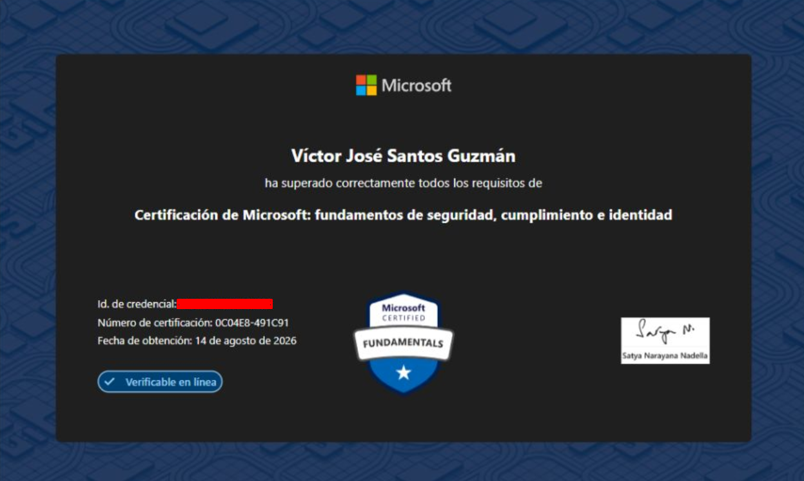

# Microsoft Security, Compliance, and Identity Fundamentals (SC-900)

## Sobre la certificación

La **Microsoft Security, Compliance, and Identity Fundamentals (SC-900)** es una certificación de nivel inicial enfocada en los fundamentos de **seguridad, identidad y compliance** dentro del ecosistema de Microsoft.

## Resultado

**Estado:** Aprobado 

**Fecha:** 11 de agosto de 2026 

## Preparación

Mi preparación tomó aproximadamente **2–3 semanas**, estudiando alrededor de **2–3 horas al día**.

Mis resultados en evaluaciones prácticas fueron mejorando progresivamente:

**64% → 75% → 88% → ~95% de forma consistente.**

## Recursos

Mi principal recurso fue **Microsoft Learn**, complementándolo con:

* Microsoft Practice Assessment
* Tutorials Dojo
* Gemini Code para simulaciones
* ChatGPT para aclarar conceptos y resolver dudas

## Documentación

He organizado mis apuntes en cuatro áreas principales:

* [01 - Conceptos de Seguridad, Compliance e Identidad](https://github.com/victorjs-g/Certificaciones/tree/main/Microsoft-Security-Compliance-and-Identity-Fundamentals-SC-900/01-Conceptos-de-Seguridad-Compliance-Identidad)
* [02 - Microsoft Entra](https://github.com/victorjs-g/Certificaciones/tree/main/Microsoft-Security-Compliance-and-Identity-Fundamentals-SC-900/02-Microsoft-Entra)
* [03 - Soluciones de Seguridad de Microsoft](https://github.com/victorjs-g/Certificaciones/tree/main/Microsoft-Security-Compliance-and-Identity-Fundamentals-SC-900/03-Soluciones-de-Seguridad-de-Microsoft)
* [04 - Soluciones de Compliance de Microsoft](https://github.com/victorjs-g/Certificaciones/tree/main/Microsoft-Security-Compliance-and-Identity-Fundamentals-SC-900/04-Soluciones-de-Compliance-de-Microsoft)

Cada sección contiene conceptos, explicaciones, ejemplos y material visual utilizado durante mi preparación.

## Recursos oficiales

[Microsoft Learn — SC-900](https://learn.microsoft.com/en-us/credentials/certifications/security-compliance-and-identity-fundamentals/)

Si estás preparando la **SC-900**, espero que estos apuntes te sirvan como material complementario para reforzar los fundamentos de seguridad, identidad y compliance de Microsoft.
